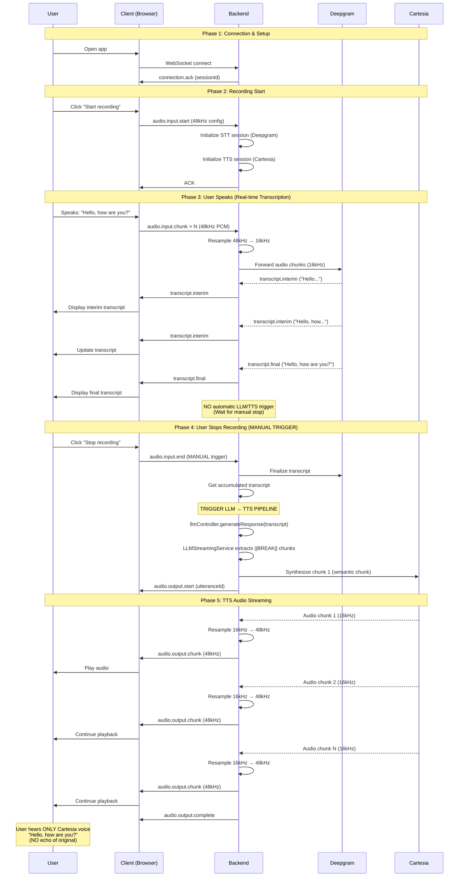

# MVP Audio Pipeline Documentation

**Version**: 2.0.0
**Date**: 2026-02-20
**Status**: Current Implementation (Full AI Pipeline)
**Related**: [Architecture Documentation](./architecture.md), [WebSocket Protocol](../protocol/websocket-protocol.md)

---

## Overview

This document describes the **current audio pipeline** in Vantum backend. The pipeline now includes full STT → LLM → TTS integration. The trigger remains manual (user clicks "Stop recording"), with automatic VAD-based triggers planned as a future enhancement.

### What This Document Covers

1. **Current Pipeline Flow** - How STT → LLM → TTS works right now
2. **Manual Trigger Strategy** - Why we keep manual controls for now
3. **Technical Implementation** - How components interact
4. **Future Enhancement Roadmap** - Path to automatic/intelligent triggers
5. **Migration Strategy** - How we'll evolve to full production

---

## Current MVP Behavior

### Pipeline Trigger Strategy (Manual)

**Current Implementation**: The STT → LLM → TTS pipeline triggers when user clicks the "Stop recording" button (sends `audio.input.end` event).

**What This Means**:

- User starts recording → Server initializes STT, LLM session, TTS session
- User speaks → Deepgram transcribes in real-time → Client receives `transcript.interim` and `transcript.final` events
- User clicks "Stop recording" → Server finalizes accumulated transcript
- Transcript → LLM (OpenAI GPT-4.1) → streaming response with `||BREAK||` markers
- Semantic chunks progressively sent to Cartesia TTS → Audio chunks streamed to client

**What This Does NOT Do** (yet):

- ❌ No automatic synthesis on `transcript.final` during recording
- ❌ No VAD-based silence detection
- ❌ No automatic trigger on speech pause
- ❌ No debouncing for partial transcripts
- ❌ No interruption handling (cancel TTS if user speaks during response)

**Why Manual Trigger?**:

- **Predictable**: User has full control, easy to test and debug
- **Iterative**: Validates entire pipeline end-to-end before adding trigger complexity
- **Sufficient**: Works well for demos and initial production use

### Audio Echo Strategy (Removed)

**Previous Behavior**: Original client audio was echoed back for testing playback pipeline.

**Current Behavior**: Audio echo is completely removed. Client hears ONLY Cartesia-synthesized audio.

**Why Removed?**:

- **Cleaner pipeline**: No unnecessary buffering or playback
- **Reduces confusion**: No duplicate audio (original + TTS)
- **Simpler architecture**: Fewer components to maintain
- **Memory efficient**: No audio buffering service needed

---

## MVP Flow Diagram

### Complete MVP Flow (Manual Trigger)



### Key Phases Explained

**Phase 1-2: Setup (Connection + Recording Start)**

- Standard WebSocket connection
- Server generates sessionId
- Both STT and TTS sessions initialized upfront

**Phase 3: Real-time Transcription (User Speaking)**

- Audio flows: Browser (48kHz) → Backend → Resample (16kHz) → Deepgram
- Transcripts flow back: Deepgram → Backend → Client
- **CRITICAL**: No TTS trigger during this phase (MVP)

**Phase 4: Manual Trigger (User Stops Recording)**

- User explicit action: Click "Stop recording" button
- Backend finalizes Deepgram transcript (accumulated text)
- **TRIGGER POINT**: Backend calls `llmController.generateResponse()` → LLM streams response → `LLMStreamingService` extracts `||BREAK||` chunks → Each chunk synthesized via `ttsController.synthesize()`

**Phase 5: TTS Streaming**

- Cartesia generates audio (16kHz) → Backend resamples (48kHz) → Client plays
- Client hears ONLY Cartesia voice (no echo)

---

## Technical Implementation

### Component Interaction

**Components Involved**:

1. **AudioHandler** (`/src/modules/socket/handlers/audio.handler.ts`)
   - Handles `voicechat.audio.start`, `voicechat.audio.chunk`, `voicechat.audio.end`
   - Forwards audio to STT, triggers STT → LLM → TTS pipeline on `audio.end`

2. **STT Service** (`/src/modules/stt/services/stt.service.ts`)
   - Real-time transcription with Deepgram
   - Accumulates transcript during session
   - `finalizeTranscript()` returns accumulated text on `audio.end`

3. **LLM Service** (`/src/modules/llm/services/llm.service.ts`)
   - **CRITICAL INTEGRATION POINT** — receives transcript, generates AI response
   - OpenAI GPT-4.1 streaming with conversation context
   - Calls `LLMStreamingService` to extract semantic chunks

4. **LLM Streaming Service** (`/src/modules/llm/services/llm-streaming.service.ts`)
   - Buffers LLM tokens, extracts chunks at `||BREAK||` markers
   - Falls back to sentence-based splitting if no markers present
   - Sends each chunk to TTS sequentially

5. **TTS Service** (`/src/modules/tts/services/tts.service.ts`)
   - Cartesia WebSocket integration
   - Synthesizes each semantic chunk to audio
   - Streams chunks back to client with sequential playback

6. **Audio Resampler** (`/src/modules/audio/services/audio-resampler.service.ts`)
   - Bidirectional resampling (48kHz ↔ 16kHz)
   - Used for both STT input (48kHz → 16kHz) and TTS output (16kHz → 48kHz)

### Data Flow (MVP)

```
┌─────────────────────────────────────────────────────────────────┐
│                      MVP AUDIO PIPELINE                          │
├─────────────────────────────────────────────────────────────────┤
│                                                                  │
│  User Recording Phase (Real-time STT):                           │
│  ┌──────────────────────────────────────────────────────────┐  │
│  │ Browser (48kHz) → Backend → Resample (16kHz)             │  │
│  │              → Deepgram STT                              │  │
│  │              → transcript.interim/final → Client         │  │
│  └──────────────────────────────────────────────────────────┘  │
│                                                                  │
│  Manual Trigger Phase (User Stops Recording):                   │
│  ┌──────────────────────────────────────────────────────────┐  │
│  │ User clicks "Stop" → audio.input.end event               │  │
│  │              → STT finalize transcript                    │  │
│  │              → llmController.generateResponse()  ← LLM   │  │
│  │              → LLMStreamingService (||BREAK|| chunks)     │  │
│  │              → ttsController.synthesize() per chunk       │  │
│  └──────────────────────────────────────────────────────────┘  │
│                                                                  │
│  TTS Synthesis Phase (Cartesia Streaming):                      │
│  ┌──────────────────────────────────────────────────────────┐  │
│  │ Cartesia (16kHz) → Backend → Resample (48kHz)            │  │
│  │              → audio.output.chunk × N → Client            │  │
│  │              → Client plays ONLY TTS audio                │  │
│  └──────────────────────────────────────────────────────────┘  │
│                                                                  │
└─────────────────────────────────────────────────────────────────┘
```

### No Audio Buffering (Simplified)

**Previous Architecture** (with echo):

```
Audio chunks → Audio Buffer Service → Store in memory
              → On audio.input.end → Stream back to client
```

**Current Architecture** (no echo):

```
Audio chunks → Directly to STT (no buffering)
              → Transcripts to client
              → On audio.input.end → Finalize → TTS
```

**Benefits**:

- Lower memory usage (no buffering)
- Simpler code (fewer components)
- Faster implementation (less to test)
- Cleaner separation (STT → TTS pipeline)

---

## Why Manual Triggers? (MVP Rationale)

### Speed of Implementation

**Manual Control**:

- Implemented in < 1 day
- Simple logic: If `audio.input.end`, trigger TTS
- Easy to debug: Clear cause → effect

**Automatic Control** (for comparison):

- Requires VAD library integration (2-3 days)
- Complex silence detection tuning (1-2 days)
- Edge case handling (partial transcripts, interruptions) (2-3 days)
- **Total**: 5-8 days vs 1 day

**Decision**: Build MVP fast, validate pipeline, THEN add intelligence.

### Iterative Development Philosophy

**Phase 1 (Complete ✅)**: Full AI pipeline with manual trigger

- ✅ STT integration (Deepgram, real-time transcription)
- ✅ LLM integration (OpenAI GPT-4.1, semantic streaming)
- ✅ TTS integration (Cartesia, sequential audio playback)
- ✅ End-to-end STT → LLM → TTS flow validated

**Phase 2 (Enhancement)**: Add automatic triggers

- VAD-based silence detection (no manual "Stop" button)
- Automatic pipeline trigger on speech pause
- Debouncing for partial transcripts

**Phase 3 (Advanced)**: Conversational intelligence

- Interruption handling (cancel TTS if user speaks)
- Speculative generation (start LLM on interim transcripts)

**Why This Order?**:

- Validate each layer before adding complexity
- Faster debugging (fewer moving parts)
- Clear migration path (manual → automatic → intelligent)

### User Experience Trade-offs

**MVP UX (Manual)**:

- ✅ Predictable: User knows when TTS will trigger
- ✅ Controllable: User decides when to synthesize
- ❌ Extra click: User must click "Stop recording"
- ❌ Less natural: Not conversational flow

**Future UX (Automatic)**:

- ✅ Natural: Seamless conversation flow
- ✅ No manual action: Hands-free operation
- ❌ Less predictable: User might not expect synthesis
- ❌ Complex tuning: VAD threshold affects UX

**Decision**: MVP UX is acceptable for development/testing phase. Improve UX in production.

---

## Future Enhancement Roadmap

### Phase 1: Automatic Synthesis on Transcript Final (Low Complexity)

**Goal**: Remove manual "Stop recording" button. Trigger TTS automatically when Deepgram finalizes transcript.

**Implementation**:

```typescript
// File: /src/modules/tts/handlers/transcript.handler.ts

export async function handleFinalTranscript(transcript: string, sessionId: string): Promise<void> {
  // Current: Called only on audio.input.end
  // Future: Called on EVERY transcript.final from Deepgram

  // Add debouncing logic:
  // Wait 500ms after last transcript.final before synthesizing
  // If new transcript.final arrives, restart timer

  await ttsController.synthesize(sessionId, transcript);
}
```

**Changes Required**:

1. Modify `handleFinalTranscript()` to add debouncing
2. Add timer management (cancel previous, start new)
3. Handle edge case: User speaks continuously (multiple transcript.final events)

**Complexity**: Low (1-2 days)

**UX Improvement**: Medium (removes manual button, but might synthesize mid-thought)

### Phase 2: Voice Activity Detection (VAD) (Medium Complexity)

**Goal**: Detect when user stops speaking automatically. Trigger TTS after silence detected.

**Implementation Options**:

**Option A: Use Deepgram's Built-in VAD (RECOMMENDED)**

- Deepgram already detects speech start/end
- `transcript.final` = user finished speaking (Deepgram VAD)
- Pros: Already working, production-grade, no additional libraries
- Cons: Less control over silence threshold

**Option B: Add Explicit VAD Library**

- Library: `@ricky0123/vad-node` or custom WebRTC VAD
- Analyze audio chunks for voice activity
- Detect silence (e.g. 500ms no speech)
- Pros: Fine-grained control, tunable thresholds
- Cons: Additional dependency, latency overhead, tuning complexity

**Recommended: Option A (Deepgram VAD)**

```typescript
// No code changes needed!
// Deepgram transcript.final ALREADY indicates speech end
// Just trigger TTS on transcript.final (Phase 1)
```

**Complexity**: Low if using Deepgram VAD, Medium if custom VAD

**UX Improvement**: High (seamless, natural conversation flow)

### Phase 3: Debouncing Partial Transcripts (Low Complexity)

**Goal**: Prevent premature TTS synthesis on natural pauses in speech.

**Problem**:

```
User says: "Hello... (pause) ...how are you?"
Deepgram sends: transcript.final("Hello")
              Then: transcript.final("how are you?")

Bad behavior: Synthesize "Hello" immediately → Interrupts user
Good behavior: Wait 500ms, combine into "Hello, how are you?"
```

**Implementation**:

```typescript
// File: /src/modules/tts/handlers/transcript.handler.ts

let debounceTimer: NodeJS.Timeout | null = null;
let accumulatedText = '';

export async function handleFinalTranscript(transcript: string, sessionId: string): Promise<void> {
  // Accumulate transcript
  accumulatedText += (accumulatedText ? ' ' : '') + transcript;

  // Cancel previous timer
  if (debounceTimer) {
    clearTimeout(debounceTimer);
  }

  // Start new timer: Wait 500ms of silence
  debounceTimer = setTimeout(async () => {
    if (accumulatedText.trim().length > 0) {
      await ttsController.synthesize(sessionId, accumulatedText);
      accumulatedText = ''; // Reset
    }
  }, 500); // 500ms debounce
}
```

**Complexity**: Low (1 day)

**UX Improvement**: High (prevents awkward interruptions)

### Phase 4: Interruption Handling (High Complexity)

**Goal**: Allow user to interrupt AI response mid-speech.

**Flow**:

```
AI is speaking (TTS playing)
  → User starts speaking (detected by VAD)
  → Cancel TTS synthesis
  → Stop audio playback
  → Resume STT listening
  → Preserve conversation context
```

**State Machine**:

```
LISTENING → User speaks → TRANSCRIBING
TRANSCRIBING → Silence detected → THINKING
THINKING → TTS starts → RESPONDING
RESPONDING → User speaks → INTERRUPTED (cancel TTS)
INTERRUPTED → Clear audio queue → LISTENING
```

**Implementation**:

```typescript
// Monitor for user speech during RESPONDING state
// If detected:
// 1. Cancel current TTS synthesis (ttsController.cancelSynthesis)
// 2. Send audio.output.cancel to client
// 3. Client clears audio playback queue
// 4. Transition back to LISTENING state
// 5. Preserve conversation context (interrupted message in history)
```

**Complexity**: High (3-4 days)

**UX Improvement**: Very High (natural, human-like conversation)

### Phase 5: Speculative Generation (Very High Complexity)

**Goal**: Start generating LLM response before user finishes speaking.

**Flow**:

```
User speaking → transcript.interim arrives
  → Start LLM generation with partial transcript
  → Continue updating LLM with new transcript.interim
  → When user stops → LLM already generating → TTS starts immediately
```

**Benefits**:

- Near-zero latency (response ready when user stops)
- Natural conversation flow
- Competitive advantage

**Challenges**:

- Complex state management (speculative vs confirmed)
- Higher API costs (generate multiple times)
- Rollback logic (if user changes mind mid-sentence)

**Complexity**: Very High (1-2 weeks)

**UX Improvement**: Exceptional (feels like human conversation)

---

## Migration Strategy

### Step-by-Step Evolution

**Current State (MVP)**:

```
audio.input.end (manual) → Finalize → TTS
```

**Phase 1 Transition**:

```
transcript.final (automatic) + 500ms debounce → TTS
Keep audio.input.end as fallback (for explicit stop)
```

**Phase 2 Transition**:

```
VAD silence detection (500ms) → transcript.final → TTS
No manual trigger needed
```

**Phase 3 Transition**:

```
VAD + LLM integration → Intelligent conversation orchestration
```

### Backward Compatibility

**All phases must support**:

1. Existing WebSocket protocol (no breaking changes)
2. Frontend compatibility (gradual UI updates)
3. Graceful degradation (if VAD fails, fall back to manual)

### Testing Strategy

**Each phase requires**:

1. Unit tests (new components)
2. Integration tests (full pipeline)
3. Manual QA (UX validation)
4. A/B testing (compare manual vs automatic)

---

## Testing Manual Flow

### Manual QA Checklist

- [ ] User can start recording
- [ ] Audio chunks stream to backend (verify in logs)
- [ ] Interim transcripts display in real-time
- [ ] Final transcripts display correctly
- [ ] User clicks "Stop recording"
- [ ] Backend finalizes Deepgram transcript
- [ ] TTS synthesis starts (verify in logs)
- [ ] Audio chunks stream from Cartesia
- [ ] Client receives resampled 48kHz audio
- [ ] User hears ONLY Cartesia voice (no echo)
- [ ] No duplicate audio playback
- [ ] Memory usage remains stable (no leaks)

### Automated Tests

**Integration Test**:

```typescript
// File: /vantum-backend/tests/integration/mvp-audio-pipeline.test.ts

describe('MVP Audio Pipeline (Manual Trigger)', () => {
  it('should trigger TTS on audio.input.end', async () => {
    // 1. Connect WebSocket
    // 2. Send audio.input.start
    // 3. Send audio.input.chunk × N
    // 4. Send audio.input.end (manual trigger)
    // 5. Verify: audio.output.start received
    // 6. Verify: audio.output.chunk × N received
    // 7. Verify: audio.output.complete received
  });

  it('should NOT trigger TTS on transcript.final during recording', async () => {
    // 1. Send audio.input.chunk × N
    // 2. Receive transcript.final
    // 3. Verify: NO audio.output.start (no automatic synthesis)
    // 4. Send audio.input.end
    // 5. Verify: NOW audio.output.start (manual trigger)
  });
});
```

---

## Configuration

### Environment Variables

**Current MVP**:

```bash
# .env
DEEPGRAM_API_KEY=your_key_here   # STT service
CARTESIA_API_KEY=your_key_here   # TTS service
```

**Future (with VAD)**:

```bash
# .env
VAD_SILENCE_THRESHOLD_MS=500     # Silence detection threshold
VAD_DEBOUNCE_MS=500              # Debounce partial transcripts
ENABLE_AUTOMATIC_SYNTHESIS=true  # Feature flag
```

### Feature Flags

**Gradual Rollout Strategy**:

```typescript
// Feature flag: Enable automatic synthesis
const ENABLE_AUTO_SYNTHESIS = process.env.ENABLE_AUTOMATIC_SYNTHESIS === 'true';

if (ENABLE_AUTO_SYNTHESIS) {
  // Phase 1+: Automatic trigger
  handleFinalTranscript(transcript, sessionId);
} else {
  // MVP: Manual trigger only
  // (Handled in audio.handler.ts on audio.input.end)
}
```

---

## Performance Considerations

### MVP Performance (Current)

**Latency**:

- STT transcription: 50-200ms (Deepgram)
- Manual trigger: 0ms (user action, instant)
- TTS synthesis: 800ms-1s (Cartesia first chunk)
- Audio resampling: <1ms (negligible)
- **Total**: ~1-1.5s from user stops to audio playback

**Memory**:

- No audio buffering: Lower memory footprint
- STT session: ~200KB per session
- TTS session: ~200KB per session
- **Total**: ~400KB per active session

### Future Performance (with VAD)

**Added Latency**:

- VAD detection: 10-50ms (depending on implementation)
- Debounce wait: 500ms (configurable)
- **Total**: +500-550ms (acceptable for UX)

**Added Memory**:

- VAD buffer: ~50KB per session
- Debounce buffer: ~10KB per session
- **Total**: +60KB per session (minimal)

---

## Related Documentation

### Core Architecture

- [Architecture Documentation](./architecture.md) - System architecture overview
- [WebSocket Protocol](../protocol/websocket-protocol.md) - Complete protocol specification
- [Data Models](./data-models.md) - Session and state models

### Services

- [STT Service Documentation](../modules/stt/api.md) - Deepgram STT integration
- [TTS Service Documentation](../services/tts-service.md) - Cartesia TTS integration
- [Audio Resampling](../audio/audio-resampling.md) - Audio format conversion

### Implementation

- [Implementation Plan](../development/implementation-plan.md) - Development roadmap
- [Technical Debt](../development/technical-debt.md) - Known limitations

---

## Summary

**Pipeline Status**: ✅ FULLY IMPLEMENTED and PRODUCTION READY

**Current Behavior**:

- Manual "Stop recording" trigger initiates STT → LLM → TTS pipeline
- STT: Real-time Deepgram transcription, accumulates full transcript
- LLM: OpenAI GPT-4.1 streaming with conversation context, semantic `||BREAK||` chunking
- TTS: Cartesia synthesis per chunk, sequential audio playback to client
- No audio echo — client hears only AI-synthesized voice

**Future Roadmap**:

1. **Phase 2**: Automatic trigger on VAD silence (no manual "Stop" button)
2. **Phase 2**: Debouncing for partial transcripts (handle natural speech pauses)
3. **Phase 3**: Interruption handling (cancel TTS if user speaks mid-response)
4. **Phase 3**: Speculative generation for near-zero latency

**Developer Notes**:

- Full AI pipeline (STT → LLM → TTS) validated end-to-end
- Manual trigger simplifies testing and provides predictable UX
- Clear path from manual trigger → automatic VAD → intelligent interruptions
- Each future phase builds on the existing pipeline incrementally

---

**This is a living document. Update as implementation progresses through enhancement phases.**
