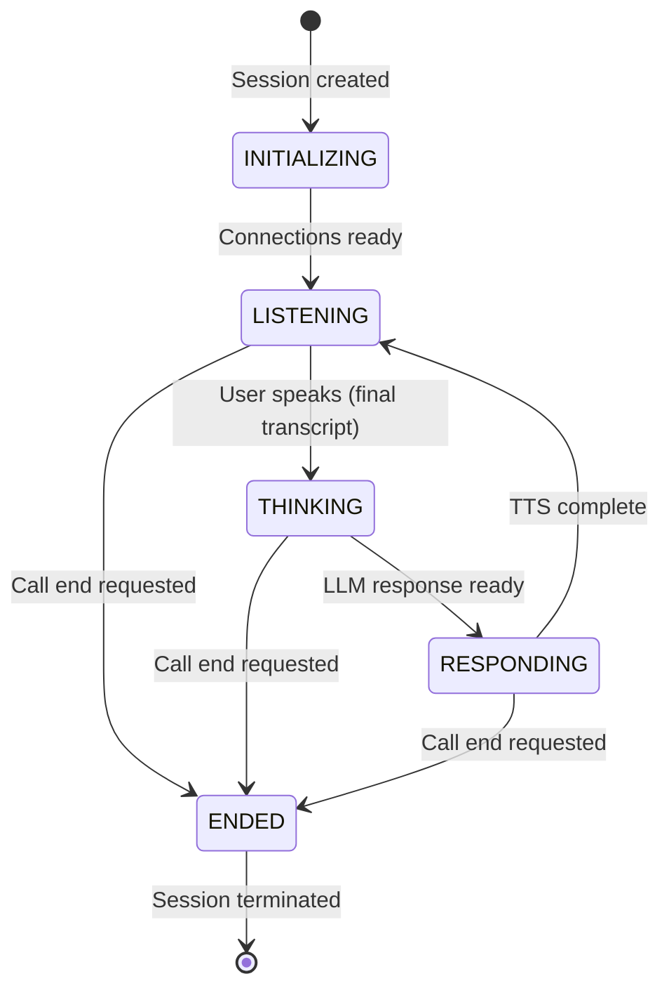
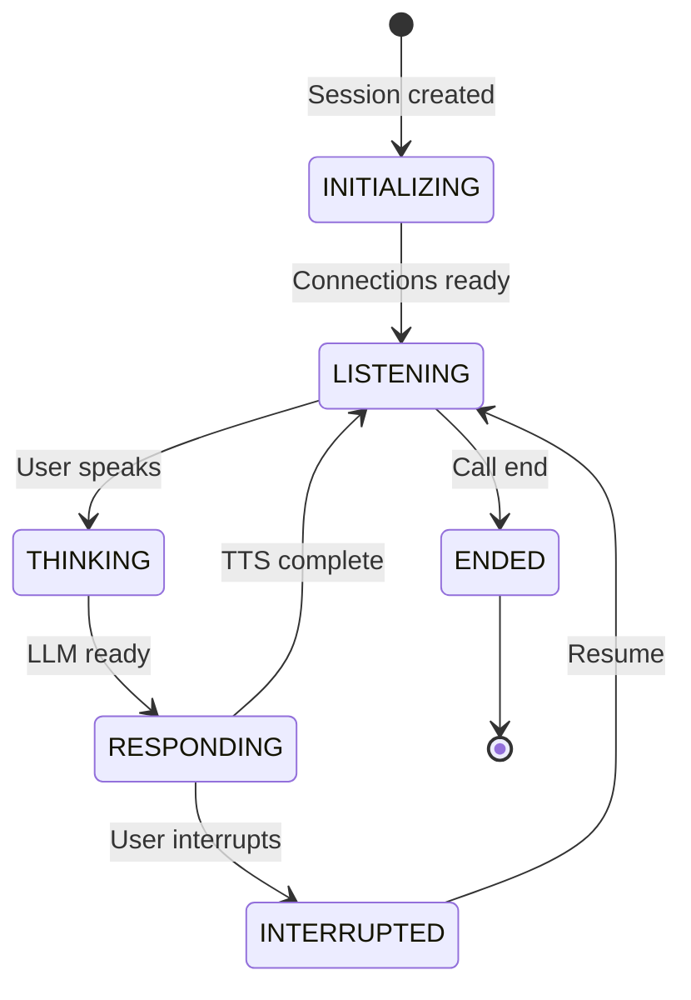

# Conversation State Machine

**Version**: 1.0.0
**Last Updated**: 2024-12-27
**Status**: Active

Complete state machine specification for conversation flow in the Vantum backend.

## Overview

The conversation flow is modeled as a state machine to clearly define valid transitions and handle edge cases. This ensures predictable behavior and makes the system easier to reason about, test, and debug.

**Related Documents**:
- [Data Models](./data-models.md) - ConversationState enum definition
- [Architecture Overview](./architecture.md) - System architecture
- [External Services](../integrations/external-services.md) - STT/LLM/TTS integrations

---

## State Diagram

### Normal Flow



### With Interruption



### ASCII Diagram (Complete Flow)

```
┌─────────────┐
│ INITIALIZING│
└──────┬──────┘
       │ Connections established
       ▼
┌─────────────┐
│  LISTENING  │◄────┐
└──────┬──────┘     │
       │ User       │
       │ speaks     │
       ▼            │
┌─────────────┐    │
│  THINKING   │    │
└──────┬──────┘    │
       │ LLM       │
       │ responds  │
       ▼            │
┌─────────────┐    │
│ RESPONDING  │    │
└──────┬──────┘    │
       │            │
       │ TTS        │
       │ complete   │
       └────────────┘

       (Interruption Path)

┌─────────────┐
│ RESPONDING  │
└──────┬──────┘
       │ User interrupts
       ▼
┌─────────────┐
│ INTERRUPTED │
└──────┬──────┘
       │ Cancel TTS
       │ Preserve history
       ▼
┌─────────────┐
│  LISTENING  │
└─────────────┘

       (Call End)

Any state ──▶ ┌────────┐ ──▶ ┌────────┐
              │ ENDING │     │ ENDED  │
              └────────┘     └────────┘
```

---

## State Definitions

### INITIALIZING

**Purpose**: Set up all connections and resources

**Entry Conditions**:
- Session created
- WebSocket connection established
- Server generated and sent sessionId to client

**Actions**:
- Initialize Deepgram WebSocket connection
- Load conversation configuration (LLM model, TTS voice, system prompt)
- Create conversation context
- Initialize audio resampler (48kHz → 16kHz or 8kHz → 16kHz)

**Exit Conditions**:
- All connections ready → transition to **LISTENING**
- Setup failure → transition to **ENDED**

**Typical Duration**: 500ms - 2s

---

### LISTENING

**Purpose**: Wait for user to speak

**Entry Conditions**:
- Coming from INITIALIZING (first time)
- Coming from RESPONDING (after AI finished speaking)
- Coming from INTERRUPTED (after cancelling AI response)

**Actions**:
- Stream audio to Deepgram (via AudioResamplerService)
- Receive interim transcripts (log but don't act on them)
- Wait for final transcript
- Monitor Voice Activity Detection (VAD) threshold

**Exit Conditions**:
- Final transcript received → transition to **THINKING**
- Call end requested → transition to **ENDED**

**Edge Cases**:
- Background noise: Ignore if below VAD threshold
- Long silence: Maintain LISTENING state, don't force transition

**Typical Duration**: Variable (user-dependent)

---

### THINKING

**Purpose**: Process user input and generate AI response

**Entry Conditions**:
- Coming from LISTENING with final transcript

**Actions**:
- Add user message to conversation context
- Send conversation context to LLM (OpenAI GPT-4)
- Stream LLM tokens as they arrive
- Accumulate complete response
- **Note**: Audio streaming to STT is paused during this state

**Exit Conditions**:
- LLM response complete → transition to **RESPONDING**
- LLM error → send error to client, transition to **LISTENING**
- Call end requested → transition to **ENDED**

**Edge Cases**:
- LLM timeout: Use fallback response
- LLM rate limit: Queue and retry, notify client
- Empty response: Generate default response

**Typical Duration**: 500ms - 3s

---

### RESPONDING

**Purpose**: Play AI-generated audio response

**Entry Conditions**:
- Coming from THINKING with LLM response ready

**Actions**:
- Convert LLM response text to speech (Cartesia)
- Stream TTS audio chunks to client
- Monitor for user interruption (VAD threshold exceeded)
- Add assistant message to conversation context

**Exit Conditions**:
- TTS playback complete → transition to **LISTENING**
- User interrupts (starts speaking) → transition to **INTERRUPTED**
- Call end requested → transition to **ENDED**

**Interruption Detection**:
- Monitor Deepgram for user speech during TTS
- Use VAD threshold to distinguish speech from noise
- React immediately on detection

**Typical Duration**: 2s - 10s (depending on response length)

---

### INTERRUPTED

**Purpose**: Handle user interruption gracefully

**Entry Conditions**:
- Coming from RESPONDING when user starts speaking

**Actions**:
- Cancel ongoing TTS immediately
- Stop audio playback on client
- Mark interrupted message in conversation history with `interrupted: true`
- Clean up TTS resources
- Preserve conversation context (don't remove interrupted message)

**Exit Conditions**:
- Cleanup complete → transition to **LISTENING**

**Rationale**:
- Maintaining interrupted message in history helps AI understand context
- Immediate cancellation provides responsive UX
- User can interject without losing conversation flow

**Typical Duration**: <100ms

**Example**:
```typescript
// Conversation history after interruption
[
  { role: 'user', content: 'Tell me about your product.' },
  { role: 'assistant', content: 'Our product has three main features—', interrupted: true },
  { role: 'user', content: 'Actually, just tell me the price.' },
  { role: 'assistant', content: 'The pricing starts at $99 per month.' }
]
```

---

### ENDED

**Purpose**: Terminal state, session closed

**Entry Conditions**:
- User requested call end
- System detected disconnect
- Error requiring session termination

**Actions**:
- Close Deepgram connection
- Close LLM streaming (if active)
- Cancel TTS (if active)
- Save conversation history (future: to database)
- Calculate call duration and metrics
- Remove session from SessionService
- Release all resources
- Log final metrics

**Exit Conditions**:
- None (terminal state)

**Cleanup Tasks**:
- WebSocket connection closed
- Deepgram connection closed
- Audio resampler resources released
- Conversation context stored
- Session removed from memory

**Typical Duration**: <500ms

---

## State Transition Table

| From State    | Event                    | To State    | Actions                                      | Validation                          |
|---------------|--------------------------|-------------|----------------------------------------------|-------------------------------------|
| INITIALIZING  | Connections ready        | LISTENING   | Start listening for audio                    | All connections established         |
| INITIALIZING  | Setup failure            | ENDED       | Log error, cleanup                           | None                                |
| LISTENING     | Final transcript         | THINKING    | Send transcript to LLM                       | Transcript non-empty                |
| LISTENING     | Call end                 | ENDED       | Cleanup                                      | None                                |
| THINKING      | LLM response ready       | RESPONDING  | Start TTS generation                         | Response non-empty                  |
| THINKING      | LLM error                | LISTENING   | Send error to client                         | None                                |
| THINKING      | Call end                 | ENDED       | Cleanup                                      | None                                |
| RESPONDING    | TTS complete             | LISTENING   | Resume listening                             | All audio sent                      |
| RESPONDING    | User interrupts          | INTERRUPTED | Cancel TTS                                   | VAD threshold exceeded              |
| RESPONDING    | Call end                 | ENDED       | Cleanup                                      | None                                |
| INTERRUPTED   | Cleanup complete         | LISTENING   | Resume listening, preserve history           | Resources released                  |
| Any state     | Disconnect               | ENDED       | Force cleanup                                | None                                |

---

## Implementation Guide

### State Machine Service

```typescript
enum ConversationState {
  INITIALIZING = 'INITIALIZING',
  LISTENING = 'LISTENING',
  THINKING = 'THINKING',
  RESPONDING = 'RESPONDING',
  INTERRUPTED = 'INTERRUPTED',
  ENDED = 'ENDED',
}

class ConversationStateMachine {
  private state: ConversationState = ConversationState.INITIALIZING;
  private sessionId: string;

  constructor(sessionId: string) {
    this.sessionId = sessionId;
  }

  /**
   * Get current state
   */
  getState(): ConversationState {
    return this.state;
  }

  /**
   * Transition to new state with validation
   */
  transition(newState: ConversationState): void {
    // Validate transition
    if (!this.isValidTransition(this.state, newState)) {
      throw new Error(
        `Invalid state transition: ${this.state} → ${newState} for session ${this.sessionId}`
      );
    }

    // Log transition
    logger.info('State transition', {
      from: this.state,
      to: newState,
      sessionId: this.sessionId,
      timestamp: Date.now(),
    });

    // Update state
    const previousState = this.state;
    this.state = newState;

    // Execute state-specific actions
    this.executeStateActions(newState, previousState);

    // Emit state change event (for monitoring/metrics)
    this.emitStateChangeEvent(previousState, newState);
  }

  /**
   * Check if transition is valid
   */
  private isValidTransition(from: ConversationState, to: ConversationState): boolean {
    const validTransitions: Record<ConversationState, ConversationState[]> = {
      [ConversationState.INITIALIZING]: [
        ConversationState.LISTENING,
        ConversationState.ENDED,
      ],
      [ConversationState.LISTENING]: [
        ConversationState.THINKING,
        ConversationState.ENDED,
      ],
      [ConversationState.THINKING]: [
        ConversationState.RESPONDING,
        ConversationState.LISTENING, // On error
        ConversationState.ENDED,
      ],
      [ConversationState.RESPONDING]: [
        ConversationState.LISTENING,
        ConversationState.INTERRUPTED,
        ConversationState.ENDED,
      ],
      [ConversationState.INTERRUPTED]: [
        ConversationState.LISTENING,
        ConversationState.ENDED,
      ],
      [ConversationState.ENDED]: [],
    };

    return validTransitions[from]?.includes(to) ?? false;
  }

  /**
   * Execute actions for new state
   */
  private executeStateActions(newState: ConversationState, previousState: ConversationState): void {
    switch (newState) {
      case ConversationState.INITIALIZING:
        // No actions needed (initial state)
        break;

      case ConversationState.LISTENING:
        this.onEnterListening(previousState);
        break;

      case ConversationState.THINKING:
        this.onEnterThinking();
        break;

      case ConversationState.RESPONDING:
        this.onEnterResponding();
        break;

      case ConversationState.INTERRUPTED:
        this.onEnterInterrupted();
        break;

      case ConversationState.ENDED:
        this.onEnterEnded();
        break;
    }
  }

  /**
   * LISTENING state entry
   */
  private onEnterListening(previousState: ConversationState): void {
    logger.debug('Entering LISTENING state', { sessionId: this.sessionId });

    // Resume audio streaming to STT
    if (previousState === ConversationState.INTERRUPTED) {
      logger.info('Resuming after interruption', { sessionId: this.sessionId });
    }

    // Start monitoring for user speech
    // (Handled by AudioHandler + STTService)
  }

  /**
   * THINKING state entry
   */
  private onEnterThinking(): void {
    logger.debug('Entering THINKING state', { sessionId: this.sessionId });

    // Pause audio streaming to STT
    // Process user input with LLM
    // (Handled by LLMService)
  }

  /**
   * RESPONDING state entry
   */
  private onEnterResponding(): void {
    logger.debug('Entering RESPONDING state', { sessionId: this.sessionId });

    // Start TTS generation and playback
    // Monitor for interruption
    // (Handled by TTSService)
  }

  /**
   * INTERRUPTED state entry
   */
  private onEnterInterrupted(): void {
    logger.debug('Entering INTERRUPTED state', { sessionId: this.sessionId });

    // Cancel TTS immediately
    // Preserve interrupted message in history
    // Quickly transition back to LISTENING
  }

  /**
   * ENDED state entry
   */
  private onEnterEnded(): void {
    logger.info('Entering ENDED state', { sessionId: this.sessionId });

    // Cleanup all resources
    // Save conversation history
    // Calculate metrics
  }

  /**
   * Emit state change event for monitoring
   */
  private emitStateChangeEvent(from: ConversationState, to: ConversationState): void {
    // Send to WebSocket client for UI updates
    // Send to monitoring system for metrics
    // (Implementation depends on event system)
  }
}
```

### Usage Example

```typescript
// In ConversationService
class ConversationService {
  private stateMachine: ConversationStateMachine;

  async handleFinalTranscript(sessionId: string, transcript: string): Promise<void> {
    // Validate current state
    if (this.stateMachine.getState() !== ConversationState.LISTENING) {
      logger.warn('Received transcript in wrong state', {
        sessionId,
        currentState: this.stateMachine.getState(),
      });
      return;
    }

    // Transition to THINKING
    this.stateMachine.transition(ConversationState.THINKING);

    // Process with LLM
    try {
      const response = await this.llmService.generateResponse(sessionId, transcript);

      // Transition to RESPONDING
      this.stateMachine.transition(ConversationState.RESPONDING);

      // Generate TTS
      await this.ttsService.generateSpeech(sessionId, response);

      // Transition back to LISTENING when done
      this.stateMachine.transition(ConversationState.LISTENING);
    } catch (error) {
      logger.error('Error in conversation flow', { sessionId, error });

      // On error, return to LISTENING
      this.stateMachine.transition(ConversationState.LISTENING);
    }
  }

  async handleUserInterruption(sessionId: string): Promise<void> {
    // Only handle if currently responding
    if (this.stateMachine.getState() !== ConversationState.RESPONDING) {
      return;
    }

    // Transition to INTERRUPTED
    this.stateMachine.transition(ConversationState.INTERRUPTED);

    // Cancel TTS
    await this.ttsService.cancelSpeech(sessionId);

    // Quickly transition back to LISTENING
    this.stateMachine.transition(ConversationState.LISTENING);
  }
}
```

---

## Interruption Handling Strategy

### Detection

**Voice Activity Detection (VAD)**:
- Monitor Deepgram for user speech during RESPONDING state
- Use VAD confidence threshold (e.g., > 0.7)
- Distinguish intentional speech from background noise
- Ignore brief sounds (< 200ms)

### Immediate Action

When interruption detected:
1. **Cancel TTS**: Stop generating/streaming audio immediately
2. **Stop Playback**: Send cancel message to client
3. **Transition**: Move to INTERRUPTED state

### History Preservation

**Critical Design Decision**: Keep interrupted message in conversation history

**Rationale**:
- Maintains conversation coherence
- AI can reference what it was saying
- User's interruption makes more sense in context

**Example**:
```typescript
// Conversation history
[
  { role: 'user', content: 'What are your features?' },
  {
    role: 'assistant',
    content: 'We have three main features: first—',
    interrupted: true,
    metadata: {
      utteranceId: '...',
      interruptedAt: Date.now(),
    }
  },
  { role: 'user', content: 'Never mind, just tell me the price.' },
  { role: 'assistant', content: 'Our pricing starts at $99/month.' }
]
```

### Resume Flow

After interruption:
1. Transition to LISTENING immediately (<100ms)
2. Process new user input normally
3. LLM receives full context including interrupted message
4. AI can acknowledge interruption if appropriate

---

## Edge Cases

### Rapid State Changes

**Scenario**: User interrupts multiple times quickly

**Handling**:
- Each interruption cancels current TTS
- State machine prevents invalid transitions
- Conversation history maintains all partial responses

### Network Disconnection During State

**Scenario**: WebSocket drops during RESPONDING

**Handling**:
- Detect disconnect immediately
- Force transition to ENDED
- Cleanup all resources
- Log state at disconnect for debugging

### LLM Timeout

**Scenario**: LLM takes too long (> 30s)

**Handling**:
- Timeout in THINKING state
- Fallback response: "I'm having trouble processing that. Could you rephrase?"
- Transition to RESPONDING with fallback
- Log timeout for monitoring

### Empty Transcript

**Scenario**: Final transcript is empty or just noise

**Handling**:
- Validate transcript before transitioning to THINKING
- If invalid, stay in LISTENING
- Send user-friendly message: "I didn't catch that, could you repeat?"

---

## Testing Strategy

### Unit Tests

```typescript
describe('ConversationStateMachine', () => {
  let stateMachine: ConversationStateMachine;

  beforeEach(() => {
    stateMachine = new ConversationStateMachine('test-session-id');
  });

  it('should start in INITIALIZING state', () => {
    expect(stateMachine.getState()).toBe(ConversationState.INITIALIZING);
  });

  it('should allow INITIALIZING → LISTENING transition', () => {
    expect(() => {
      stateMachine.transition(ConversationState.LISTENING);
    }).not.toThrow();
    expect(stateMachine.getState()).toBe(ConversationState.LISTENING);
  });

  it('should reject invalid transition INITIALIZING → THINKING', () => {
    expect(() => {
      stateMachine.transition(ConversationState.THINKING);
    }).toThrow('Invalid state transition');
  });

  it('should handle interruption flow correctly', () => {
    stateMachine.transition(ConversationState.LISTENING);
    stateMachine.transition(ConversationState.THINKING);
    stateMachine.transition(ConversationState.RESPONDING);

    // User interrupts
    expect(() => {
      stateMachine.transition(ConversationState.INTERRUPTED);
    }).not.toThrow();

    expect(stateMachine.getState()).toBe(ConversationState.INTERRUPTED);

    // Resume listening
    stateMachine.transition(ConversationState.LISTENING);
    expect(stateMachine.getState()).toBe(ConversationState.LISTENING);
  });
});
```

### Integration Tests

Test complete flows:
- Normal conversation (LISTENING → THINKING → RESPONDING → LISTENING)
- Interruption flow (RESPONDING → INTERRUPTED → LISTENING)
- Error recovery (THINKING → LISTENING on LLM error)
- Graceful shutdown (Any state → ENDED)

---

## Monitoring & Metrics

### State Duration Tracking

Track time spent in each state:
```typescript
const stateMetrics = {
  INITIALIZING: [], // Array of durations
  LISTENING: [],
  THINKING: [],
  RESPONDING: [],
  INTERRUPTED: [],
};
```

### State Transition Logging

Log all transitions for debugging:
```typescript
logger.info('State transition', {
  sessionId,
  from: previousState,
  to: newState,
  timestamp: Date.now(),
  duration: timeSinceLastTransition,
});
```

### Alert Thresholds

- THINKING > 5s → Alert (LLM slow)
- RESPONDING > 15s → Alert (TTS too long)
- INTERRUPTED count > 5 per session → Alert (UX issue)

---

## Related Documents

- [Data Models](./data-models.md) - ConversationState enum and Session model
- [Architecture Overview](./architecture.md) - System architecture
- [External Services](../integrations/external-services.md) - STT/LLM/TTS configuration
- [Scalability](./scalability.md) - Performance considerations

---

**This document is the single source of truth for conversation state management in the Vantum project. All implementations must follow these state transition rules exactly.**
