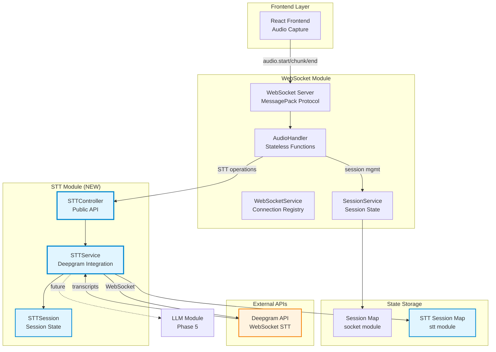
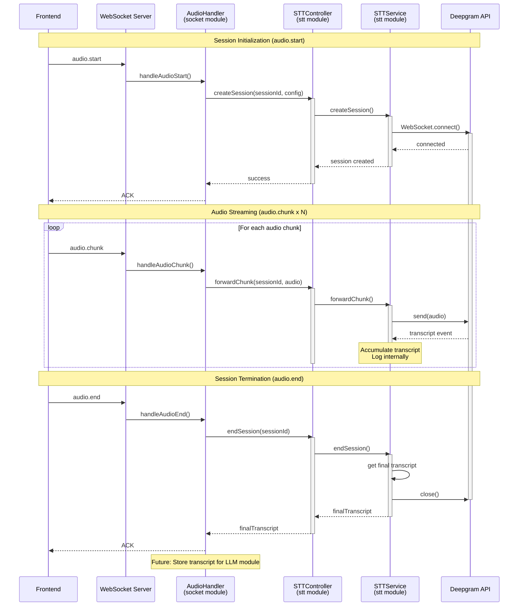
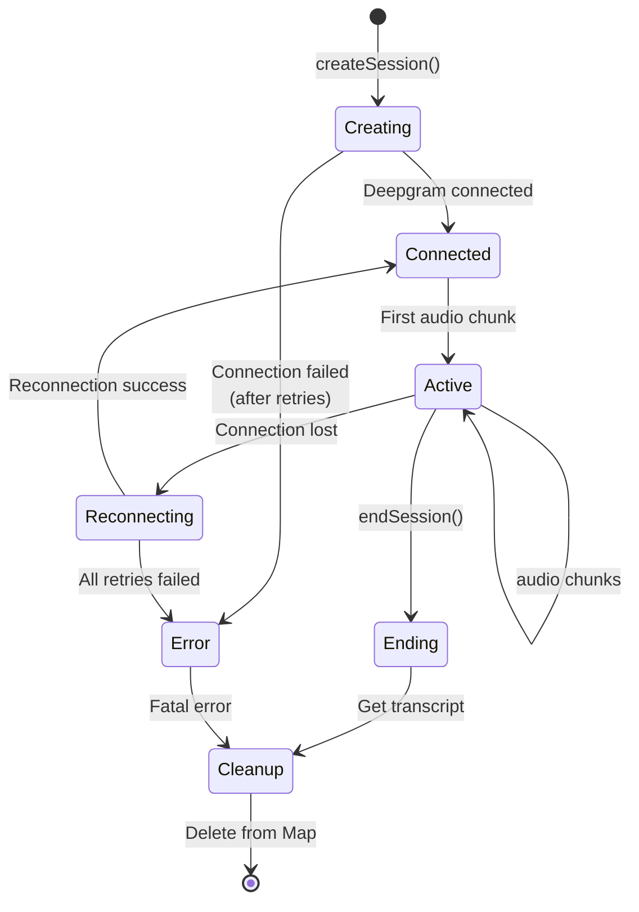

# Deepgram STT Integration - Architecture Design Specification

**Version**: 2.0.0
**Last Updated**: 2024-12-24
**Status**: Design Phase (REVISED - STT as Separate Module)
**Author**: @architect

---

## Table of Contents

1. [Overview](#overview)
2. [System Architecture](#system-architecture)
3. [Module Structure](#module-structure)
4. [Component Design](#component-design)
5. [Data Flow](#data-flow)
6. [State Management](#state-management)
7. [Error Handling Strategy](#error-handling-strategy)
8. [API Contracts](#api-contracts)
9. [Implementation Plan](#implementation-plan)
10. [Testing Strategy](#testing-strategy)
11. [Deployment & Rollback](#deployment--rollback)

---

## Overview

### Purpose

This document specifies the architecture for integrating Deepgram's real-time Speech-to-Text (STT) service into the Vantum backend as **an independent module**. This is Phase 4 of the implementation plan and forms the foundation for the complete AI voice pipeline (STT → LLM → TTS).

### Goals

1. **Real-time Transcription**: Stream audio chunks to Deepgram and receive transcriptions in real-time
2. **Stateful Session Management**: Maintain 1:1 mapping between Vantum sessions and Deepgram WebSocket connections
3. **Robust Error Handling**: Implement hybrid retry strategy with graceful degradation
4. **Production-Ready**: Handle edge cases, memory management, and graceful shutdown
5. **Extensible Design**: Enable future LLM integration with accumulated transcripts
6. **Modular Architecture**: STT as a completely separate, independent module

### Non-Goals

1. Not implementing VAD (Voice Activity Detection) in this phase
2. Not sending transcript events to frontend (no UI for captions yet)
3. Not implementing circuit breaker pattern (future enhancement)
4. Not implementing Redis persistence (local Map only for POC)

---

## System Architecture

### High-Level Architecture Diagram



### Module Boundaries & Separation of Concerns

| Module | Responsibilities | Does NOT Handle |
|--------|------------------|-----------------|
| **socket** | WebSocket connections, MessagePack protocol, Audio event handling, Session lifecycle | STT integration, Deepgram connections, Transcription logic |
| **stt** | Deepgram WebSocket management, Transcription accumulation, STT-specific error handling, Retry logic | WebSocket protocol, Client connections, Audio event routing |

### Integration Points (Cross-Module Communication)

| Source Module | Target Module | Integration Method | Data Flow |
|---------------|---------------|-------------------|-----------|
| **socket (AudioHandler)** → **stt (STTController)** | Direct import + function call | `createSession()`, `forwardChunk()`, `endSession()` |
| **stt** → **socket (SessionService)** | Read-only access (optional validation) | `getSessionBySessionId()` for validation |
| **Deepgram API** → **stt (STTService)** | Event listeners | `transcript`, `error`, `close`, `metadata` events |

**Key Design Principle**:
- **socket module** owns client WebSocket connections and audio event routing
- **stt module** owns Deepgram WebSocket connections and transcription logic
- Clean separation with minimal coupling through well-defined API contracts

---

## Module Structure

### New STT Module Organization

```
vantum-backend/
├── src/
│   ├── modules/
│   │   ├── socket/              # EXISTING - WebSocket & Audio Handling
│   │   │   ├── handlers/
│   │   │   │   ├── audio.handler.ts      # MODIFIED: Calls STT module
│   │   │   │   ├── message.handler.ts    # EXISTING
│   │   │   │   └── error.handler.ts      # EXISTING
│   │   │   ├── services/
│   │   │   │   ├── session.service.ts    # EXISTING
│   │   │   │   ├── websocket.service.ts  # EXISTING
│   │   │   │   ├── audio-buffer.service.ts # EXISTING (echo testing)
│   │   │   │   └── index.ts              # EXISTING
│   │   │   ├── utils/
│   │   │   │   ├── MessagePackHelper.ts  # EXISTING
│   │   │   │   └── WebSocketUtils.ts     # EXISTING
│   │   │   ├── types/
│   │   │   │   ├── session.ts            # EXISTING
│   │   │   │   ├── socket.ts             # EXISTING
│   │   │   │   └── index.ts              # EXISTING
│   │   │   └── index.ts
│   │   │
│   │   └── stt/                 # NEW MODULE - Speech-to-Text
│   │       ├── services/
│   │       │   ├── stt.service.ts        # Core STT service
│   │       │   ├── stt-session.service.ts # Session state management
│   │       │   └── index.ts              # Export all services
│   │       ├── controllers/
│   │       │   ├── stt.controller.ts     # Public API for socket module
│   │       │   └── index.ts              # Export all controllers
│   │       ├── config/
│   │       │   ├── deepgram.config.ts    # Deepgram configuration
│   │       │   ├── retry.config.ts       # Retry policies
│   │       │   ├── timeout.config.ts     # Timeout values
│   │       │   └── index.ts              # Export all configs
│   │       ├── types/
│   │       │   ├── stt-session.types.ts  # Session state types
│   │       │   ├── transcript.types.ts   # Transcript types
│   │       │   ├── error.types.ts        # STT-specific errors
│   │       │   └── index.ts              # Export all types
│   │       ├── utils/
│   │       │   ├── audio-validator.ts    # Audio format validation
│   │       │   ├── error-classifier.ts   # Error classification logic
│   │       │   └── index.ts              # Export all utils
│   │       └── index.ts                  # Public module exports
│   │
│   └── shared/                  # EXISTING - Shared utilities
│       └── utils/
│           └── logger.ts
│
├── tests/
│   ├── modules/
│   │   ├── socket/              # EXISTING
│   │   └── stt/                 # NEW - STT tests
│   │       ├── services/
│   │       │   ├── stt.service.test.ts
│   │       │   └── stt-session.service.test.ts
│   │       ├── controllers/
│   │       │   └── stt.controller.test.ts
│   │       └── integration/
│   │           └── stt-flow.test.ts
│
└── docs/
    └── modules/
        └── stt/                 # NEW - STT documentation
            ├── README.md
            ├── api.md
            └── architecture.md
```

### Module Exports (Public API)

**socket module** (`src/modules/socket/index.ts`):
```typescript
// EXISTING - No changes needed
export * from './services';
export * from './handlers';
export * from './types';
export * from './utils';
```

**stt module** (`src/modules/stt/index.ts`):
```typescript
// NEW - Public API for other modules
export { sttController } from './controllers';
export type {
  STTSessionState,
  TranscriptSegment,
  STTConfig,
  STTMetrics,
} from './types';
```

**Key Point**: Socket module imports **only** from `stt/index.ts` (public API), never from internal stt files.

---

## Component Design

### 1. STTController (Public API Gateway)

**File**: `/vantum-backend/src/modules/stt/controllers/stt.controller.ts`

**Purpose**: Provides a clean, stable API for the socket module to interact with STT functionality. Abstracts internal implementation details.

**Responsibilities**:
- Expose public API for session management (`createSession`, `endSession`, `forwardChunk`)
- Validate input parameters
- Handle cross-module error translation
- Delegate to STTService for actual implementation
- Provide metrics and health checks

**Key Methods**:

```typescript
class STTController {
  // Session Lifecycle (Called by socket module)
  async createSession(sessionId: string, config: STTConfig): Promise<void>
  async endSession(sessionId: string): Promise<string> // Returns final transcript
  async forwardChunk(sessionId: string, audioChunk: Uint8Array): Promise<void>

  // Health & Monitoring (Called by socket module or monitoring)
  getMetrics(): STTServiceMetrics
  getSessionMetrics(sessionId: string): STTSessionMetrics | undefined
  isHealthy(): boolean

  // Lifecycle (Called by main server)
  async shutdown(): Promise<void>
}
```

**Implementation Pattern**:
```typescript
import { sttService } from '../services';
import { logger } from '@/shared/utils';
import type { STTConfig } from '../types';

class STTController {
  async createSession(sessionId: string, config: STTConfig): Promise<void> {
    try {
      // Input validation
      if (!sessionId || !config) {
        throw new Error('Invalid input: sessionId and config are required');
      }

      // Delegate to service
      await sttService.createSession(sessionId, config);

      logger.info('STT session created via controller', { sessionId });
    } catch (error) {
      logger.error('STT controller: Failed to create session', { sessionId, error });
      throw error; // Propagate to caller
    }
  }

  async forwardChunk(sessionId: string, audioChunk: Uint8Array): Promise<void> {
    // Input validation
    if (!sessionId || !audioChunk || audioChunk.length === 0) {
      logger.warn('STT controller: Invalid chunk', { sessionId });
      return;
    }

    // Delegate to service (non-blocking, fire-and-forget)
    await sttService.forwardChunk(sessionId, audioChunk);
  }

  async endSession(sessionId: string): Promise<string> {
    try {
      const transcript = await sttService.endSession(sessionId);
      logger.info('STT session ended via controller', { sessionId });
      return transcript;
    } catch (error) {
      logger.error('STT controller: Failed to end session', { sessionId, error });
      return ''; // Graceful degradation
    }
  }

  getMetrics() {
    return sttService.getMetrics();
  }

  getSessionMetrics(sessionId: string) {
    return sttService.getSessionMetrics(sessionId);
  }

  isHealthy(): boolean {
    return sttService.isHealthy();
  }

  async shutdown(): Promise<void> {
    await sttService.shutdown();
  }
}

// Export singleton instance
export const sttController = new STTController();
```

**Dependencies**:
- `sttService` (internal to stt module)
- `logger` (shared utility)

---

### 2. STTService (Core Business Logic)

**File**: `/vantum-backend/src/modules/stt/services/stt.service.ts`

**Purpose**: Internal service that manages Deepgram WebSocket connections and transcript accumulation. Not directly accessible outside the stt module.

**Responsibilities**:
- Manage lifecycle of Deepgram WebSocket connections (1:1 with sessions)
- Forward audio chunks to Deepgram
- Accumulate transcripts for future LLM integration
- Implement hybrid retry strategy for connection failures
- Handle transparent reconnection on mid-stream disconnects
- Manage memory with periodic cleanup of stale sessions

**Key Methods**:

```typescript
class STTService {
  // Session Management (Called by STTController)
  async createSession(sessionId: string, config: STTConfig): Promise<void>
  async endSession(sessionId: string): Promise<string>
  async forwardChunk(sessionId: string, audioChunk: Uint8Array): Promise<void>

  // Connection Management (Private)
  private async connectToDeepgram(config: DeepgramConfig): Promise<LiveTranscriptionEvents>
  private async handleReconnection(sessionId: string): Promise<void>
  private shouldRetry(error: DeepgramError): boolean
  private getRetryDelays(error: DeepgramError): number[]

  // Transcript Handling (Private)
  private handleTranscriptUpdate(sessionId: string, transcript: DeepgramTranscript): void
  private handleDeepgramError(sessionId: string, error: DeepgramError): void

  // Lifecycle Management (Private)
  private startCleanupTimer(): void
  private cleanupStaleSessions(): void
  async shutdown(): Promise<void>

  // Metrics & Health (Called by STTController)
  getMetrics(): STTServiceMetrics
  getSessionMetrics(sessionId: string): STTSessionMetrics | undefined
  isHealthy(): boolean
}
```

**State Management**:
```typescript
// Internal state (private to stt module)
private sessions = new Map<string, STTSession>();
private cleanupTimer?: NodeJS.Timeout;
private readonly apiKey: string;

// Configuration constants
private readonly MAX_TRANSCRIPT_LENGTH = 50000;
private readonly SESSION_TIMEOUT_MS = 3600000;
private readonly INACTIVITY_TIMEOUT_MS = 300000;
private readonly CLEANUP_INTERVAL_MS = 300000;
```

**Dependencies**:
- `@deepgram/sdk` - Official Deepgram SDK
- `STTSessionService` - Session state management
- `DeepgramConfig` - Configuration
- `logger` - Shared utility

---

### 3. STTSessionService (Session State Management)

**File**: `/vantum-backend/src/modules/stt/services/stt-session.service.ts`

**Purpose**: Manages the state of individual STT sessions. Encapsulates session lifecycle and transcript accumulation.

**Responsibilities**:
- Create and manage STTSession instances
- Store session state in Map
- Provide session lookup methods
- Handle session cleanup

**Key Methods**:

```typescript
class STTSessionService {
  private sessions = new Map<string, STTSession>();

  // Session CRUD
  createSession(sessionId: string, connectionId: string, config: STTConfig): STTSession
  getSession(sessionId: string): STTSession | undefined
  hasSession(sessionId: string): boolean
  deleteSession(sessionId: string): void

  // Bulk Operations
  getAllSessions(): STTSession[]
  getSessionCount(): number

  // Cleanup
  cleanup(): void
}
```

**STTSession Class**:

```typescript
export class STTSession {
  // Core Identifiers
  sessionId: string;
  connectionId: string;

  // Deepgram Connection
  deepgramLiveClient: LiveTranscriptionEvents | null;
  connectionState: 'connecting' | 'connected' | 'disconnected' | 'error';

  // Transcript Accumulation
  accumulatedTranscript: string;
  interimTranscript: string;
  lastTranscriptTime: number;
  transcriptSegments: TranscriptSegment[];

  // Config
  config: {
    samplingRate: number;
    language: string;
    model: string;
  };

  // Retry State
  retryCount: number;
  lastRetryTime: number;
  reconnectAttempts: number;

  // Lifecycle
  createdAt: number;
  lastActivityAt: number;
  isActive: boolean;

  // Metrics
  metrics: {
    chunksReceived: number;
    chunksForwarded: number;
    transcriptsReceived: number;
    errors: number;
    reconnections: number;
  };

  constructor(sessionId: string, connectionId: string, config: STTConfig)

  // Utility Methods
  touch(): void
  addTranscript(text: string, confidence: number, isFinal: boolean): void
  getFinalTranscript(): string
  getDuration(): number
  getInactivityDuration(): number
  cleanup(): void
}
```

---

### 4. Configuration Modules

**File**: `/vantum-backend/src/modules/stt/config/deepgram.config.ts`

```typescript
export const DEEPGRAM_CONFIG = {
  model: 'nova-2' as const,
  language: 'en-US' as const,
  smart_format: true,
  interim_results: true,
  endpointing: false,
  utterances: false,
  encoding: 'linear16' as const,
  sample_rate: 16000,
  channels: 1,
  punctuate: true,
  diarize: false,
  alternatives: 1,
} as const;

export interface DeepgramConfig {
  model: string;
  language: string;
  smart_format: boolean;
  interim_results: boolean;
  endpointing: boolean;
  utterances: boolean;
  encoding: string;
  sample_rate: number;
  channels: number;
  punctuate: boolean;
  diarize: boolean;
  alternatives: number;
}
```

**File**: `/vantum-backend/src/modules/stt/config/retry.config.ts`

```typescript
export const RETRY_CONFIG = {
  CONNECTION_RETRY_DELAYS: [0, 100, 1000, 3000, 5000],
  RECONNECTION_RETRY_DELAYS: [0, 100, 500],
  RATE_LIMIT_DELAYS: [5000, 10000, 20000],
  SERVICE_UNAVAILABLE_DELAYS: [1000, 3000, 5000],
  SERVER_ERROR_DELAYS: [0, 500, 1000],
  NETWORK_ERROR_DELAYS: [0, 100, 500],
} as const;
```

**File**: `/vantum-backend/src/modules/stt/config/timeout.config.ts`

```typescript
export const TIMEOUT_CONFIG = {
  CONNECTION_TIMEOUT_MS: 10000,
  MESSAGE_TIMEOUT_MS: 5000,
  SESSION_TIMEOUT_MS: 3600000,
  INACTIVITY_TIMEOUT_MS: 300000,
  CLEANUP_INTERVAL_MS: 300000,
} as const;
```

---

### 5. Handler Integration (Socket Module Changes)

**File**: `/vantum-backend/src/modules/socket/handlers/audio.handler.ts` (modifications)

**Changes Required**:

```typescript
// Add import for STT controller (public API only)
import { sttController } from '@/modules/stt';

// Add environment flag
const USE_STT = !!process.env.DEEPGRAM_API_KEY;

// In handleAudioStart - ADD THIS BLOCK
if (USE_STT) {
  // NEW: Initialize STT session via controller
  await sttController.createSession(session.sessionId, {
    sessionId: session.sessionId,
    connectionId,
    samplingRate,
    language: payload.language || 'en-US',
  });
  logger.info('STT session initialized', { sessionId: session.sessionId });
} else {
  // LEGACY: Echo testing
  audioBufferService.initializeBuffer(session.sessionId, samplingRate, startEventId);
  logger.info('Echo buffer initialized', { sessionId: session.sessionId });
}

// In handleAudioChunk - ADD THIS BLOCK
if (USE_STT) {
  // NEW: Forward to STT controller
  if (!isMuted) {
    await sttController.forwardChunk(session.sessionId, audioChunk);
  }
} else {
  // LEGACY: Buffer for echo
  if (!isMuted) {
    audioBufferService.addChunk(session.sessionId, audioChunk);
  }
}

// In handleAudioEnd - ADD THIS BLOCK
if (USE_STT) {
  // NEW: End STT session via controller and get final transcript
  const finalTranscript = await sttController.endSession(session.sessionId);
  logger.info('STT session ended', {
    sessionId: session.sessionId,
    transcriptLength: finalTranscript.length,
  });
  // TODO: Store transcript for LLM (Phase 5)
} else {
  // LEGACY: Echo audio back
  await streamEchoedAudio(session.sessionId, samplingRate);
  audioBufferService.clearBuffer(session.sessionId);
}
```

**Key Points**:
- Handlers remain stateless (no state stored in handler functions)
- All STT state managed by `stt module`
- Import only from `@/modules/stt` (public API via barrel export)
- Never import from internal stt files (controllers, services, config)
- Environment flag (`USE_STT`) enables toggling between STT and echo mode
- Echo testing code preserved for parallel testing

---

## Data Flow

### Sequence Diagram: Complete STT Flow (Cross-Module)



### Module Communication Pattern

```
socket module (AudioHandler)
    ↓
    ↓ Import: import { sttController } from '@/modules/stt'
    ↓ Call: sttController.createSession(...)
    ↓
stt module (STTController) [PUBLIC API]
    ↓
    ↓ Internal delegation
    ↓
stt module (STTService) [PRIVATE]
    ↓
    ↓ WebSocket connection
    ↓
Deepgram API
```

**Key Architectural Principle**:
- **Inbound**: socket module → stt module (via STTController public API)
- **Outbound**: stt module → Deepgram API (via WebSocket)
- **No reverse dependency**: stt module never imports from socket module
- **Optional validation**: stt module MAY import SessionService for read-only validation (if needed)

---

## State Management

### Module-Level State Separation

| State | Owned By | Stored In | Accessed By |
|-------|----------|-----------|-------------|
| **WebSocket connections** | socket module | `WebSocketService.activeWebSockets` | socket handlers only |
| **Session metadata** | socket module | `SessionService.sessions` | socket handlers, optionally stt module (read-only) |
| **STT sessions** | stt module | `STTSessionService.sessions` | stt module only |
| **Deepgram connections** | stt module | `STTSession.deepgramLiveClient` | stt module only |
| **Transcripts** | stt module | `STTSession.accumulatedTranscript` | stt module only, returned via API |

### State Transition Diagram (STT Module Internal)



### Cross-Module State Coordination

**Scenario**: Session created in socket module, then STT session created
```typescript
// In socket module (AudioHandler)
const session = sessionService.createSession(socketId, metadata); // socket module state

// Later...
await sttController.createSession(session.sessionId, config); // stt module state

// Both modules now have state for the same logical session:
// - socket module: tracks WebSocket connection, session metadata
// - stt module: tracks Deepgram connection, transcript accumulation
```

**Cleanup Coordination**:
```typescript
// In socket module (disconnect handler)
async function handleDisconnect(socketId: string): void {
  const session = sessionService.getSessionBySocketId(socketId);

  if (session && USE_STT) {
    // Clean up STT module state
    await sttController.endSession(session.sessionId);
  }

  // Clean up socket module state
  sessionService.deleteSession(socketId);
  websocketService.removeConnection(session.sessionId);
}
```

**Key Point**: Both modules independently manage their own state, coordinated via sessionId. No shared state objects.

---

## Error Handling Strategy

### Error Classification Matrix

| Error Type | HTTP Code | Retry? | Strategy | Module Responsibility |
|------------|-----------|--------|----------|----------------------|
| **Fatal Errors** |||||
| Invalid API Key | 401 | No | Fail immediately | stt module logs, socket module receives error |
| Forbidden | 403 | No | Fail immediately | stt module logs, socket module receives error |
| Not Found | 404 | No | Fail immediately | stt module logs, socket module receives error |
| **Retryable Errors** |||||
| Rate Limit | 429 | Yes | Exponential backoff | stt module handles internally |
| Server Error | 500 | Yes | Fast retry | stt module handles internally |
| Bad Gateway | 502 | Yes | Fast retry | stt module handles internally |
| Service Unavailable | 503 | Yes | Moderate backoff | stt module handles internally |
| Gateway Timeout | 504 | Yes | Fast retry | stt module handles internally |
| Network Timeout | - | Yes | Fast retry | stt module handles internally |

### Error Handling Boundaries

**stt module (Internal Handling)**:
- Retry logic (transparent to socket module)
- Reconnection attempts (transparent to socket module)
- Transcript accumulation errors (logged internally)
- Deepgram API errors (logged, optionally propagated)

**socket module (Receives Errors)**:
- Fatal errors during session creation (propagated from sttController.createSession())
- Session not found errors
- Invalid audio format errors (if validation added)

**Error Propagation Pattern**:
```typescript
// In stt module (STTController)
async createSession(sessionId: string, config: STTConfig): Promise<void> {
  try {
    await sttService.createSession(sessionId, config);
  } catch (error) {
    logger.error('STT controller: Failed to create session', { sessionId, error });
    throw error; // Propagate to socket module
  }
}

// In socket module (AudioHandler)
try {
  await sttController.createSession(session.sessionId, config);
} catch (error) {
  logger.error('Failed to initialize STT session', { sessionId, error });
  sendError(ws, ErrorCode.STT_INIT_ERROR, 'Failed to initialize transcription', VOICECHAT_EVENTS.AUDIO_START, session.sessionId);
  return;
}
```

### Retry Strategy (stt module internal)

#### 1. Initial Connection (audio.start)

**Strategy**: Hybrid retry (fast then slow)

```typescript
// In STTService (stt module)
async connectToDeepgram(config: DeepgramConfig): Promise<LiveTranscriptionEvents> {
  const retryDelays = RETRY_CONFIG.CONNECTION_RETRY_DELAYS; // [0, 100, 1000, 3000, 5000]

  for (let attempt = 0; attempt < retryDelays.length; attempt++) {
    try {
      if (attempt > 0) {
        await sleep(retryDelays[attempt]);
        logger.info('Retrying Deepgram connection', { attempt });
      }

      const client = await this.createDeepgramConnection(config);
      logger.info('Deepgram connection established', { attempt });
      return client;

    } catch (error) {
      logger.warn('Deepgram connection failed', { attempt, error });

      if (!this.shouldRetry(error)) {
        throw error; // Fatal error, propagate to controller
      }

      if (attempt === retryDelays.length - 1) {
        throw new Error(`Failed to connect after ${retryDelays.length} attempts`);
      }
    }
  }
}
```

**Timing**: ~9.1s worst case (0ms + 100ms + 1s + 3s + 5s)

#### 2. Mid-Stream Disconnection (during streaming)

**Strategy**: Fast retries only (transparent to socket module)

```typescript
// In STTService (stt module)
private async handleReconnection(sessionId: string): Promise<void> {
  const session = this.sessionService.getSession(sessionId);
  if (!session || !session.isActive) return;

  const retryDelays = RETRY_CONFIG.RECONNECTION_RETRY_DELAYS; // [0, 100, 500]

  for (let attempt = 0; attempt < retryDelays.length; attempt++) {
    try {
      if (attempt > 0) {
        await sleep(retryDelays[attempt]);
      }

      logger.info('Attempting reconnection', { sessionId, attempt });

      const newClient = await this.createDeepgramConnection(session.config);
      session.deepgramLiveClient = newClient;
      session.connectionState = 'connected';
      session.metrics.reconnections++;

      logger.info('Reconnection successful', { sessionId, attempt });
      return; // Success, resume streaming

    } catch (error) {
      logger.warn('Reconnection failed', { sessionId, attempt, error });
    }
  }

  // All attempts failed - mark session as errored
  logger.error('Failed to reconnect, ending session', { sessionId });
  session.connectionState = 'error';
  session.isActive = false;
  // Session will be cleaned up by cleanup timer or explicit endSession call
}
```

**Timing**: ~600ms worst case (0ms + 100ms + 500ms)
**Data Loss**: <1 second of audio (acceptable for voice conversation)

---

## API Contracts

### STTController Public API (Cross-Module Interface)

**File**: `/vantum-backend/src/modules/stt/controllers/stt.controller.ts`

```typescript
export interface STTController {
  // Session Lifecycle
  createSession(sessionId: string, config: STTConfig): Promise<void>
  endSession(sessionId: string): Promise<string>
  forwardChunk(sessionId: string, audioChunk: Uint8Array): Promise<void>

  // Metrics & Health
  getMetrics(): STTServiceMetrics
  getSessionMetrics(sessionId: string): STTSessionMetrics | undefined
  isHealthy(): boolean

  // Lifecycle
  shutdown(): Promise<void>
}

export interface STTConfig {
  sessionId: string;
  connectionId: string;
  samplingRate: number;
  language?: string;
}

export interface STTServiceMetrics {
  activeSessions: number;
  totalChunksForwarded: number;
  totalTranscriptsReceived: number;
  totalErrors: number;
  totalReconnections: number;
}

export interface STTSessionMetrics {
  sessionId: string;
  duration: number;
  chunksForwarded: number;
  transcriptsReceived: number;
  reconnections: number;
  errors: number;
  finalTranscriptLength: number;
  connectionState: 'connecting' | 'connected' | 'disconnected' | 'error';
}
```

### Module Import Pattern (socket → stt)

```typescript
// In socket module files
// ✅ CORRECT: Import from module public API
import { sttController } from '@/modules/stt';
import type { STTConfig, STTMetrics } from '@/modules/stt';

// ❌ WRONG: Never import from internal stt files
import { STTService } from '@/modules/stt/services/stt.service'; // DON'T DO THIS
import { STTSession } from '@/modules/stt/services/stt-session.service'; // DON'T DO THIS
```

### Module Barrel Export (stt module)

**File**: `/vantum-backend/src/modules/stt/index.ts`

```typescript
// Public API - Only these are exposed to other modules
export { sttController } from './controllers';

// Public types - Only these are exposed
export type {
  STTConfig,
  STTServiceMetrics,
  STTSessionMetrics,
  STTSessionState,
  TranscriptSegment,
} from './types';

// Internal exports for testing only
export { STTService } from './services/stt.service';
export { STTSessionService } from './services/stt-session.service';
```

---

## Implementation Plan

### Phase 1: Module Structure & Core Service (Week 1)

**Tasks**:
1. **Create STT module structure**
   - Create `/src/modules/stt/` directory
   - Create subdirectories: `controllers/`, `services/`, `config/`, `types/`, `utils/`
   - Create barrel exports (`index.ts` files)

2. **Create configuration modules**
   - `config/deepgram.config.ts` - Deepgram settings
   - `config/retry.config.ts` - Retry policies
   - `config/timeout.config.ts` - Timeout values
   - `config/index.ts` - Export all configs

3. **Create type definitions**
   - `types/stt-session.types.ts` - STTSessionState interface
   - `types/transcript.types.ts` - TranscriptSegment interface
   - `types/error.types.ts` - STT error types
   - `types/index.ts` - Export all types

4. **Implement STTSessionService**
   - Create `services/stt-session.service.ts`
   - Implement STTSession class
   - Implement session CRUD operations
   - Add session Map management

5. **Implement basic STTService**
   - Create `services/stt.service.ts`
   - Implement session lifecycle methods
   - Implement basic Deepgram connection (no retry yet)
   - Implement transcript event handling

6. **Implement STTController**
   - Create `controllers/stt.controller.ts`
   - Implement public API methods
   - Add input validation
   - Delegate to STTService

7. **Integrate with socket module**
   - Update `socket/handlers/audio.handler.ts`
   - Add `import { sttController } from '@/modules/stt'`
   - Add environment flag check (`USE_STT`)
   - Call STTController methods in handlers
   - Keep echo testing parallel

**Deliverables**:
- STT module structure complete
- Basic STT integration working
- Transcripts logged to console
- No retry logic yet
- Tests: Basic smoke tests

**Success Criteria**:
- Audio streamed to Deepgram via stt module
- Transcripts received and logged
- Sessions created and cleaned up
- Socket module successfully calls stt module API

---

### Phase 2: Error Handling & Retry Logic (Week 2)

**Tasks**:
1. **Implement error classifier utility**
   - Create `utils/error-classifier.ts`
   - Implement `shouldRetry(error)` logic
   - Implement `getRetryDelays(error)` logic

2. **Implement hybrid retry strategy**
   - Update STTService.connectToDeepgram()
   - Add retry loops with configurable delays
   - Add error classification checks

3. **Implement transparent reconnection**
   - Add disconnect event listener
   - Implement handleReconnection() method
   - Add fast retry logic (0ms, 100ms, 500ms)
   - Update session state on reconnection

4. **Add timeout handling**
   - Connection timeout (10s)
   - Message timeout (5s)
   - Session timeout (1 hour)

5. **Comprehensive error logging**
   - Structured error logs with context
   - Metrics tracking (errors, reconnections)
   - Alert placeholders for monitoring

6. **Error propagation to socket module**
   - Fatal errors propagated from STTController
   - Socket module handles STT errors gracefully

**Deliverables**:
- Robust error handling
- Transparent reconnection
- Production-ready retry logic
- Comprehensive logging

**Success Criteria**:
- Survives transient failures
- Gracefully handles API errors
- Logs all failure scenarios
- Socket module receives appropriate errors

---

### Phase 3: Memory Management & Testing (Week 2-3)

**Tasks**:
1. **Implement cleanup timer**
   - Periodic stale session checks (5 minutes)
   - Session age checks (1 hour max)
   - Inactivity checks (5 minutes no audio)
   - Transcript size limits (50KB max)

2. **Implement graceful shutdown**
   - Close all Deepgram connections
   - Delete all sessions
   - Log final metrics

3. **Add monitoring metrics**
   - Session-level metrics (per session)
   - Service-level aggregates
   - Export via STTController.getMetrics()

4. **Write unit tests**
   - `stt.controller.test.ts` - Public API tests
   - `stt.service.test.ts` - Service logic tests
   - `stt-session.service.test.ts` - Session management tests

5. **Write integration tests**
   - `stt-flow.test.ts` - Full audio flow
   - Reconnection scenario tests
   - Cleanup behavior tests

6. **Write cross-module tests**
   - socket → stt integration tests
   - End-to-end audio flow tests

**Deliverables**:
- Automatic cleanup working
- Graceful shutdown
- Comprehensive metrics
- 80%+ test coverage

**Success Criteria**:
- No memory leaks
- Clean shutdown on SIGTERM
- Metrics available for monitoring
- All tests passing

---

### Phase 4: Documentation & Finalization (Week 3)

**Tasks**:
1. **Create module documentation**
   - `/docs/modules/stt/README.md` - Module overview
   - `/docs/modules/stt/api.md` - Public API documentation
   - `/docs/modules/stt/architecture.md` - Internal architecture

2. **Update existing documentation**
   - Update implementation plan
   - Update architecture docs
   - Update WebSocket protocol docs (if needed)

3. **Create developer guides**
   - How to use STT module from other modules
   - How to add new STT providers (future)
   - Troubleshooting guide

4. **Final code review**
   - Review all cross-module interactions
   - Verify module boundaries
   - Check for circular dependencies
   - Validate error handling

**Deliverables**:
- Comprehensive module documentation
- Updated architecture docs
- Developer guides
- Production-ready code

**Success Criteria**:
- All documentation up to date
- Module boundaries clear
- Ready for Phase 5 (LLM integration)

---

## Testing Strategy

### Unit Tests (Module-Level)

**stt module tests** (`tests/modules/stt/`):

```typescript
// tests/modules/stt/controllers/stt.controller.test.ts
describe('STTController', () => {
  let controller: STTController;

  beforeEach(() => {
    controller = new STTController();
  });

  describe('createSession', () => {
    it('should create new session with valid config', async () => {
      const sessionId = 'test-session-id';
      const config: STTConfig = {
        sessionId,
        connectionId: 'test-conn-id',
        samplingRate: 16000,
        language: 'en-US',
      };

      await controller.createSession(sessionId, config);

      const metrics = controller.getSessionMetrics(sessionId);
      expect(metrics).toBeDefined();
      expect(metrics?.connectionState).toBe('connected');
    });

    it('should throw on invalid config', async () => {
      await expect(
        controller.createSession('', {} as STTConfig)
      ).rejects.toThrow();
    });
  });

  // More tests...
});
```

### Integration Tests (Cross-Module)

**socket → stt integration tests** (`tests/integration/stt-socket-integration.test.ts`):

```typescript
describe('Socket-STT Integration', () => {
  let server: WebSocketServer;
  let client: WebSocket;

  beforeAll(async () => {
    // Start test server with STT enabled
    process.env.DEEPGRAM_API_KEY = 'test_key';
    server = await startTestServer();
  });

  afterAll(async () => {
    await server.close();
  });

  it('should handle complete audio flow (start → chunks → end)', async () => {
    // 1. Connect client
    client = new WebSocket('ws://localhost:3001/ws');
    await waitForConnection(client);

    // 2. Receive connection ACK
    const ack = await waitForMessage(client);
    expect(ack.eventType).toBe('connection.ack');
    const sessionId = ack.sessionId;

    // 3. Send audio.start (socket module handles)
    const audioStart = createAudioStartMessage(sessionId);
    client.send(pack(audioStart));
    const startAck = await waitForMessage(client);
    expect(startAck.eventType).toBe('voicechat.audio.start');

    // 4. Verify STT session created (via stt module)
    const sttMetrics = sttController.getSessionMetrics(sessionId);
    expect(sttMetrics).toBeDefined();
    expect(sttMetrics?.connectionState).toBe('connected');

    // 5. Send audio chunks
    for (let i = 0; i < 10; i++) {
      const chunk = createAudioChunkMessage(sessionId);
      client.send(pack(chunk));
      await sleep(100);
    }

    // 6. Send audio.end
    const audioEnd = createAudioEndMessage(sessionId);
    client.send(pack(audioEnd));
    const endAck = await waitForMessage(client);
    expect(endAck.eventType).toBe('voicechat.audio.end');

    // 7. Verify STT session cleaned up
    const finalMetrics = sttController.getSessionMetrics(sessionId);
    expect(finalMetrics).toBeUndefined(); // Session deleted
  });
});
```

### Manual Testing Checklist

**Module Isolation**:
- [ ] STT module can be tested independently
- [ ] Socket module works without STT (echo mode)
- [ ] No circular dependencies

**Cross-Module Integration**:
- [ ] Socket module successfully calls STT controller
- [ ] Transcripts logged correctly
- [ ] Session cleanup coordinated properly

**Error Scenarios**:
- [ ] Fatal errors propagated to socket module
- [ ] Retryable errors handled internally
- [ ] Reconnection transparent to socket module

**Memory & Cleanup**:
- [ ] No memory leaks in long-running tests
- [ ] Graceful shutdown closes all connections
- [ ] Cleanup timer removes stale sessions

---

## Deployment & Rollback

### Deployment Strategy

**Phase 4 Deployment**: Module-based gradual rollout

1. **Development**:
   ```bash
   # Local testing without STT
   unset DEEPGRAM_API_KEY
   npm run dev
   # Socket module uses echo mode

   # Local testing with STT
   export DEEPGRAM_API_KEY=your_key
   npm run dev
   # Socket module uses stt module
   ```

2. **Staging**:
   ```bash
   # Deploy to staging
   # Set DEEPGRAM_API_KEY in staging environment
   # Run integration tests
   # Monitor logs for errors
   # Verify module boundaries
   ```

3. **Production**:
   ```bash
   # Deploy to production (gradual rollout)
   # Enable for 10% traffic first
   # Monitor metrics:
   #   - Error rates (socket module + stt module)
   #   - Latency (200-300ms target)
   #   - Memory usage (both modules)
   #   - Cross-module call overhead
   # Gradually increase to 100%
   ```

### Rollback Plan

**If issues occur in production**:

1. **Immediate Rollback (Disable STT)**:
   ```bash
   # Option 1: Disable STT module (use echo mode)
   unset DEEPGRAM_API_KEY
   # Restart service
   # Socket module continues working with echo testing

   # Option 2: Revert entire deployment
   git revert <commit-hash>
   deploy
   ```

2. **Module-Level Rollback**:
   ```bash
   # If only stt module has issues:
   # 1. Disable STT via env var
   # 2. Socket module continues operating
   # 3. Fix stt module issues
   # 4. Redeploy stt module only
   ```

3. **Monitoring Alerts**:
   - STT module error rate > 5% → Alert
   - Socket → STT call latency > 100ms → Alert
   - Memory leak in stt module → Alert
   - Deepgram API 401/403 → Critical alert

### Environment Variables

```bash
# Required for STT module
DEEPGRAM_API_KEY=your_deepgram_api_key

# Optional (with defaults)
STT_MODEL=nova-2
STT_LANGUAGE=en-US
STT_SESSION_TIMEOUT_MS=3600000
STT_INACTIVITY_TIMEOUT_MS=300000
STT_MAX_TRANSCRIPT_LENGTH=50000
STT_CLEANUP_INTERVAL_MS=300000
```

---

## Summary

This revised design specification provides a **production-ready, modular architecture** for Deepgram STT integration as a **completely independent module** separate from the socket module.

### Key Architectural Changes

**Module Separation**:
- **socket module**: WebSocket connections, MessagePack protocol, Audio routing
- **stt module**: Deepgram integration, Transcription, STT-specific logic
- Clean boundaries with minimal coupling

**Integration Pattern**:
- socket module imports only from `@/modules/stt` (public API)
- STTController provides stable API gateway
- STTService handles internal business logic
- No reverse dependencies (stt never imports socket)

**State Management**:
- Each module manages its own state independently
- Coordination via sessionId (shared identifier)
- No shared state objects

**Error Handling**:
- Fatal errors propagated to socket module
- Retryable errors handled internally by stt module
- Transparent reconnection (invisible to socket module)

### Production-Ready Features

- Hybrid retry strategy (fast then slow)
- Transparent reconnection (<1s downtime)
- Memory leak prevention (cleanup timer, size limits)
- Graceful shutdown (SIGTERM handling)
- Comprehensive metrics (per-session + aggregate)
- Modular testing (isolated + cross-module)
- Clear module boundaries (easy to maintain)

### Next Phase Integration

**For Phase 5 (LLM)**: Create new `llm` module that:
- Imports from `@/modules/stt` to get transcripts
- Provides its own controller API
- Socket module coordinates stt → llm flow

**Scalability**: Each module (socket, stt, llm, tts) can scale independently.

---

## Appendix: Complete File Structure

```
vantum-backend/
├── src/
│   ├── modules/
│   │   ├── socket/                      # EXISTING MODULE
│   │   │   ├── handlers/
│   │   │   │   ├── audio.handler.ts     # MODIFIED: Imports stt controller
│   │   │   │   ├── message.handler.ts
│   │   │   │   └── error.handler.ts
│   │   │   ├── services/
│   │   │   │   ├── session.service.ts
│   │   │   │   ├── websocket.service.ts
│   │   │   │   ├── audio-buffer.service.ts
│   │   │   │   └── index.ts
│   │   │   ├── utils/
│   │   │   │   ├── MessagePackHelper.ts
│   │   │   │   └── WebSocketUtils.ts
│   │   │   ├── types/
│   │   │   │   ├── session.ts
│   │   │   │   ├── socket.ts
│   │   │   │   └── index.ts
│   │   │   └── index.ts
│   │   │
│   │   └── stt/                         # NEW MODULE
│   │       ├── controllers/
│   │       │   ├── stt.controller.ts    # Public API gateway
│   │       │   └── index.ts
│   │       ├── services/
│   │       │   ├── stt.service.ts       # Core business logic
│   │       │   ├── stt-session.service.ts # Session management
│   │       │   └── index.ts
│   │       ├── config/
│   │       │   ├── deepgram.config.ts   # Deepgram settings
│   │       │   ├── retry.config.ts      # Retry policies
│   │       │   ├── timeout.config.ts    # Timeout values
│   │       │   └── index.ts
│   │       ├── types/
│   │       │   ├── stt-session.types.ts # Session state types
│   │       │   ├── transcript.types.ts  # Transcript types
│   │       │   ├── error.types.ts       # STT errors
│   │       │   └── index.ts
│   │       ├── utils/
│   │       │   ├── audio-validator.ts   # Audio validation
│   │       │   ├── error-classifier.ts  # Error classification
│   │       │   └── index.ts
│   │       └── index.ts                 # Public module exports
│   │
│   └── shared/
│       └── utils/
│           └── logger.ts
│
├── tests/
│   ├── modules/
│   │   ├── socket/                      # Existing socket tests
│   │   └── stt/                         # NEW: STT module tests
│   │       ├── controllers/
│   │       │   └── stt.controller.test.ts
│   │       ├── services/
│   │       │   ├── stt.service.test.ts
│   │       │   └── stt-session.service.test.ts
│   │       └── integration/
│   │           └── stt-flow.test.ts
│   └── integration/
│       └── stt-socket-integration.test.ts # Cross-module tests
│
└── docs/
    ├── modules/
    │   └── stt/                         # NEW: STT documentation
    │       ├── README.md
    │       ├── api.md
    │       └── architecture.md
    └── design/
        └── deepgram-stt-integration-design-v2.md # This document
```

---

**End of Revised Design Specification**

**Next Steps**: Please review this revised modular design. If approved, @backend-dev can begin implementation with clear module boundaries and separation of concerns.
