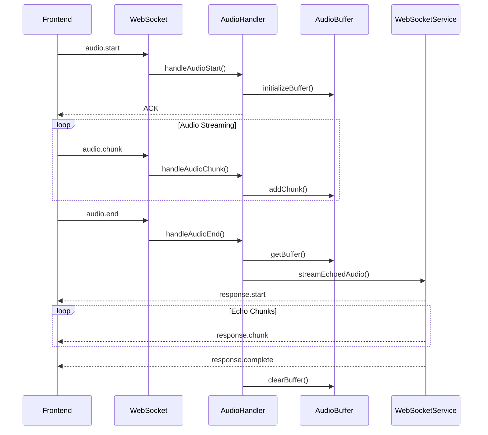
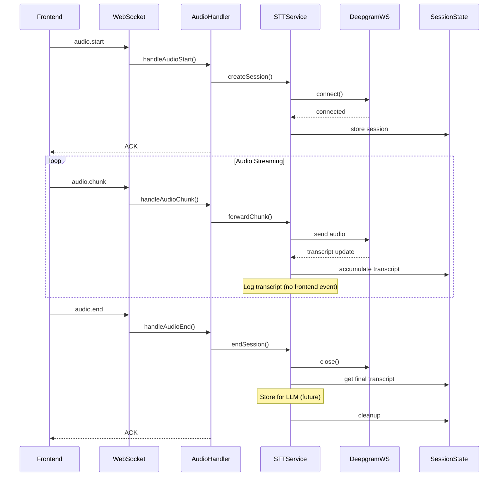
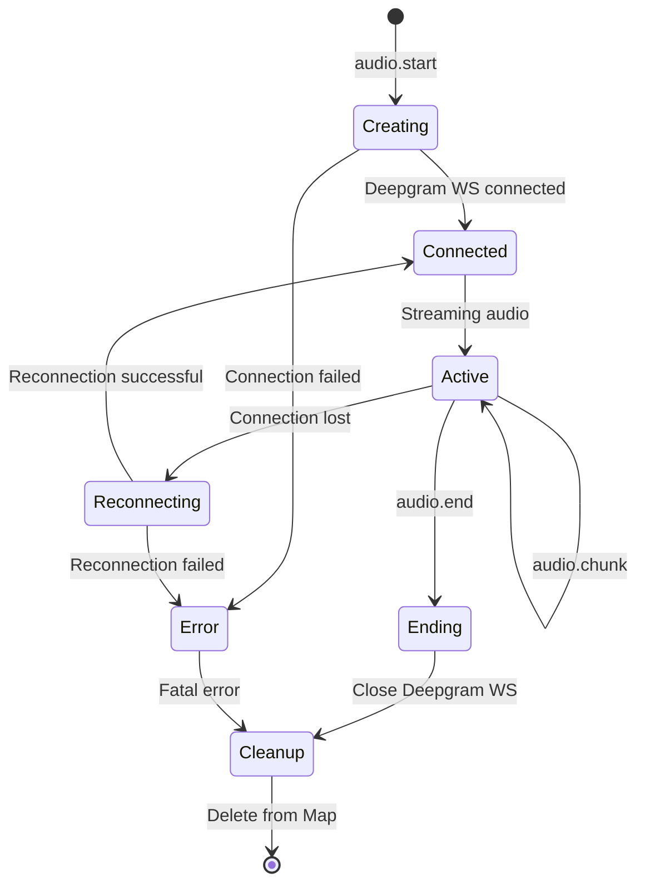

# STT Implementation Discussion & Architectural Decisions

**Version**: 1.0.0  
**Last Updated**: 2025-12-24  
**Status**: Active

## Overview

This document captures the comprehensive discussion and architectural decisions for integrating Speech-to-Text (STT) functionality using Deepgram into the Vantum backend. It serves as both a stakeholder alignment record and an implementation reference for Phase 4 of the development plan.

> **Related Documents**: 
> - [Implementation Plan](./implementation-plan.md) - Overall project phases
> - [STT Provider Comparison](../reference/stt-provider-comparison.md) - Deepgram vs Soniox analysis
> - [Voice Mode Implementation Reference](../reference/voice-mode-implementation.md) - Conceptual reference
> - [Architecture Documentation](../architecture/architecture.md) - System architecture

---

## Table of Contents

1. [Current State Analysis](#current-state-analysis)
2. [Proposed STT Flow](#proposed-stt-flow)
3. [Architectural Decisions](#architectural-decisions)
4. [Error Handling Deep Dive](#error-handling-deep-dive)
5. [State Management Deep Dive](#state-management-deep-dive)
6. [Implementation Recommendations](#implementation-recommendations)
7. [Next Steps](#next-steps)

---

## Current State Analysis

### As-Is Flow (Echo Testing)

The current implementation uses echo/loopback testing to validate the audio pipeline without external STT integration.



**Current Implementation Location**: [`src/modules/socket/handlers/audio.handler.ts`](../../src/modules/socket/handlers/audio.handler.ts)

**Key Characteristics**:
- Audio chunks buffered in memory
- Echo playback after 1 second delay
- Validates end-to-end audio pipeline
- No external dependencies

**Limitations**:
- No actual transcription
- No speech recognition
- Cannot proceed to LLM/TTS phases

---

## Proposed STT Flow

### To-Be Architecture with Deepgram Integration



### Detailed Flow Steps

**1. Session Initialization (audio.start)**
```typescript
// In handleAudioStart()
1. Validate session exists
2. Validate audio config (samplingRate, language)
3. Call STTService.createSession(sessionId, config)
   - Create Deepgram WebSocket connection
   - Store connection in session Map
   - Initialize transcript accumulator
4. Send ACK to frontend
```

**2. Audio Chunk Streaming (audio.chunk)**
```typescript
// In handleAudioChunk()
1. Validate session exists
2. Decode audio chunk from MessagePack
3. Validate audio format (16kHz, PCM, mono)
4. Call STTService.forwardChunk(sessionId, audioChunk)
   - Get Deepgram WS from session Map
   - Send chunk to Deepgram
   - Handle Deepgram transcript events
   - Accumulate transcript text
   - Log transcript updates
5. Update session lastActivityAt
```

**3. Transcript Handling (Deepgram events)**
```typescript
// In STTService
1. Listen for Deepgram transcript events
2. Extract transcript text and metadata
3. Accumulate in session state:
   - Append to accumulatedTranscript
   - Store as TranscriptSegment
   - Update lastTranscriptTime
4. Log transcript (debug/info level)
5. NO frontend events (decided: skip for now)
```

**4. Session Cleanup (audio.end)**
```typescript
// In handleAudioEnd()
1. Validate session exists
2. Call STTService.endSession(sessionId)
   - Get final accumulated transcript
   - Close Deepgram WebSocket
   - Log session metrics
   - Store transcript for LLM (future)
   - Delete from session Map
3. Send ACK to frontend
```

---

## Architectural Decisions

This section documents all key decisions made during stakeholder discussions.

### Decision 1: Transcript Handling

**Question**: What should we do with transcripts from Deepgram?

**Options Considered**:
- **Option A**: Log only (simple POC)
- **Option B**: Send to frontend (live captions)
- **Option C**: Store for later (LLM integration)

**Decision**: **Option A + Option C** (Log and Store)

**Rationale**:
- Not sending to frontend (no UI for transcripts)
- Log for debugging and verification
- Store accumulated transcript for future LLM phase
- Twilio phone integration won't have frontend

**Implementation**:
```typescript
// In STTService
onTranscriptUpdate(sessionId: string, transcript: DeepgramTranscript) {
  const session = this.sessions.get(sessionId);
  if (!session) return;
  
  // Accumulate transcript
  session.accumulatedTranscript += transcript.text;
  
  // Store segment for LLM context
  session.transcriptSegments.push({
    text: transcript.text,
    timestamp: Date.now(),
    confidence: transcript.confidence,
    isFinal: transcript.is_final,
  });
  
  // Log for debugging
  logger.info('Transcript update', {
    sessionId,
    text: transcript.text,
    isFinal: transcript.is_final,
    confidence: transcript.confidence,
  });
  
  // Store for LLM (future Phase 5)
  // Will be used when VAD detects silence
}
```

---

### Decision 2: Error Handling Strategy

**Question**: How should we handle Deepgram failures?

**Decision**: **Hybrid retry strategy with 3-5 retries**

**Rationale**:
- User-focused: Hide transient errors, maximize success
- Production-ready: Handle various failure scenarios
- API-friendly: Respect rate limits with backoff

See [Error Handling Deep Dive](#error-handling-deep-dive) for comprehensive analysis.

---

### Decision 3: Session-to-Deepgram Mapping

**Question**: How should we manage Deepgram WebSocket lifecycle?

**Options Considered**:
- **Option A**: One Deepgram WS per session
- **Option B**: Singleton Deepgram connection (multiplexed)

**Decision**: **Option A** (One WS per session)

**Rationale**:
- Simple lifecycle (matches session pattern)
- Easy to debug (isolated connections)
- Clean error handling (failure isolated to one session)
- No multiplexing complexity
- Sufficient for expected scale

**Implementation**:
```typescript
class STTService {
  private sessions = new Map<string, STTSessionState>();
  
  async createSession(sessionId: string, config: STTConfig) {
    // Create new Deepgram WS for this session
    const deepgramWs = await this.connectToDeepgram(config);
    
    // Store in session Map
    this.sessions.set(sessionId, {
      sessionId,
      deepgramWs,
      config,
      // ... other state
    });
  }
  
  async endSession(sessionId: string) {
    const session = this.sessions.get(sessionId);
    if (!session) return;
    
    // Close Deepgram WS
    session.deepgramWs.close();
    
    // Remove from Map
    this.sessions.delete(sessionId);
  }
}
```

---

### Decision 4: Transcript Events

**Question**: Should we send transcript events to frontend?

**Decision**: **No** (Not sending to frontend)

**Rationale**:
- No UI for live captions in current design
- Twilio phone integration won't have frontend
- Reduces complexity for POC
- Can add later if needed for debugging

**Future Consideration**:
- May add transcript events for web-based testing
- Useful for debugging and demos
- Easy to add later (just emit events)

---

### Decision 5: Audio Format Validation

**Question**: Should we validate audio format in backend?

**Options Considered**:
- **Option A**: Trust frontend (pass through)
- **Option B**: Validate and convert in backend

**Decision**: **Option B** (Validate and convert)

**Rationale**:
- **Twilio integration**: Backend will receive audio from phone calls
- **Format variations**: Phone audio may not match frontend format
- **Robustness**: Catch format issues early
- **Production-ready**: Validate all inputs

**Requirements**:
- Sample rate: 16kHz (Deepgram requirement)
- Encoding: PCM 16-bit signed little-endian
- Channels: Mono (1 channel)
- Format: Raw PCM audio chunks

**Implementation**:
```typescript
// In STTService or audio utility
function validateAndConvertAudio(
  audioChunk: Uint8Array,
  sourceSampleRate: number,
  targetSampleRate: number = 16000
): Uint8Array {
  // Validate chunk size (must be even for 16-bit samples)
  if (audioChunk.length % 2 !== 0) {
    throw new Error('Invalid audio chunk: length must be even for 16-bit samples');
  }
  
  // If sample rate matches, return as-is
  if (sourceSampleRate === targetSampleRate) {
    return audioChunk;
  }
  
  // Resample to target rate (16kHz)
  return resampleAudio(audioChunk, sourceSampleRate, targetSampleRate);
}
```

---

### Decision 6: Service Architecture

**Question**: Where should STT logic live?

**Options Considered**:
- **Option A**: Dedicated STT service (modular)
- **Option B**: Integrated into audio handler (simple)

**Decision**: **Option A** (Dedicated service)

**Rationale**:
- Clean separation of concerns
- Easier to test in isolation
- Ready for multiple STT providers
- Matches existing service pattern

**File Structure**:
```
src/modules/socket/services/
  ├─ stt.service.ts         # Main STT service (singleton)
  ├─ stt-session.ts         # Per-session state management
  ├─ stt-config.ts          # Deepgram configuration
  └─ index.ts               # Export all services
```

**Service Pattern**:
```typescript
// stt.service.ts
export class STTService {
  private sessions = new Map<string, STTSessionState>();
  
  async createSession(sessionId: string, config: STTConfig): Promise<void>
  async forwardChunk(sessionId: string, audioChunk: Uint8Array): Promise<void>
  async endSession(sessionId: string): Promise<string> // Returns final transcript
  
  // Internal methods
  private async connectToDeepgram(config: STTConfig): Promise<DeepgramWebSocket>
  private handleTranscriptUpdate(sessionId: string, transcript: DeepgramTranscript): void
  private handleDeepgramError(sessionId: string, error: DeepgramError): void
}

// Export singleton instance
export const sttService = new STTService();
```

---

### Decision 7: State Management

**Question**: How should we manage STT session state?

**Decision**: **Hybrid approach** (local Map + optional Redis)

**Rationale**:
- Start simple with local Map (POC)
- Optionally add Redis for scaling
- No code changes needed when adding Redis
- Production-ready architecture

See [State Management Deep Dive](#state-management-deep-dive) for comprehensive analysis.

---

### Decision 8: Deepgram Configuration

**Question**: Should Deepgram config come from frontend or be hardcoded?

**Decision**: **Hardcoded configuration**

**Rationale**:
- No frontend ultimately (Twilio phone integration)
- Consistent configuration across all calls
- Simpler implementation
- Can override per-session if needed later

**Configuration Values**:
```typescript
// stt-config.ts
export const DEEPGRAM_CONFIG = {
  // Model selection
  model: 'nova-2',              // Latest Deepgram model
  
  // Language
  language: 'en-US',            // English (US)
  
  // Features
  smart_format: true,           // Auto punctuation and formatting
  interim_results: true,        // Real-time transcript updates
  
  // VAD-related (disabled for now)
  endpointing: false,           // No automatic endpoint detection
  utterances: false,            // No utterance segmentation
  
  // Audio format
  encoding: 'linear16',         // PCM 16-bit
  sample_rate: 16000,           // 16kHz
  channels: 1,                  // Mono
  
  // Performance
  punctuate: true,              // Add punctuation
  diarize: false,               // No speaker diarization (single speaker)
  
  // Alternatives
  alternatives: 1,              // Only best transcript
};

export interface STTConfig {
  sessionId: string;
  samplingRate: number;
  language?: string;            // Override if needed
}
```

---

### Decision 9: Echo Testing

**Question**: Should we remove echo testing code?

**Decision**: **Keep for now**

**Rationale**:
- Allows parallel testing during STT development
- Useful fallback for debugging
- Can test audio pipeline without Deepgram
- Remove once STT is stable

**Implementation Approach**:
- Keep echo testing code in `audio.handler.ts`
- Add environment flag to switch between modes
- Default to STT when `DEEPGRAM_API_KEY` is set

```typescript
// In audio.handler.ts
const USE_STT = !!process.env.DEEPGRAM_API_KEY;

export async function handleAudioEnd(...) {
  // ... existing code ...
  
  if (USE_STT) {
    // New STT flow
    await sttService.endSession(session.sessionId);
  } else {
    // Legacy echo testing
    await streamEchoedAudio(session.sessionId, samplingRate);
  }
  
  // ... cleanup ...
}
```

---

### Decision 10: Shared Package Updates

**Question**: How should we handle new event types during development?

**Decision**: **Switch to local reference temporarily**

**Rationale**:
- Faster iteration (no publishing to GitHub)
- Can add types as needed
- Switch back to published package after STT is stable

**Implementation**:
```json
// In vantum-backend/package.json
{
  "dependencies": {
    "@Jatin5120/vantum-shared": "file:../vantum-shared"
  }
}
```

**New Event Types** (to add in vantum-shared):
```typescript
// For future use (not needed for initial STT implementation)
export const VOICECHAT_EVENTS = {
  // ... existing events ...
  
  // Transcript events (future)
  TRANSCRIPT_UPDATE: 'voicechat.transcript.update',
  TRANSCRIPT_FINAL: 'voicechat.transcript.final',
} as const;

// Payload types
export interface TranscriptUpdatePayload {
  text: string;
  isFinal: boolean;
  confidence: number;
  timestamp: number;
}
```

---

## Error Handling Deep Dive

### Retry Strategy Comparison

| Strategy | Delays | Total Time | Best For | Pros | Cons |
|----------|--------|------------|----------|------|------|
| **Immediate** | [0, 0, 0, 0, 0] | ~0s | Network blips | Fastest recovery | Hammers API, rate limits |
| **Exponential** | [100ms, 500ms, 1s, 2s, 4s] | ~7.6s | API overload | API-friendly | Slow initial recovery |
| **Hybrid** | [0ms, 100ms, 1s, 3s, 5s] | ~9.1s | Production | Best of both | Slightly complex |

**Recommendation**: **Hybrid strategy** for production

---

### Scenario 1: Initial Connection Failure

**When**: `audio.start` → Deepgram WebSocket fails to connect

**Strategy**: Hybrid retry with fast-then-slow backoff

```typescript
// In STTService
async connectToDeepgram(config: STTConfig): Promise<DeepgramWebSocket> {
  const retryDelays = [0, 100, 1000, 3000, 5000]; // Hybrid: fast then slow
  const timeout = 10000; // 10s per attempt
  
  for (let attempt = 0; attempt < retryDelays.length; attempt++) {
    try {
      // Wait before retry (except first attempt)
      if (attempt > 0) {
        await sleep(retryDelays[attempt]);
        logger.info('Retrying Deepgram connection', { attempt, delay: retryDelays[attempt] });
      }
      
      // Attempt connection with timeout
      const ws = await Promise.race([
        this.createDeepgramConnection(config),
        timeout(timeout),
      ]);
      
      logger.info('Deepgram connection established', { attempt });
      return ws;
      
    } catch (error) {
      logger.warn('Deepgram connection failed', {
        attempt,
        error: error.message,
        willRetry: attempt < retryDelays.length - 1,
      });
      
      // Check if error is retryable
      if (!this.shouldRetry(error)) {
        throw error; // Fatal error, don't retry
      }
      
      // Last attempt failed
      if (attempt === retryDelays.length - 1) {
        throw new Error(`Failed to connect to Deepgram after ${retryDelays.length} attempts`);
      }
    }
  }
}
```

**Benefits**:
- Quick recovery for transient issues (0ms, 100ms)
- Gentle on persistent failures (1s, 3s, 5s)
- Total ~9s worst case (acceptable for session start)

---

### Scenario 2: Mid-Stream Disconnection

**When**: Deepgram WebSocket drops during active streaming

**Strategy**: Transparent reconnect with fast retries

```typescript
// In STTService
private setupDeepgramListeners(sessionId: string, ws: DeepgramWebSocket) {
  ws.on('close', async (code, reason) => {
    logger.warn('Deepgram connection closed', { sessionId, code, reason });
    
    const session = this.sessions.get(sessionId);
    if (!session || !session.isActive) {
      return; // Session already ended
    }
    
    // Attempt transparent reconnection
    await this.handleDisconnection(sessionId);
  });
}

private async handleDisconnection(sessionId: string) {
  const session = this.sessions.get(sessionId);
  if (!session) return;
  
  const retryDelays = [0, 100, 500]; // Fast retries only
  
  for (let attempt = 0; attempt < retryDelays.length; attempt++) {
    try {
      if (attempt > 0) {
        await sleep(retryDelays[attempt]);
      }
      
      logger.info('Attempting reconnection', { sessionId, attempt });
      
      // Create new connection
      const newWs = await this.createDeepgramConnection(session.config);
      
      // Update session with new connection
      session.deepgramWs = newWs;
      session.reconnectAttempts++;
      session.deepgramConnectionState = 'connected';
      
      logger.info('Reconnection successful', { sessionId, attempt });
      return;
      
    } catch (error) {
      logger.warn('Reconnection failed', { sessionId, attempt, error: error.message });
    }
  }
  
  // All reconnection attempts failed
  logger.error('Failed to reconnect, ending session', { sessionId });
  session.deepgramConnectionState = 'error';
  session.isActive = false;
  
  // Notify via error event (future)
  // For now, just log and cleanup
}
```

**Characteristics**:
- 3 fast retries (0ms, 100ms, 500ms)
- Total <1s reconnection time
- Drop chunks during reconnection (acceptable loss)
- If all fail: end session gracefully

**Acceptable Data Loss**:
- Typical reconnection: <200ms of audio
- Worst case: <1s of audio
- User experience: Brief pause, then continues

---

### Scenario 3: API Errors

**When**: Deepgram returns HTTP error codes

**Error Code Matrix**:

| Error Code | Meaning | Retry? | Strategy | Action |
|------------|---------|--------|----------|--------|
| 401 | Invalid API key | ❌ No | Fail immediately | Alert dev, check .env |
| 403 | Forbidden | ❌ No | Fail immediately | Check permissions |
| 404 | Not found | ❌ No | Fail immediately | Check endpoint |
| 429 | Rate limit | ✅ Yes | Exponential backoff | [5s, 10s, 20s] |
| 500 | Server error | ✅ Yes | Fast retry | [0ms, 500ms, 1s] |
| 502 | Bad gateway | ✅ Yes | Fast retry | [0ms, 500ms, 1s] |
| 503 | Service unavailable | ✅ Yes | Backoff | [1s, 3s, 5s] |
| 504 | Gateway timeout | ✅ Yes | Fast retry | [0ms, 500ms, 1s] |
| Network timeout | No response | ✅ Yes | Fast retry | [0ms, 100ms, 500ms] |

**Implementation**:

```typescript
// In STTService
private shouldRetry(error: DeepgramError): boolean {
  // Fatal errors - don't retry
  const fatalErrors = [401, 403, 404];
  if (fatalErrors.includes(error.code)) {
    logger.error('Fatal Deepgram error, not retrying', {
      code: error.code,
      message: error.message,
    });
    // TODO: Alert dev (send to monitoring service)
    return false;
  }
  
  // Retryable errors
  const retryableErrors = [429, 500, 502, 503, 504];
  if (retryableErrors.includes(error.code)) {
    return true;
  }
  
  // Network errors
  if (error.type === 'NETWORK_TIMEOUT' || error.type === 'ECONNREFUSED') {
    return true;
  }
  
  // Unknown error - don't retry (fail safe)
  logger.warn('Unknown error type, not retrying', { error });
  return false;
}

private getRetryDelays(error: DeepgramError): number[] {
  // Rate limit - use exponential backoff
  if (error.code === 429) {
    return [5000, 10000, 20000]; // 5s, 10s, 20s
  }
  
  // Service unavailable - moderate backoff
  if (error.code === 503) {
    return [1000, 3000, 5000]; // 1s, 3s, 5s
  }
  
  // Server errors - fast retry
  if ([500, 502, 504].includes(error.code)) {
    return [0, 500, 1000]; // 0ms, 500ms, 1s
  }
  
  // Network errors - fast retry
  return [0, 100, 500]; // 0ms, 100ms, 500ms
}
```

---

### Timeout Configuration

```typescript
// In stt-config.ts
export const TIMEOUT_CONFIG = {
  // Connection timeout
  CONNECTION_TIMEOUT_MS: 10000,      // 10s to establish connection
  
  // Message timeout
  MESSAGE_TIMEOUT_MS: 5000,          // 5s for Deepgram to respond
  
  // Session timeout
  SESSION_TIMEOUT_MS: 3600000,       // 1 hour max session duration
  
  // Inactivity timeout
  INACTIVITY_TIMEOUT_MS: 300000,     // 5 minutes no audio = stale
};
```

---

### Circuit Breaker Pattern (Future)

For production, implement circuit breaker to prevent cascading failures:

```typescript
// Future enhancement
class CircuitBreaker {
  private failureCount = 0;
  private lastFailureTime = 0;
  private state: 'CLOSED' | 'OPEN' | 'HALF_OPEN' = 'CLOSED';
  
  private readonly FAILURE_THRESHOLD = 10;      // Open after 10 failures
  private readonly TIMEOUT_MS = 60000;          // Stay open for 1 minute
  private readonly SUCCESS_THRESHOLD = 3;       // Close after 3 successes
  
  async execute<T>(fn: () => Promise<T>): Promise<T> {
    if (this.state === 'OPEN') {
      if (Date.now() - this.lastFailureTime > this.TIMEOUT_MS) {
        this.state = 'HALF_OPEN';
      } else {
        throw new Error('Circuit breaker is OPEN');
      }
    }
    
    try {
      const result = await fn();
      this.onSuccess();
      return result;
    } catch (error) {
      this.onFailure();
      throw error;
    }
  }
  
  private onSuccess() {
    this.failureCount = 0;
    if (this.state === 'HALF_OPEN') {
      this.state = 'CLOSED';
    }
  }
  
  private onFailure() {
    this.failureCount++;
    this.lastFailureTime = Date.now();
    
    if (this.failureCount >= this.FAILURE_THRESHOLD) {
      this.state = 'OPEN';
      logger.error('Circuit breaker opened', { failureCount: this.failureCount });
      // TODO: Alert dev
    }
  }
}
```

---

## State Management Deep Dive

### State Management Options

#### Option 1: In-Memory Map (Simplest)

```typescript
class STTService {
  private sessions = new Map<string, STTSessionState>();
  
  createSession(sessionId: string, config: STTConfig) {
    this.sessions.set(sessionId, new STTSessionState(config));
  }
  
  getSession(sessionId: string): STTSessionState | undefined {
    return this.sessions.get(sessionId);
  }
  
  destroySession(sessionId: string) {
    const session = this.sessions.get(sessionId);
    session?.cleanup();
    this.sessions.delete(sessionId);
  }
}
```

**Pros**:
- Simple, fast O(1) lookup
- No external dependencies
- Easy to test

**Cons**:
- Lost on server restart
- Not scalable horizontally
- Memory grows with sessions

**Best for**: Single-instance deployments, POC, development

---

#### Option 2: Redis (Scalable)

```typescript
class STTService {
  private sessions = new Map<string, STTSessionState>(); // Local cache
  private redis: RedisClient;
  
  async createSession(sessionId: string, config: STTConfig) {
    const session = new STTSessionState(config);
    this.sessions.set(sessionId, session);
    
    // Persist to Redis
    await this.redis.set(
      `stt:session:${sessionId}`,
      JSON.stringify({ config, createdAt: Date.now() }),
      { EX: 3600 } // 1 hour TTL
    );
  }
}
```

**Pros**:
- Horizontal scaling (multiple backend instances)
- Survives restarts
- Built-in TTL (auto cleanup)

**Cons**:
- External dependency (Redis required)
- Network latency on each access
- More complex setup

**Best for**: Multi-instance production, high availability

---

#### Option 3: Hybrid (Recommended)

```typescript
class STTService {
  private sessions = new Map<string, STTSessionState>(); // Fast local cache
  private redis?: RedisClient; // Optional persistence
  
  async createSession(sessionId: string, config: STTConfig) {
    const session = new STTSessionState(config);
    this.sessions.set(sessionId, session);
    
    // Optionally persist to Redis if available
    if (this.redis) {
      await this.redis.set(
        `stt:session:${sessionId}`,
        JSON.stringify({ config, createdAt: Date.now() }),
        { EX: 3600 }
      ).catch(err => {
        logger.warn('Redis persistence failed, continuing with local only', err);
      });
    }
  }
  
  getSession(sessionId: string): STTSessionState | undefined {
    // Always use local cache for active sessions
    return this.sessions.get(sessionId);
  }
}
```

**Pros**:
- Fast (local cache for active sessions)
- Optionally scalable (Redis when needed)
- Graceful degradation (works without Redis)
- Production-ready

**Cons**:
- Slightly more complex
- Redis optional = testing both paths

**Best for**: Production with future scaling in mind

**Recommendation**: **Option 3 (Hybrid)** - Start simple, scale later

---

### State Structure Design

```typescript
// stt-session.ts

/**
 * Transcript segment for LLM context
 */
export interface TranscriptSegment {
  text: string;
  timestamp: number;
  confidence: number;
  isFinal: boolean;
}

/**
 * Deepgram connection state
 */
export type DeepgramConnectionState = 
  | 'connecting' 
  | 'connected' 
  | 'disconnected' 
  | 'error';

/**
 * STT session state
 * Manages Deepgram connection and transcript accumulation per session
 */
export interface STTSessionState {
  // Core identifiers
  sessionId: string;
  connectionId: string;
  
  // Deepgram connection
  deepgramWs: DeepgramWebSocket | null;
  deepgramConnectionState: DeepgramConnectionState;
  
  // Transcript accumulation
  accumulatedTranscript: string;
  interimTranscript: string;
  lastTranscriptTime: number;
  transcriptSegments: TranscriptSegment[];
  
  // Audio config
  config: {
    samplingRate: number;
    language: string;
    model: string;
  };
  
  // Retry state
  retryCount: number;
  lastRetryTime: number;
  reconnectAttempts: number;
  
  // Lifecycle
  createdAt: number;
  lastActivityAt: number;
  isActive: boolean;
  
  // Metrics (for monitoring)
  metrics: {
    chunksReceived: number;
    chunksForwarded: number;
    transcriptsReceived: number;
    errors: number;
    reconnections: number;
  };
}

/**
 * STT session class
 * Encapsulates session state and operations
 */
export class STTSession implements STTSessionState {
  // ... all properties from interface ...
  
  constructor(sessionId: string, connectionId: string, config: STTConfig) {
    this.sessionId = sessionId;
    this.connectionId = connectionId;
    this.config = {
      samplingRate: config.samplingRate,
      language: config.language || 'en-US',
      model: 'nova-2',
    };
    
    this.deepgramWs = null;
    this.deepgramConnectionState = 'connecting';
    
    this.accumulatedTranscript = '';
    this.interimTranscript = '';
    this.lastTranscriptTime = Date.now();
    this.transcriptSegments = [];
    
    this.retryCount = 0;
    this.lastRetryTime = 0;
    this.reconnectAttempts = 0;
    
    this.createdAt = Date.now();
    this.lastActivityAt = Date.now();
    this.isActive = true;
    
    this.metrics = {
      chunksReceived: 0,
      chunksForwarded: 0,
      transcriptsReceived: 0,
      errors: 0,
      reconnections: 0,
    };
  }
  
  /**
   * Update activity timestamp
   */
  touch(): void {
    this.lastActivityAt = Date.now();
  }
  
  /**
   * Add transcript segment
   */
  addTranscript(text: string, confidence: number, isFinal: boolean): void {
    if (isFinal) {
      this.accumulatedTranscript += text;
      this.interimTranscript = '';
    } else {
      this.interimTranscript = text;
    }
    
    this.transcriptSegments.push({
      text,
      timestamp: Date.now(),
      confidence,
      isFinal,
    });
    
    this.lastTranscriptTime = Date.now();
    this.metrics.transcriptsReceived++;
  }
  
  /**
   * Get final transcript for LLM
   */
  getFinalTranscript(): string {
    return this.accumulatedTranscript.trim();
  }
  
  /**
   * Get session duration in milliseconds
   */
  getDuration(): number {
    return Date.now() - this.createdAt;
  }
  
  /**
   * Get time since last activity in milliseconds
   */
  getInactivityDuration(): number {
    return Date.now() - this.lastActivityAt;
  }
  
  /**
   * Cleanup resources
   */
  cleanup(): void {
    if (this.deepgramWs) {
      this.deepgramWs.close();
      this.deepgramWs = null;
    }
    this.isActive = false;
  }
}
```

---

### State Lifecycle



**State Transitions**:

1. **Creating** → **Connected**
   - Trigger: Deepgram WebSocket successfully connected
   - Action: Store connection, initialize transcript

2. **Connected** → **Active**
   - Trigger: First audio chunk received
   - Action: Start forwarding to Deepgram

3. **Active** → **Active**
   - Trigger: Subsequent audio chunks
   - Action: Forward to Deepgram, accumulate transcripts

4. **Active** → **Reconnecting**
   - Trigger: Deepgram connection lost
   - Action: Attempt reconnection

5. **Reconnecting** → **Connected**
   - Trigger: Reconnection successful
   - Action: Resume streaming

6. **Reconnecting** → **Error**
   - Trigger: All reconnection attempts failed
   - Action: Mark session as failed

7. **Active** → **Ending**
   - Trigger: audio.end received
   - Action: Get final transcript

8. **Ending** → **Cleanup**
   - Trigger: Cleanup initiated
   - Action: Close Deepgram WS, log metrics

9. **Cleanup** → **[Deleted]**
   - Trigger: Cleanup complete
   - Action: Delete from session Map

---

### Memory Management

**Concerns**:
- Long sessions accumulate large transcripts
- Memory leak risk with stale sessions
- Unbounded Map growth

**Solutions**:

```typescript
// In STTService
export class STTService {
  private sessions = new Map<string, STTSession>();
  private cleanupTimer?: NodeJS.Timeout;
  
  // Memory limits
  private readonly MAX_TRANSCRIPT_LENGTH = 50000;  // ~50KB per session
  private readonly SESSION_TIMEOUT_MS = 3600000;   // 1 hour
  private readonly INACTIVITY_TIMEOUT_MS = 300000; // 5 minutes
  private readonly CLEANUP_INTERVAL_MS = 300000;   // 5 minutes
  
  constructor() {
    this.startCleanupTimer();
  }
  
  /**
   * Start periodic cleanup timer
   */
  private startCleanupTimer(): void {
    this.cleanupTimer = setInterval(() => {
      this.cleanupStaleSessions();
    }, this.CLEANUP_INTERVAL_MS);
  }
  
  /**
   * Cleanup stale sessions
   */
  private cleanupStaleSessions(): void {
    const now = Date.now();
    let cleanedCount = 0;
    
    for (const [sessionId, session] of this.sessions) {
      // Check session age
      const sessionAge = session.getDuration();
      if (sessionAge > this.SESSION_TIMEOUT_MS) {
        logger.warn('Cleaning up old session', {
          sessionId,
          age: sessionAge,
          reason: 'timeout',
        });
        this.destroySession(sessionId);
        cleanedCount++;
        continue;
      }
      
      // Check inactivity
      const inactivity = session.getInactivityDuration();
      if (inactivity > this.INACTIVITY_TIMEOUT_MS) {
        logger.warn('Cleaning up inactive session', {
          sessionId,
          inactivity,
          reason: 'inactivity',
        });
        this.destroySession(sessionId);
        cleanedCount++;
        continue;
      }
      
      // Trim transcript if too large
      if (session.accumulatedTranscript.length > this.MAX_TRANSCRIPT_LENGTH) {
        const originalLength = session.accumulatedTranscript.length;
        session.accumulatedTranscript = 
          session.accumulatedTranscript.slice(-this.MAX_TRANSCRIPT_LENGTH);
        
        logger.warn('Trimmed transcript to prevent memory issues', {
          sessionId,
          originalLength,
          newLength: session.accumulatedTranscript.length,
        });
      }
    }
    
    if (cleanedCount > 0) {
      logger.info('Cleanup completed', {
        cleanedCount,
        remainingSessions: this.sessions.size,
      });
    }
  }
  
  /**
   * Graceful shutdown
   */
  async shutdown(): Promise<void> {
    logger.info('Shutting down STT service', {
      activeSessions: this.sessions.size,
    });
    
    // Stop cleanup timer
    if (this.cleanupTimer) {
      clearInterval(this.cleanupTimer);
    }
    
    // Close all sessions
    const closePromises = Array.from(this.sessions.keys()).map(sessionId =>
      this.endSession(sessionId).catch(err =>
        logger.error('Error closing session during shutdown', { sessionId, err })
      )
    );
    
    await Promise.all(closePromises);
    
    logger.info('STT service shutdown complete');
  }
  
  /**
   * Get service metrics
   */
  getMetrics(): {
    activeSessions: number;
    totalChunksForwarded: number;
    totalTranscriptsReceived: number;
    totalErrors: number;
  } {
    let totalChunksForwarded = 0;
    let totalTranscriptsReceived = 0;
    let totalErrors = 0;
    
    for (const session of this.sessions.values()) {
      totalChunksForwarded += session.metrics.chunksForwarded;
      totalTranscriptsReceived += session.metrics.transcriptsReceived;
      totalErrors += session.metrics.errors;
    }
    
    return {
      activeSessions: this.sessions.size,
      totalChunksForwarded,
      totalTranscriptsReceived,
      totalErrors,
    };
  }
}
```

---

## Implementation Recommendations

### Priority Order

1. **Basic STT Service** (Week 1)
   - Create service files (stt.service.ts, stt-session.ts, stt-config.ts)
   - Implement session Map (local only)
   - Basic Deepgram connection (no retry yet)
   - Simple transcript accumulation
   - Integration with audio.handler.ts

2. **Hybrid Retry Logic** (Week 1-2)
   - Implement retry strategies
   - Error classification (retryable vs fatal)
   - Transparent reconnection
   - Timeout handling

3. **Audio Validation/Conversion** (Week 2)
   - Validate audio format
   - Sample rate conversion (if needed)
   - Format validation utilities
   - Integration tests

4. **Keep Echo Testing Parallel** (Week 2)
   - Environment flag (USE_STT)
   - Switch between STT and echo
   - Parallel testing capability

5. **Redis Backing** (Future - when scaling)
   - Optional Redis integration
   - Session persistence
   - Multi-instance support

---

### Production Considerations

**Monitoring & Metrics**:
```typescript
// Log key metrics
logger.info('STT session metrics', {
  sessionId,
  duration: session.getDuration(),
  chunksForwarded: session.metrics.chunksForwarded,
  transcriptsReceived: session.metrics.transcriptsReceived,
  reconnections: session.metrics.reconnections,
  errors: session.metrics.errors,
  finalTranscriptLength: session.accumulatedTranscript.length,
});
```

**Error Alerting**:
```typescript
// Alert on fatal errors
if (isFatalError(error)) {
  logger.error('FATAL: Deepgram API error', { error });
  // TODO: Send to monitoring service (Datadog, Sentry, etc.)
  // await alerting.sendAlert('deepgram_fatal_error', { error });
}
```

**Graceful Shutdown**:
```typescript
// In index.ts
process.on('SIGTERM', async () => {
  logger.info('SIGTERM received, shutting down gracefully');
  await sttService.shutdown();
  process.exit(0);
});

process.on('SIGINT', async () => {
  logger.info('SIGINT received, shutting down gracefully');
  await sttService.shutdown();
  process.exit(0);
});
```

**Circuit Breaker** (Future):
- Implement after initial deployment
- Monitor failure rates
- Prevent cascading failures
- Auto-recovery mechanism

---

## Next Steps

### Prerequisites

1. **Environment Setup**:
   ```bash
   # Add to .env
   DEEPGRAM_API_KEY=your_api_key_here
   ```

2. **Install Dependencies**:
   ```bash
   cd vantum-backend
   pnpm add @deepgram/sdk
   ```

3. **Switch to Local Shared Package**:
   ```json
   // In vantum-backend/package.json
   {
     "dependencies": {
       "@Jatin5120/vantum-shared": "file:../vantum-shared"
     }
   }
   ```
   ```bash
   pnpm install
   ```

---

### Implementation Checklist

**Phase 4: STT Integration** (from [Implementation Plan](./implementation-plan.md))

- [ ] Create STT service files
  - [ ] `src/modules/socket/services/stt.service.ts`
  - [ ] `src/modules/socket/services/stt-session.ts`
  - [ ] `src/modules/socket/services/stt-config.ts`

- [ ] Implement Deepgram integration
  - [ ] Connection management
  - [ ] Audio streaming
  - [ ] Transcript handling
  - [ ] Error handling

- [ ] Update audio handler
  - [ ] Integrate STT service
  - [ ] Add environment flag (USE_STT)
  - [ ] Keep echo testing parallel

- [ ] Add retry logic
  - [ ] Hybrid retry strategy
  - [ ] Error classification
  - [ ] Transparent reconnection

- [ ] Add audio validation
  - [ ] Format validation
  - [ ] Sample rate conversion
  - [ ] Validation utilities

- [ ] Testing
  - [ ] Unit tests for STT service
  - [ ] Integration tests with Deepgram
  - [ ] Error handling tests
  - [ ] Memory leak tests

- [ ] Documentation
  - [ ] Update implementation plan
  - [ ] Add API documentation
  - [ ] Update architecture docs

---

### Testing Strategy

**With Echo Testing**:
```bash
# Test without STT (echo mode)
unset DEEPGRAM_API_KEY
npm run dev

# Test with STT
export DEEPGRAM_API_KEY=your_key
npm run dev
```

**Parallel Testing**:
- Keep echo testing functional
- Switch via environment variable
- Compare audio quality
- Validate transcript accuracy

---

### Future Phases

**Phase 5: LLM Integration** (After STT is stable)
- Use accumulated transcript from STT
- Send to OpenAI API
- Stream LLM responses
- Integrate with TTS

**Phase 6: TTS Integration**
- ElevenLabs or Cartesia
- Stream audio back to client
- Complete voice pipeline

**Phase 7: VAD Integration**
- Two-tier silence detection (500ms/2000ms)
- Speculative generation
- Interruption handling

---

## See Also

- [Implementation Plan](./implementation-plan.md) - Overall project phases
- [STT Provider Comparison](../reference/stt-provider-comparison.md) - Deepgram vs Soniox
- [Voice Mode Implementation Reference](../reference/voice-mode-implementation.md) - Conceptual reference
- [Architecture Documentation](../architecture/architecture.md) - System architecture
- [WebSocket Protocol Specification](../protocol/websocket-protocol.md) - Message formats
- [API Documentation](../api/api.md) - API reference
- [Documentation Index](../README.md) - All documentation files

---

## Version History

| Version | Date       | Changes                                    |
| ------- | ---------- | ------------------------------------------ |
| 1.0.0   | 2025-12-24 | Initial version - STT discussion captured |

---

**Last Updated**: 2025-12-24  
**Maintained By**: Backend Team

