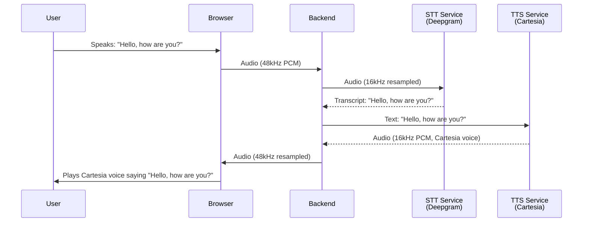
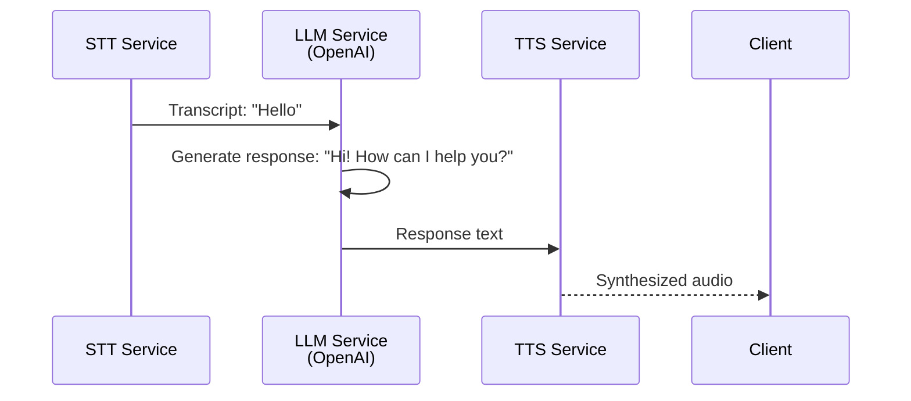
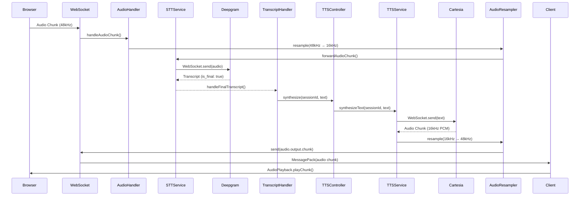
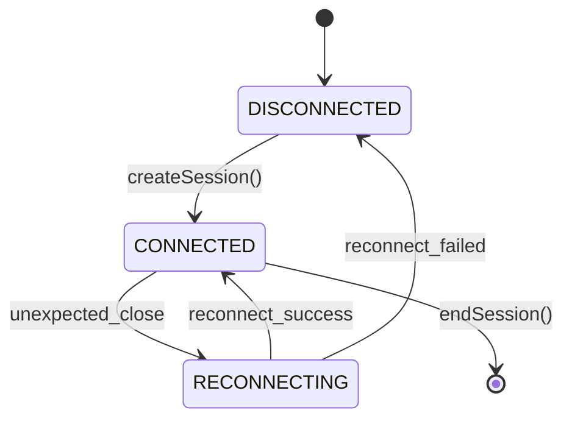
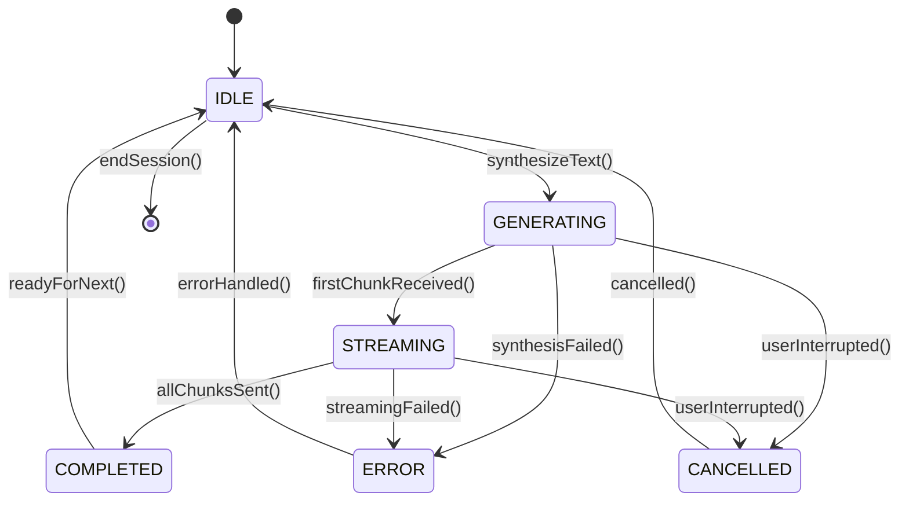

# TTS Module Documentation

**Version**: 1.0.0
**Last Updated**: 2026-01-04
**Status**: Design Complete - Ready for Implementation
**Maintainer**: @architect

---

## Overview

The Text-to-Speech (TTS) module provides real-time audio synthesis using Cartesia's streaming API. Designed as an "echo mode" implementation initially, it validates the complete audio pipeline (STT → TTS) before LLM integration. The module follows the proven Handler + Service pattern established by the STT module.

**Key Features**:
- Session-level persistent WebSocket connections to Cartesia
- Streaming audio generation (<1s first chunk latency)
- Bidirectional audio resampling (16kHz ↔ 48kHz)
- Transparent reconnection with buffering
- Echo mode: User speech → STT → TTS → User hears Cartesia voice
- Future-proof design (LLM insertion requires zero TTS refactoring)

---

## Table of Contents

1. [Architecture Overview](#architecture-overview)
2. [Why Cartesia?](#why-cartesia)
3. [Echo Mode Strategy](#echo-mode-strategy)
4. [Module Structure](#module-structure)
5. [Core Components](#core-components)
6. [Data Flow](#data-flow)
7. [Session Management](#session-management)
8. [State Machine](#state-machine)
9. [Audio Format & Resampling](#audio-format--resampling)
10. [Error Handling](#error-handling)
11. [Event Protocol](#event-protocol)
12. [Configuration](#configuration)
13. [Testing Strategy](#testing-strategy)
14. [Performance Targets](#performance-targets)
15. [LLM Insertion Strategy](#llm-insertion-strategy)
16. [Implementation Checklist](#implementation-checklist)

---

## Architecture Overview

### Current State (Echo Mode)



**Critical Clarification**: This is NOT raw audio echo. The flow is:
1. User's voice → STT transcribes to TEXT
2. TEXT → TTS synthesizes to AUDIO (Cartesia's voice)
3. User hears **Cartesia's voice** speaking their transcribed words

### Future State (With LLM)



**Zero TTS Refactoring**: TTS accepts text from any source (transcript or LLM). Only the `TranscriptHandler` changes to route through LLM.

---

## Why Cartesia?

### Decision Matrix

| Criteria | **Cartesia** ⭐ | ElevenLabs |
|----------|----------------|------------|
| **Latency (First Chunk)** | **500-800ms** | 1-2s |
| **API Type** | **WebSocket Streaming** | HTTP REST (polling) |
| **Output Format** | **PCM 16kHz** (perfect match) | MP3/Opus (decode overhead) |
| **Voice Quality** | High (neural) | Very High |
| **Cost** | ~$300/month | ~$250/month |
| **Integration Complexity** | Low (mirrors Deepgram) | Medium |

**Winner**: Cartesia

**Rationale**:
- **50% lower latency** (800ms vs 2s) meets <1s SLA
- **WebSocket streaming** matches proven STT pattern
- **PCM 16kHz output** eliminates encoding/decoding overhead
- **Architectural consistency** (mirrors Deepgram integration)

**Trade-offs Accepted**:
- $50/month higher cost (worth it for latency)
- Slightly lower voice quality (still production-grade)

---

## Echo Mode Strategy

### What is Echo Mode?

**Echo mode** validates the complete audio pipeline before LLM integration:

```
User speaks → STT transcribes → TTS synthesizes → User hears
```

**Why Echo Mode First?**
1. **Validates audio pipeline** end-to-end (capture → STT → TTS → playback)
2. **Tests resampling** bidirectionally (48kHz → 16kHz → 48kHz)
3. **Isolates TTS issues** from LLM complexity
4. **Enables early testing** of Cartesia integration
5. **Provides user feedback** mechanism (hear your own speech transcribed)

### Echo Mode Flow

```mermaid
graph LR
    A[User: "Hello"] -->|Audio| B[STT: Deepgram]
    B -->|Text: "Hello"| C[TranscriptHandler]
    C -->|Text: "Hello"| D[TTS: Cartesia]
    D -->|Audio| E[User hears Cartesia voice: "Hello"]

    style C fill:#FFB6C1
    style D fill:#90EE90
```

**Key Point**: The same TTS module will be used in production with LLM. No refactoring needed.

---

## Module Structure

### Directory Layout

```
/src/modules/tts/
├── services/
│   ├── tts.service.ts              # Core TTS logic (singleton)
│   ├── tts-session.service.ts      # Session management (singleton)
│   └── index.ts
├── controllers/
│   ├── tts.controller.ts           # Public API (exported)
│   └── index.ts
├── handlers/
│   ├── transcript.handler.ts       # Handle STT final transcripts
│   └── index.ts
├── config/
│   ├── cartesia.config.ts          # Cartesia configuration
│   ├── retry.config.ts             # Retry/reconnection config
│   ├── timeout.config.ts           # Timeout constants
│   ├── tts.constants.ts            # TTS constants
│   └── index.ts
├── types/
│   ├── tts-session.types.ts        # TTSSession, TTSConfig, metrics
│   ├── audio.types.ts              # Audio-related types
│   ├── error.types.ts              # Error classification types
│   └── index.ts
├── utils/
│   ├── error-classifier.ts         # Classify Cartesia errors
│   └── index.ts
└── index.ts                        # Module exports
```

**Pattern Compliance**:
- ✅ Handler + Service Separation (handlers stateless, services stateful)
- ✅ Controller as Public API (TTSController only exported interface)
- ✅ Config Separation (all constants in config/)
- ✅ Type Safety (strict TypeScript, all types defined)

---

## Core Components

### 1. TTSService

**Core TTS business logic**. Manages Cartesia WebSocket connections, audio synthesis, session lifecycle.

**Key Responsibilities**:
- Create/manage persistent Cartesia connections per session
- Send text to Cartesia for synthesis
- Receive audio chunks and forward to client
- Handle reconnection with buffering (like STT)
- Error classification and recovery
- Metrics and monitoring

**API**:
```typescript
class TTSService {
  // Session Management
  async createSession(sessionId: string, config: TTSConfig): Promise<void>;
  async endSession(sessionId: string): Promise<void>;

  // Synthesis
  async synthesizeText(
    sessionId: string,
    text: string,
    options?: SynthesisOptions
  ): Promise<void>;

  // Control
  async cancelSynthesis(sessionId: string): Promise<void>;

  // Lifecycle
  async shutdown(): Promise<void>;
}
```

**Key Features**:
- **Persistent connections**: One Cartesia WebSocket per session (eliminates connection overhead)
- **Streaming synthesis**: Sends audio chunks as they arrive (<1s latency)
- **Reconnection**: Transparent reconnection on network failures
- **Buffering**: Buffers text during reconnection (no data loss)
- **Graceful shutdown**: Closes all connections cleanly on SIGTERM

---

### 2. TTSSessionService

**Stateful singleton** managing all active TTS sessions.

**Key Responsibilities**:
- Create/delete TTSSession instances
- Track session state (connection, synthesis, metrics)
- Provide session lookup/retrieval
- Enforce session limits

**API**:
```typescript
class TTSSessionService {
  createSession(sessionId: string, connectionId: string, config: TTSConfig): TTSSession;
  getSession(sessionId: string): TTSSession | undefined;
  hasSession(sessionId: string): boolean;
  deleteSession(sessionId: string): void;
  getAllSessions(): TTSSession[];
  getSessionCount(): number;
}
```

---

### 3. TTSSession

**Represents a single TTS session**. One session per user call, maintains connection state and metrics.

**State**:
```typescript
class TTSSession {
  // Identity
  readonly sessionId: string;
  readonly connectionId: string;
  readonly config: TTSConfig;
  readonly createdAt: number;

  // Connection state
  cartesiaClient: CartesiaClient | null;
  connectionState: 'connected' | 'disconnected' | 'reconnecting';
  isReconnecting: boolean;

  // Synthesis state
  ttsState: TTSState;
  currentUtteranceId: string | null;
  textBuffer: string;  // Buffer for incomplete sentences

  // Metrics
  metrics: TTSSessionMetrics;

  // Reconnection buffering
  private reconnectionBuffer: Buffer[];
  private lastActivityTime: number;
  private keepAliveInterval?: NodeJS.Timeout;
}
```

---

### 4. TTSController

**Public API** for TTS operations. This is the ONLY exported interface from the TTS module.

**API**:
```typescript
class TTSController {
  async initializeSession(sessionId: string, config: TTSConfig): Promise<void>;
  async synthesize(sessionId: string, text: string, options?: SynthesisOptions): Promise<void>;
  async cancel(sessionId: string): Promise<void>;
  async endSession(sessionId: string): Promise<void>;

  hasSession(sessionId: string): boolean;
  getMetrics(sessionId: string): TTSSessionMetrics | undefined;
  isHealthy(): boolean;
}

export const ttsController = new TTSController();
```

**Usage**:
```typescript
// Other modules use TTSController, not internal services
import { ttsController } from '@/modules/tts';

// Initialize TTS session
await ttsController.initializeSession(sessionId, config);

// Synthesize text to speech (main entry point)
await ttsController.synthesize(sessionId, transcript.text);

// Cancel ongoing synthesis
await ttsController.cancel(sessionId);

// End session
await ttsController.endSession(sessionId);
```

---

### 5. TranscriptHandler

**Stateless event handler** for final transcripts from STT. Routes transcripts to TTS for synthesis.

**Implementation**:
```typescript
/**
 * Handle final transcripts from STT
 * Triggered when Deepgram sends is_final: true transcript
 * Routes transcript to TTS for echo synthesis
 */
export async function handleFinalTranscript(
  payload: FinalTranscriptPayload,
  sessionId: string
): Promise<void> {
  try {
    logger.info('Final transcript received', {
      sessionId,
      transcript: payload.transcript.substring(0, 50) + '...',
      confidence: payload.confidence,
    });

    // Validate transcript
    if (!payload.transcript || payload.transcript.trim().length === 0) {
      logger.warn('Empty transcript, skipping TTS', { sessionId });
      return;
    }

    // Send to TTS for synthesis (echo mode)
    await ttsController.synthesize(sessionId, payload.transcript);

    logger.info('Transcript sent to TTS', {
      sessionId,
      length: payload.transcript.length,
    });
  } catch (error) {
    logger.error('Error handling final transcript', {
      sessionId,
      error: error instanceof Error ? error.message : String(error),
    });
  }
}
```

**Future LLM Integration**: Only this handler changes. TTS remains unchanged.

---

## Data Flow

### Complete Echo Flow



**Key Points**:
1. **Resampling**: Bidirectional (48kHz → 16kHz → 48kHz)
2. **Streaming**: Audio chunks sent as received (low latency)
3. **Persistent connection**: Cartesia WebSocket remains open throughout session
4. **Error handling**: Each step has error recovery

---

## Session Management

### Session Lifecycle

**Persistent Connection Strategy** (mirrors STT):

```
Session Start:
  ├─ Create TTSSession
  ├─ Open Cartesia WebSocket connection
  ├─ Setup event listeners
  ├─ Start keepAlive timer
  └─ Set state: connected

During Call (Multiple Synthesis Cycles):
  ├─ Synthesis Request 1 → Audio Chunks → Complete
  ├─ Synthesis Request 2 → Audio Chunks → Complete
  ├─ Synthesis Request N → Audio Chunks → Complete
  └─ Connection remains open throughout

Session End:
  ├─ Close Cartesia WebSocket
  ├─ Clear all timers
  ├─ Delete TTSSession
  └─ Log metrics
```

**Key Design**: One Cartesia connection per session (user call), NOT per synthesis request.

**Rationale** (same as STT):
- Eliminates 1-2s connection overhead per utterance
- Maintains acoustic context (voice consistency)
- Simpler state management
- Transparent reconnection if connection drops

### Connection State Machine



**States**:
- `DISCONNECTED`: No active connection
- `CONNECTED`: WebSocket open, ready for synthesis
- `RECONNECTING`: Connection lost, attempting reconnection

### Keepalive Mechanism

**Problem**: WebSocket connections timeout after inactivity.

**Solution**: Send periodic keepalive messages (like STT).

```typescript
// Start keepalive on connection open
private startKeepAlive(session: TTSSession): void {
  session.keepAliveInterval = setInterval(() => {
    const client = session.cartesiaClient;
    if (client) {
      client.keepAlive();  // Cartesia SDK method
      logger.debug('Sent keepAlive to Cartesia', { sessionId: session.sessionId });
    }
  }, TTS_CONSTANTS.KEEPALIVE_INTERVAL_MS);  // 8000ms (8 seconds)
}
```

**Interval**: 8 seconds (Cartesia recommended, same as Deepgram)

---

## State Machine

### Synthesis State Machine



**States**:
- `IDLE`: Session active, no synthesis in progress
- `GENERATING`: Cartesia synthesizing audio (waiting for first chunk)
- `STREAMING`: Sending audio chunks to client
- `COMPLETED`: Synthesis finished successfully
- `CANCELLED`: User interrupted, cancel synthesis
- `ERROR`: Synthesis failed

### State Transition Rules

```typescript
class TTSSession {
  private ttsState: TTSState = TTSState.IDLE;

  canSynthesize(): boolean {
    return this.ttsState === TTSState.IDLE;
  }

  canCancel(): boolean {
    return [TTSState.GENERATING, TTSState.STREAMING].includes(this.ttsState);
  }

  transitionTo(newState: TTSState): void {
    const validTransitions: Record<TTSState, TTSState[]> = {
      [TTSState.IDLE]: [TTSState.GENERATING],
      [TTSState.GENERATING]: [TTSState.STREAMING, TTSState.ERROR, TTSState.CANCELLED],
      [TTSState.STREAMING]: [TTSState.COMPLETED, TTSState.ERROR, TTSState.CANCELLED],
      [TTSState.COMPLETED]: [TTSState.IDLE],
      [TTSState.ERROR]: [TTSState.IDLE],
      [TTSState.CANCELLED]: [TTSState.IDLE],
    };

    const allowed = validTransitions[this.ttsState] || [];
    if (!allowed.includes(newState)) {
      logger.warn('Invalid state transition', {
        sessionId: this.sessionId,
        from: this.ttsState,
        to: newState,
      });
      return;
    }

    logger.info('TTS state transition', {
      sessionId: this.sessionId,
      from: this.ttsState,
      to: newState,
    });

    this.ttsState = newState;
  }
}
```

---

## Audio Format & Resampling

### Audio Pipeline

**STT Input (already implemented)**:
```
Browser: 48kHz PCM 16-bit → Resample → 16kHz PCM 16-bit → Deepgram
```

**TTS Output (NEW)**:
```
Cartesia: 16kHz PCM 16-bit → Resample → 48kHz PCM 16-bit → Browser
```

**Key Insight**: TTS output requires **upsampling** (16kHz → 48kHz), opposite of STT input.

### Cartesia Output Format

- **Format**: PCM (Pulse Code Modulation)
- **Bit Depth**: 16-bit signed integers
- **Sample Rate**: 16000 Hz (16kHz)
- **Channels**: 1 (mono)
- **Encoding**: Raw PCM (no compression)

**Example Audio Chunk**:
```typescript
// Cartesia sends raw PCM buffer
const audioChunk: Buffer = Buffer.from([
  // 16-bit signed integers (little-endian)
  0x00, 0x01,  // Sample 1: 256
  0xFF, 0x00,  // Sample 2: 255
  0x00, 0xFF,  // Sample 3: -256
  // ... 100ms = 1600 samples = 3200 bytes
]);
```

### Resampling Strategy

**Reuse Existing AudioResamplerService** (already implements bidirectional resampling):

```typescript
// Current implementation (STT input)
const resampledInput = await audioResamplerService.resample(
  sessionId,
  audioChunk,  // 48kHz
  48000        // source rate
);
// Returns 16kHz for Deepgram

// NEW: TTS output resampling
const resampledOutput = await audioResamplerService.resample(
  sessionId,
  ttsAudioChunk,  // 16kHz from Cartesia
  16000           // source rate
);
// Returns 48kHz for browser playback
```

**No Changes Needed**: AudioResamplerService already supports any sample rate conversion.

### Chunk Size Calculation

**TTS Output**:
- Sample Rate: 16kHz
- Duration: 100ms (industry standard for streaming)
- Samples: 16000 Hz × 0.1s = 1600 samples
- Bytes: 1600 samples × 2 bytes/sample = **3200 bytes**

**After Resampling (48kHz)**:
- Samples: 48000 Hz × 0.1s = 4800 samples
- Bytes: 4800 samples × 2 bytes/sample = **9600 bytes**

**Matches STT Input Chunk Size** (9600 bytes at 48kHz) - symmetry validated!

---

## Error Handling

### Error Classification

```typescript
export enum TTSErrorType {
  CONNECTION = 'connection',     // WebSocket connection failed
  SYNTHESIS = 'synthesis',       // Audio generation failed
  TIMEOUT = 'timeout',           // Request timed out
  RATE_LIMIT = 'rate_limit',     // 429 rate limit exceeded
  AUTH = 'auth',                 // 401/403 authentication failed
  FATAL = 'fatal',               // Unrecoverable error
  TRANSIENT = 'transient',       // Temporary error, retry
}

export interface ClassifiedError {
  type: TTSErrorType;
  message: string;
  statusCode?: number;
  retryable: boolean;
  retryAfter?: number;  // Seconds (for rate limiting)
}
```

### Error Handling Strategies

#### 1. Connection Errors (Retryable)

```typescript
// Retry with exponential backoff (like STT)
const retryDelays = [1000, 2000, 4000];  // 1s, 2s, 4s
for (let attempt = 0; attempt < 3; attempt++) {
  try {
    await connectToCartesia(session);
    break;  // Success
  } catch (error) {
    const classified = classifyCartesiaError(error);
    if (classified.type === TTSErrorType.FATAL) {
      throw error;  // Don't retry fatal errors
    }
    if (attempt < 2) {
      await sleep(retryDelays[attempt]);
    }
  }
}
```

#### 2. Synthesis Errors (Fallback)

```typescript
try {
  await ttsService.synthesizeText(sessionId, text);
} catch (error) {
  logger.error('TTS synthesis failed, using text fallback', { sessionId, error });

  // Fallback: Send text-only to client (display on screen)
  await sendTextOnlyResponse(sessionId, text);

  // Continue conversation without audio
}
```

#### 3. Timeout Handling

```typescript
const SYNTHESIS_TIMEOUT_MS = 5000;  // 5 seconds

const timeoutPromise = new Promise((_, reject) =>
  setTimeout(() => reject(new Error('Synthesis timeout')), SYNTHESIS_TIMEOUT_MS)
);

try {
  await Promise.race([
    ttsService.synthesizeText(sessionId, text),
    timeoutPromise
  ]);
} catch (error) {
  if (error.message === 'Synthesis timeout') {
    await handleSynthesisTimeout(sessionId, text);
  }
}
```

#### 4. Rate Limiting (429 Errors)

```typescript
if (error.statusCode === 429) {
  const retryAfter = error.retryAfter || 5;  // Seconds
  logger.warn('Rate limited, waiting', { sessionId, retryAfter });

  await sleep(retryAfter * 1000);

  // Retry synthesis
  await ttsService.synthesizeText(sessionId, text);
}
```

### Graceful Degradation

**Priority**: Keep conversation flowing even if TTS fails.

**Fallback Hierarchy**:
1. **Primary**: Cartesia TTS audio
2. **Fallback 1**: Pre-recorded audio (common phrases cached)
3. **Fallback 2**: Text-only response (display on client screen)
4. **Fallback 3**: Silent acknowledgment (beep + proceed to next question)

---

## Event Protocol

### New TTS Events

Add to `@Jatin5120/vantum-shared`:

```typescript
export const EVENTS = {
  // ... existing events ...

  transcript: {
    interim: 'transcript.interim',   // Existing
    final: 'transcript.final',       // NEW - triggers TTS
    error: 'transcript.error',       // Existing
  },

  audio: {
    output: {
      start: 'audio.output.start',        // NEW - TTS started
      chunk: 'audio.output.chunk',        // Existing - TTS audio
      complete: 'audio.output.complete',  // Existing - TTS done
      cancel: 'audio.output.cancel',      // Existing - User interrupted
    }
  },

  tts: {
    error: {
      connection: 'tts.error.connection',
      synthesis: 'tts.error.synthesis',
      timeout: 'tts.error.timeout',
      general: 'tts.error.general',
    }
  }
};
```

### Event Payloads

#### transcript.final (Server → Client)

```typescript
interface FinalTranscriptPayload {
  transcript: string;      // Complete final transcript
  confidence: number;      // 0.0-1.0
  timestamp: number;       // Unix timestamp
  language: string;        // 'en-US'
}

// Message
{
  eventType: 'transcript.final',
  eventId: 'uuid-v7',
  sessionId: 'session-uuid',
  payload: {
    transcript: 'Hello, how are you?',
    confidence: 0.98,
    timestamp: 1704415200000,
    language: 'en-US'
  }
}
```

#### audio.output.start (Server → Client)

```typescript
interface AudioOutputStartPayload {
  utteranceId: string;     // UUID v7 for this TTS generation
  textLength: number;      // Length of text being synthesized
  timestamp: number;       // When synthesis started
}

// Message
{
  eventType: 'audio.output.start',
  eventId: 'uuid-v7',
  sessionId: 'session-uuid',
  payload: {
    utteranceId: 'utterance-uuid',
    textLength: 21,
    timestamp: 1704415200100
  }
}
```

#### audio.output.chunk (Server → Client)

```typescript
interface AudioOutputChunkPayload {
  audio: Uint8Array;       // PCM 16-bit audio (48kHz for browser)
  utteranceId: string;     // Unique per chunk (time-ordered UUIDv7)
  sampleRate: number;      // 48000 (browser) or 8000 (Twilio)
}

// Message
{
  eventType: 'audio.output.chunk',
  eventId: 'uuid-v7',          // SAME for all chunks
  sessionId: 'session-uuid',   // SAME for all chunks
  payload: {
    audio: Uint8Array,
    utteranceId: 'chunk-uuid',  // UNIQUE per chunk (time-ordered)
    sampleRate: 48000
  }
}
```

#### audio.output.complete (Server → Client)

```typescript
interface AudioOutputCompletePayload {
  utteranceId: string;     // Same as audio.output.start
  totalChunks: number;     // Number of audio chunks sent
  durationMs: number;      // Total synthesis duration
}

// Message
{
  eventType: 'audio.output.complete',
  eventId: 'uuid-v7',
  sessionId: 'session-uuid',
  payload: {
    utteranceId: 'utterance-uuid',
    totalChunks: 15,
    durationMs: 850
  }
}
```

#### tts.error.* (Server → Client)

```typescript
interface TTSErrorPayload {
  message: string;         // Error description
}

// Message (follows existing error pattern)
{
  eventType: 'tts.error.synthesis',
  eventId: 'uuid-v7',
  sessionId: 'session-uuid',
  requestType: 'audio.output.start',  // Original request
  payload: {
    message: 'Cartesia synthesis failed: connection timeout'
  }
}
```

---

## Configuration

### Environment Variables

```bash
# .env
# TTS Configuration
CARTESIA_API_KEY=your_cartesia_api_key_here
CARTESIA_VOICE_ID=professional-female
CARTESIA_MODEL_VERSION=latest

# Optional Overrides
TTS_SAMPLE_RATE=16000
TTS_ENCODING=pcm
TTS_SPEED=1.0
TTS_LANGUAGE=en-US

# Performance Tuning
TTS_CONNECTION_TIMEOUT_MS=5000
TTS_SYNTHESIS_TIMEOUT_MS=5000
TTS_KEEPALIVE_INTERVAL_MS=8000
TTS_MAX_CONCURRENT_SESSIONS=50

# Retry Configuration
TTS_MAX_RETRY_ATTEMPTS=3
TTS_RETRY_DELAYS_MS=1000,2000,4000

# Cleanup
TTS_CLEANUP_INTERVAL_MS=300000
TTS_SESSION_IDLE_TIMEOUT_MS=600000
TTS_SESSION_TIMEOUT_MS=1800000
```

### Cartesia Configuration

```typescript
// /src/modules/tts/config/cartesia.config.ts
export const CARTESIA_CONFIG = {
  apiKey: process.env.CARTESIA_API_KEY || '',
  voiceId: process.env.CARTESIA_VOICE_ID || 'professional-female',
  modelVersion: process.env.CARTESIA_MODEL_VERSION || 'latest',
  sampleRate: parseInt(process.env.TTS_SAMPLE_RATE || '16000', 10),
  encoding: (process.env.TTS_ENCODING as 'pcm' | 'opus') || 'pcm',
  speed: parseFloat(process.env.TTS_SPEED || '1.0'),
  language: process.env.TTS_LANGUAGE || 'en-US',
  stream: true,  // Always true for streaming
} as const;
```

---

## Testing Strategy

### Test Coverage Target

**Target**: 85%+ code coverage (match STT module)

**Test Pyramid**:
```
        /\
       /  \      E2E Tests (5-10%)
      /____\     Integration Tests (20-30%)
     /      \
    /________\   Unit Tests (60-70%)
```

### Unit Tests

**TTSService Tests** (`tts.service.test.ts`):
- Session creation with persistent connection
- Text synthesis and streaming
- Cancellation handling
- Error classification
- Timeout handling
- Reconnection logic
- Graceful shutdown

**TTSSessionService Tests** (`tts-session.service.test.ts`):
- Session CRUD operations
- Session limit enforcement
- Metrics tracking
- State transitions

### Integration Tests

**STT → TTS Flow** (`stt-tts-integration.test.ts`):
- Echo cycle (transcript → TTS → audio)
- User interruption during TTS
- Error propagation
- Multiple utterances per session

### E2E Tests

**Full Echo Cycle** (`echo-e2e.test.ts`):
- Complete flow: speak → transcribe → synthesize → hear
- End-to-end latency validation (<3s)
- Audio quality verification
- Concurrent sessions

### Performance Tests

- First chunk latency (<1s)
- Concurrent synthesis (10+ sessions)
- Memory usage per session (<300KB)
- Throughput (chunks/sec)

**All External APIs Must Be Mocked**:
- Cartesia API mocked for unit/integration tests
- Only E2E tests use real Cartesia (optional)

---

## Performance Targets

### Latency Targets

| Metric | Target | Measurement |
|--------|--------|-------------|
| **TTS First Chunk** | <1s | Cartesia connection open → first audio chunk received |
| **TTS Total Synthesis** | <2s | Text sent → last audio chunk received |
| **Echo End-to-End** | <3s | User stops speaking → AI starts speaking |
| **WebSocket Round-Trip** | <100ms | Client → Server → Client |
| **Audio Chunk Processing** | <10ms | Receive chunk → send to client |

**Echo Latency Breakdown**:
```
User stops speaking ──────────────────────> AI starts speaking
      │                                            │
      ├─ STT transcription: 500ms                │
      ├─ Handler routing: 10ms                   │
      ├─ TTS first chunk: 800ms                  │
      ├─ Resampling: 1ms                         │
      ├─ WebSocket send: 50ms                    │
      └─ Client playback: 10ms                   │
                                                  │
      Total: ~1.4s (well under <3s target) ✅
```

### Resource Limits

| Resource | Limit | Enforcement |
|----------|-------|-------------|
| **Concurrent Sessions** | 50 per instance | Hard limit, reject new connections |
| **Memory per Session** | 300KB | Monitor, alert if exceeded |
| **Audio Buffer Size** | 100KB | Circular buffer, drop old chunks |
| **Text Buffer Size** | 10KB | Prevent memory leak from long text |
| **Reconnection Buffer** | 1MB | Limit buffering during reconnection |

### Error Recovery SLAs

| Error Type | Recovery Strategy | Max Recovery Time |
|------------|------------------|------------------|
| **Connection Failure** | Retry 3×, exponential backoff | <10s |
| **Synthesis Timeout** | Fallback to text-only | <1s |
| **Rate Limit (429)** | Wait and retry | <30s |
| **WebSocket Close** | Transparent reconnection | <5s |

---

## LLM Insertion Strategy

### Current Architecture (Echo Mode)

```typescript
// TranscriptHandler (current)
export async function handleFinalTranscript(
  payload: FinalTranscriptPayload,
  sessionId: string
): Promise<void> {
  // Echo mode: Send transcript directly to TTS
  await ttsController.synthesize(sessionId, payload.transcript);
}
```

### Future Architecture (With LLM)

**No TTS Refactoring Required** - Only modify TranscriptHandler:

```typescript
// TranscriptHandler (future)
export async function handleFinalTranscript(
  payload: FinalTranscriptPayload,
  sessionId: string
): Promise<void> {
  // Step 1: Send transcript to LLM
  const llmResponse = await llmController.generateResponse(
    sessionId,
    payload.transcript
  );

  // Step 2: Send LLM response to TTS (SAME API as echo mode)
  await ttsController.synthesize(sessionId, llmResponse.text);
}
```

**Key Insight**: TTSController.synthesize() accepts text from ANY source (transcript or LLM).

### Migration Path

**Phase 1: Echo Mode (Current)**
```
STT → TranscriptHandler → TTS
```

**Phase 2: LLM Integration (Future)**
```
STT → TranscriptHandler → LLM → TTS
                              ↑
                        (modify handler only)
```

**Phase 3: Streaming Optimization (Future)**
```
STT → TranscriptHandler → LLM (streaming) → Sentence Buffer → TTS
```

**Zero TTS Refactoring**: TTS module designed to accept text from any source.

---

## Implementation Checklist

### Phase 1: Core TTS Module (Week 1)

**Goal**: Basic TTS integration working end-to-end

- [ ] Create module structure (`/src/modules/tts/`)
- [ ] Implement TTSService (basic synthesis)
- [ ] Implement TTSSessionService (session management)
- [ ] Implement TTSController (public API)
- [ ] Implement TranscriptHandler (route transcripts to TTS)
- [ ] Add TTS event types to @Jatin5120/vantum-shared
- [ ] Integrate audio resampling (16kHz → 48kHz)
- [ ] Basic error handling

**Deliverable**: Echo mode working (speak → hear back)

**Tests**: Unit tests for services (50%+ coverage)

### Phase 2: Production Hardening (Week 2)

**Goal**: Production-ready with error handling, monitoring, metrics

- [ ] Implement reconnection logic with buffering
- [ ] Add error classification and recovery
- [ ] Implement state machine (TTSState)
- [ ] Add comprehensive logging
- [ ] Implement metrics and monitoring
- [ ] Add cleanup timers
- [ ] Implement graceful shutdown
- [ ] Add keepalive mechanism

**Deliverable**: Production-ready TTS module

**Tests**: Integration tests (80%+ coverage)

### Phase 3: Testing & Optimization (Week 3)

**Goal**: 85%+ test coverage, performance validation

- [ ] Write E2E tests (full echo cycle)
- [ ] Performance testing (latency validation)
- [ ] Load testing (10+ concurrent sessions)
- [ ] Memory leak testing
- [ ] Documentation updates
- [ ] Code review and refinement

**Deliverable**: Fully tested, documented TTS module

**Tests**: E2E tests, performance tests (85%+ coverage)

### Phase 4: Future LLM Integration (Week 4+)

**Goal**: Insert LLM between STT and TTS

- [ ] Implement LLMService (OpenAI GPT-4)
- [ ] Modify TranscriptHandler to route through LLM
- [ ] Implement sentence buffering for streaming
- [ ] Add conversation history management
- [ ] Add interruption handling
- [ ] Testing and optimization

**Deliverable**: Full AI pipeline (STT → LLM → TTS)

**Note**: This is FUTURE work, not part of current TTS implementation.

---

## Related Documentation

- [WebSocket Protocol Specification](../protocol/websocket-protocol.md) - Message formats
- [Architecture Overview](../architecture/architecture.md) - System design
- [Deepgram STT Integration Design](../design/deepgram-stt-integration-design.md) - STT reference
- [Audio Resampling Architecture](../audio/audio-resampling.md) - Resampling details
- [External Services Integration](../integrations/external-services.md) - API details
- [Implementation Plan](../development/implementation-plan.md) - Roadmap

---

## Summary

The TTS module provides a production-ready, streaming text-to-speech system using Cartesia:

✅ **Echo mode validation** (STT → TTS without LLM)
✅ **<1s latency** (Cartesia streaming, optimized resampling)
✅ **Persistent connections** (mirrors proven STT pattern)
✅ **Future-proof design** (zero refactoring when LLM added)
✅ **Comprehensive error handling** (retry, reconnection, graceful degradation)
✅ **Production monitoring** (metrics, logging, health checks)
✅ **85%+ test coverage target** (unit, integration, E2E tests)

**Next Steps**:
1. User reviews and approves this specification
2. User invokes @backend-dev with this specification
3. Backend-dev implements TTS module (3 weeks)
4. Tester writes comprehensive tests (85%+ coverage)
5. Reviewer validates implementation
6. Deploy to production

---

**Version**: 1.0.0
**Last Updated**: 2026-01-04
**Status**: Design Complete - Ready for Implementation
**Maintainer**: @architect
