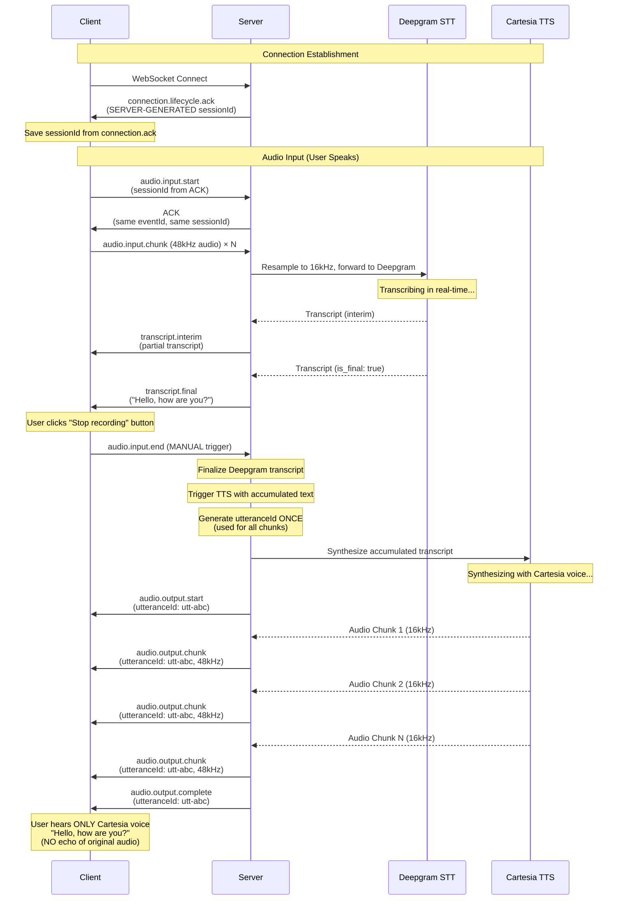
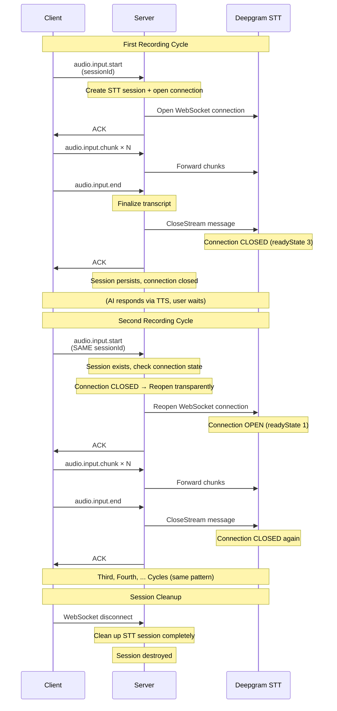
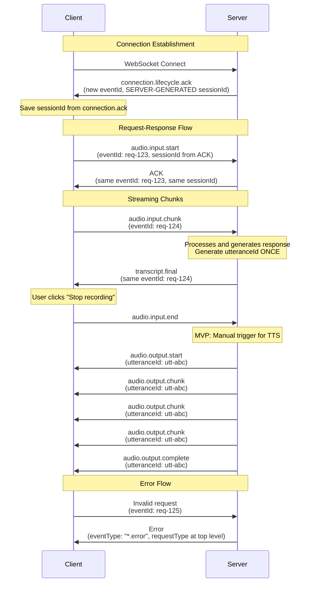

# WebSocket Protocol Specification

**Version**: 1.5.0
**Last Updated**: 2026-01-26
**Status**: Single Source of Truth

This document defines the complete WebSocket protocol specification for the Vantum backend. All implementations must follow these specifications exactly.

## Quick Start

**New to the protocol?** Start here:

1. Read [Base Message Structure](#base-message-structure) to understand the common format
2. Review [Session ID Generation](#session-id-generation) to understand how sessions work
3. Check [Message Types](#message-types) to see request/response patterns
4. Review [Complete Examples](#complete-examples) for real-world usage
5. Use [Quick Reference Guide](./websocket-quick-reference.md) for fast lookup

**Key Points**:

- All fields use **camelCase** (`eventType`, `eventId`, `sessionId`)
- All messages require 4 fields: `eventType`, `eventId`, `sessionId`, `payload`
- **Session ID is server-generated** (sent to client in `connection.ack`)
- Responses echo back the same `eventId` and `sessionId` from the request
- Error responses include `requestType` at top level
- **TTS audio chunks share the SAME utteranceId per synthesis response** ⭐
- **MVP: TTS triggers on manual "Stop recording" button** (automatic triggers planned)

## Table of Contents

1. [Base Message Structure](#base-message-structure)
2. [Session ID Generation](#session-id-generation) **(CRITICAL)**
3. [Message Types](#message-types)
   - [Request Messages](#1-request-messages-client--server)
   - [ACK Response Messages](#2-ack-response-messages-server--client)
   - [Regular Response Messages](#3-regular-response-messages-server--client)
   - [Error Response Messages](#4-error-response-messages-server--client)
   - [Connection ACK](#5-connection-ack-special-case)
4. [Field Requirements](#field-requirements)
5. [Validation Rules](#validation-rules)
6. [Event Types](#event-types)
7. [Message Flow Examples](#message-flow-examples)
8. [Complete Examples](#complete-examples)
9. [Semantic Streaming](#semantic-streaming) ⭐ **NEW**
10. [Implementation Notes](#implementation-notes)

---

## Base Message Structure

All WebSocket messages (requests and responses) follow this structure:

```typescript
interface BaseMessage {
  eventType: string; // REQUIRED - Event type identifier
  eventId: string; // REQUIRED - UUIDv7 for this event
  sessionId: string; // REQUIRED - Session ID (UUIDv7, server-generated)
  payload: unknown; // REQUIRED - Event-specific data
}
```

### Field Descriptions

- **`eventType`** (string, required): Event type identifier (e.g., `"audio.input.start"`, `"audio.output.chunk"`)
- **`eventId`** (string, required): Unique identifier for this event (UUIDv7 format, time-ordered)
  - Client generates for requests
  - Server echoes back in responses
  - Server generates new for server-initiated events
- **`sessionId`** (string, required): Session identifier (UUIDv7 format, **server-generated**)
  - Server generates on connection
  - Server sends in `connection.ack`
  - Client uses in all subsequent messages
  - Same for all events in a session
- **`payload`** (object, required): Event-specific data structure

### Naming Convention

**All field names use camelCase:**

- ✅ `eventType` (not `event_type`)
- ✅ `eventId` (not `event_id`)
- ✅ `sessionId` (not `session_id`)
- ✅ `requestType` (not `request_type`)
- ✅ `utteranceId` (not `utterance_id`)
- ✅ `sampleRate` (not `sample_rate`)

---

## Session ID Generation (CRITICAL)

**IMPORTANT**: Session IDs are **always generated by the server**, not the client.

### Flow:

1. **Client connects** to WebSocket (no sessionId yet)
2. **Server generates** sessionId (UUIDv7)
3. **Server sends** `connection.ack` with sessionId
4. **Client receives** sessionId from `connection.ack`
5. **Client uses** that sessionId in all subsequent messages

### Why Server-Generated?

- **Server controls** session lifecycle and state
- **Prevents conflicts** from multiple clients using same ID
- **Time-ordered** UUIDv7 enables chronological session tracking
- **Simplifies** session management (server is source of truth)

### Example Flow:

```typescript
// 1. Client connects to WebSocket
// (No message sent yet, just TCP/WebSocket handshake)

// 2. Server generates sessionId and sends connection.ack
{
  eventType: "connection.lifecycle.ack",
  eventId: "01934567-89ab-cdef-0123-456789abcdef",  // Server-generated
  sessionId: "01934567-89ab-cdef-0123-456789abcd00", // SERVER-GENERATED ⭐
  payload: {
    success: true
  }
}

// 3. Client uses sessionId from connection.ack in all requests
{
  eventType: "audio.input.start",
  eventId: "11111111-1111-1111-1111-111111111111",  // Client-generated
  sessionId: "01934567-89ab-cdef-0123-456789abcd00", // FROM connection.ack ⭐
  payload: {
    samplingRate: 48000,
    language: "en-US"
  }
}
```

### Common Mistakes:

❌ **WRONG**: Client generates sessionId before connecting

```typescript
// DON'T DO THIS
const sessionId = generateUUID(); // Client-generated
connect(sessionId); // This won't work with server-generated IDs
```

✅ **CORRECT**: Client waits for server's sessionId

```typescript
// DO THIS
ws.on('message', (data) => {
  const message = unpack(data);
  if (message.eventType === 'connection.lifecycle.ack') {
    const sessionId = message.sessionId; // Use server's sessionId
    // Now use sessionId in all subsequent messages
  }
});
```

---

## Message Types

### 1. Request Messages (Client → Server)

Request messages are sent by the client to initiate actions or send data.

**Format:**

- `eventType`: Request event type (e.g., `"audio.input.start"`)
- `eventId`: UUIDv7 generated by client (unique per request)
- `sessionId`: UUIDv7 from `connection.ack` (server-generated)
- `payload`: Request-specific data

**Example:**

```typescript
{
  eventType: "audio.input.start",
  eventId: "01234567-89ab-cdef-0123-456789abcdef",
  sessionId: "fedcba98-7654-3210-fedc-ba9876543210",  // From connection.ack
  payload: {
    samplingRate: 48000,
    language: "en-US",
    voiceId: "c961b81c-a935-4c17-bfb3-ba2239de8c2f"  // Optional: TTS voice ID (Kyle - male)
  }
}
```

**Note:** All requests must be sent after receiving `connection.ack`. The client must use the `sessionId` from that ACK in all subsequent messages.

---

### 2. ACK Response Messages (Server → Client)

ACK responses acknowledge successful processing of a request.

**Format:**

- `eventType`: **Same as request** (echoed back)
- `eventId`: **Same as request** (echoed back)
- `sessionId`: **Same as request** (echoed back)
- `payload`: `{ success: true }`

**Example:**

```typescript
{
  eventType: "audio.input.start",  // Same as request
  eventId: "01234567-89ab-cdef-0123-456789abcdef",  // Same as request
  sessionId: "fedcba98-7654-3210-fedc-ba9876543210",  // Same as request
  payload: {
    success: true
  }
}
```

**When ACKs are sent:**

- ✅ ACK for `audio.input.start` (after session initialization)
- ✅ ACK for `audio.input.end` (after session cleanup)
- ❌ **No ACK for `audio.input.chunk`** (streaming events don't get ACKs)

**If validation fails:** Send an error response (not an ACK).

---

### 3. Regular Response Messages (Server → Client)

Regular responses are sent by the server to provide data or signal events.

**Format:**

- `eventType`: Response event type (e.g., `"conversation.response.start"`)
- `eventId`: **Same as original request** `eventId` (echoed back for correlation)
- `sessionId`: **Same as original request** `sessionId` (echoed back)
- `payload`: Response-specific data

**Response Types:**

- `transcript.interim` - Interim transcript (partial, may change)
- `transcript.final` - Final transcript (complete, won't change)
- `audio.output.start` - TTS synthesis started (RESPONSE_START)
- `conversation.response.start` - AI about to respond
- `conversation.response.complete` - AI response complete
- `audio.output.cancel` - User interrupted AI / stop response
- `audio.output.chunk` - TTS audio chunk (RESPONSE_CHUNK, see special format below) ⭐
- `audio.output.complete` - TTS synthesis complete (RESPONSE_COMPLETE)

**Example - Transcript Final:**

```typescript
{
  eventType: "transcript.final",
  eventId: "01234567-89ab-cdef-0123-456789abcdef",  // Same as request
  sessionId: "fedcba98-7654-3210-fedc-ba9876543210",  // Same as request
  payload: {
    transcript: "Hello, how are you?",
    confidence: 0.98,
    timestamp: 1704415200000,
    language: "en-US"
  }
}
```

**Example - Audio Output Start (RESPONSE_START):**

```typescript
{
  eventType: "audio.output.start",
  eventId: "01234567-89ab-cdef-0123-456789abcdef",  // Same as request
  sessionId: "fedcba98-7654-3210-fedc-ba9876543210",  // Same as request
  payload: {
    utteranceId: "utterance-uuid-v7",  // ⭐ SAME for all chunks of this response
    timestamp: 1704415200100
  }
}
```

**Example - Response Complete:**

```typescript
{
  eventType: "conversation.response.complete",
  eventId: "01234567-89ab-cdef-0123-456789abcdef",  // Same as request
  sessionId: "fedcba98-7654-3210-fedc-ba9876543210",  // Same as request
  payload: {
    utteranceId: "01234567-89ab-cdef-0123-456789abcdef"
  }
}
```

#### Response Chunks (Special Format) ⭐ **UPDATED**

**CRITICAL CHANGE (v1.3.0)**: All chunks for the **same synthesis response** now share the **SAME utteranceId**. This allows frontend to correlate chunks belonging to the same response.

**Format:**

- `eventType`: `"audio.output.chunk"`
- `eventId`: **Different for each chunk** (unique event ID per message)
- `sessionId`: **Same for all chunks** (from original request)
- `payload.utteranceId`: **SAME for all chunks of same response** ⭐ **CRITICAL**
- `payload.audio`: Audio data (PCM 16-bit)
- `payload.sampleRate`: Sample rate (48000 Hz)

**Example - Multiple Chunks (SAME synthesis response):**

```typescript
// RESPONSE_START: Server starts synthesis
{
  eventType: "audio.output.start",
  eventId: "req-123",
  sessionId: "sess-456",
  payload: {
    utteranceId: "utt-abc",  // ⭐ Generated ONCE for entire response
    timestamp: 1704415200100
  }
}

// RESPONSE_CHUNK 1
{
  eventType: "audio.output.chunk",
  eventId: "event-001",  // UNIQUE event ID
  sessionId: "sess-456",
  payload: {
    audio: Uint8Array,
    utteranceId: "utt-abc",  // ⭐ SAME as RESPONSE_START
    sampleRate: 48000
  }
}

// RESPONSE_CHUNK 2
{
  eventType: "audio.output.chunk",
  eventId: "event-002",  // UNIQUE event ID (different from chunk 1)
  sessionId: "sess-456",
  payload: {
    audio: Uint8Array,
    utteranceId: "utt-abc",  // ⭐ SAME as RESPONSE_START and chunk 1
    sampleRate: 48000
  }
}

// RESPONSE_CHUNK 3
{
  eventType: "audio.output.chunk",
  eventId: "event-003",  // UNIQUE event ID (different from chunks 1 and 2)
  sessionId: "sess-456",
  payload: {
    audio: Uint8Array,
    utteranceId: "utt-abc",  // ⭐ SAME as RESPONSE_START and all chunks
    sampleRate: 48000
  }
}

// RESPONSE_COMPLETE: Synthesis finished
{
  eventType: "audio.output.complete",
  eventId: "event-004",
  sessionId: "sess-456",
  payload: {
    utteranceId: "utt-abc"  // ⭐ SAME as RESPONSE_START and all chunks
  }
}
```

**Key Points:**

- ✅ **SAME `utteranceId`** for RESPONSE_START, all chunks, and RESPONSE_COMPLETE
- ✅ **UNIQUE `eventId`** per message (each chunk has different eventId)
- ✅ Frontend correlates chunks by **utteranceId** (all chunks with same utteranceId = same response)
- ✅ Interruptions detected when **new utteranceId** appears (new response started)
- ✅ No `sequenceNumber` field (not needed with consistent utteranceId)

**Frontend Implementation:**

```typescript
// Track current playing utterance
let currentUtteranceId: string | null = null;
const audioQueue: AudioChunk[] = [];

function handleMessage(message: EventMessage) {
  if (message.eventType === 'audio.output.start') {
    currentUtteranceId = message.payload.utteranceId;
    audioQueue.length = 0; // Clear queue for new response
  }

  if (message.eventType === 'audio.output.chunk') {
    if (message.payload.utteranceId === currentUtteranceId) {
      // Same response - add to queue
      audioQueue.push(message.payload.audio);
    } else {
      // New response - interruption detected!
      audioQueue.length = 0; // Clear old queue
      currentUtteranceId = message.payload.utteranceId;
      audioQueue.push(message.payload.audio);
    }
  }

  if (message.eventType === 'audio.output.complete') {
    if (message.payload.utteranceId === currentUtteranceId) {
      // This response is complete
      currentUtteranceId = null;
    }
  }
}
```

---

### 4. Error Response Messages (Server → Client)

Error responses indicate that a request failed or was invalid.

**Format:**

- `eventType`: Converted using `toErrorEventType(requestType)` (e.g., `"audio.error.invalid_format"`)
- `eventId`: **Same as original request** `eventId` (echoed back)
- `sessionId`: **Same as original request** `sessionId` (echoed back)
- `requestType`: **Original request `eventType`** (at top level, not in payload)
- `payload`: `{ message: string }` (only error message)

**Example:**

```typescript
{
  eventType: "audio.error.invalid_format",  // Converted from "audio.input.start"
  eventId: "01234567-89ab-cdef-0123-456789abcdef",  // Same as request
  sessionId: "fedcba98-7654-3210-fedc-ba9876543210",  // Same as request
  requestType: "audio.input.start",  // Original eventType - AT TOP LEVEL
  payload: {
    message: "Invalid sampling rate: must be between 8000 and 48000"
  }
}
```

**Error Event Type Conversion:**

- `toErrorEventType("audio.input.start")` → `"audio.error.invalid_format"` or `"audio.error.general"`
- `toErrorEventType("conversation.response.start")` → `"conversation.error.general"`
- Generic pattern: Replace last part with "error"

**Malformed Requests:**

- If `eventType` is missing: Use `"error.system.unknown"` as `eventType`
- `requestType` in payload: Use `null` or the malformed value if available

**Key Points:**

- ✅ `requestType` is at **top level** (same level as `eventType`, `eventId`, `sessionId`)
- ✅ `payload` contains **only** `{ message: string }`
- ✅ No error code, timestamp, or other fields in payload

---

### 5. Connection ACK (Special Case)

Connection ACK is sent automatically by the server when a WebSocket connection is established.

**Format:**

- `eventType`: `"connection.lifecycle.ack"`
- `eventId`: **New UUIDv7** (generated by server, not a response to a request)
- `sessionId`: **Server-generated session ID** (UUIDv7) ⭐ **CRITICAL**
- `payload`: `{ success: true }`

**Example:**

```typescript
{
  eventType: "connection.lifecycle.ack",
  eventId: "01234567-89ab-cdef-0123-456789abcdef",  // New UUIDv7
  sessionId: "fedcba98-7654-3210-fedc-ba9876543210",  // SERVER-GENERATED ⭐
  payload: {
    success: true
  }
}
```

**Note:** This is **not** a response to a client request. It's sent automatically on connection establishment, and it contains the **server-generated sessionId** that the client must use in all subsequent messages.

---

## Field Requirements

| Field         | Request                  | ACK Response           | Regular Response   | Error Response           | Connection ACK                  |
| ------------- | ------------------------ | ---------------------- | ------------------ | ------------------------ | ------------------------------- |
| `eventType`   | ✅ Required              | ✅ Same as request     | ✅ Response type   | ✅ Converted error type  | ✅ `"connection.lifecycle.ack"` |
| `eventId`     | ✅ Required (new UUIDv7) | ✅ Same as request     | ✅ Same as request | ✅ Same as request       | ✅ New UUIDv7                   |
| `sessionId`   | ✅ Required (from ACK)   | ✅ Same as request     | ✅ Same as request | ✅ Same as request       | ✅ **Server-generated** ⭐      |
| `requestType` | ❌                       | ❌                     | ❌                 | ✅ Required (top level)  | ❌                              |
| `payload`     | ✅ Required              | ✅ `{ success: true }` | ✅ Response data   | ✅ `{ message: string }` | ✅ `{ success: true }`          |

---

## Validation Rules

1. **Required Fields:** All messages must have all four base fields (`eventType`, `eventId`, `sessionId`, `payload`)
2. **Missing Fields:** If required fields are missing, send error response with `eventType: "error.system.unknown"`
3. **UUID Format:** `eventId` and `sessionId` must be valid UUIDv7 format
4. **Session ID:** `sessionId` is **server-generated** (sent in `connection.ack`), client must use that value
5. **Duplicate Event IDs:** Server accepts duplicate `eventId` values (client responsibility to ensure uniqueness)

---

## Event Types

This section lists all event types. For detailed specifications, see the [Message Types](#message-types) section above.

### Client → Server Events

- `audio.input.start` - Initialize voice session (see [Request Messages](#1-request-messages-client--server))
- `audio.input.chunk` - Stream audio chunk (see [Request Messages](#1-request-messages-client--server))
- `audio.input.end` - End voice session (see [Request Messages](#1-request-messages-client--server))
  - **MVP**: Triggers TTS synthesis with accumulated transcript

### Server → Client Events

#### Connection Events

- `connection.lifecycle.ack` - Connection acknowledgment with server-generated sessionId (see [Connection ACK](#5-connection-ack-special-case))

#### STT Events (Deepgram)

- `transcript.interim` - Interim transcript (partial, may change)
- `transcript.final` - Final transcript (complete, won't change)

#### TTS Events (Cartesia)

- `audio.output.start` - TTS synthesis started (RESPONSE_START) (see [Regular Response Messages](#3-regular-response-messages-server--client))
- `audio.output.chunk` - TTS audio chunk (RESPONSE_CHUNK) (see [Response Chunks](#response-chunks-special-format))
- `audio.output.complete` - TTS synthesis complete (RESPONSE_COMPLETE) (see [Regular Response Messages](#3-regular-response-messages-server--client))
- `audio.output.cancel` - User interrupted AI / stop response (see [Regular Response Messages](#3-regular-response-messages-server--client))

#### Conversation Events (Future LLM Integration)

- `conversation.response.start` - AI about to respond (see [Regular Response Messages](#3-regular-response-messages-server--client))
- `conversation.response.complete` - AI response complete (see [Regular Response Messages](#3-regular-response-messages-server--client))

#### Error Events

- `audio.error.*` - Error for audio events (see [Error Response Messages](#4-error-response-messages-server--client))
- `tts.error.*` - Error for TTS events (see [Error Response Messages](#4-error-response-messages-server--client))
  - `tts.error.connection` - TTS WebSocket connection failed
  - `tts.error.synthesis` - TTS audio generation failed
  - `tts.error.timeout` - TTS request timed out
  - `tts.error.general` - Generic TTS error
- `conversation.error.*` - Error for conversation events (see [Error Response Messages](#4-error-response-messages-server--client))
- `error.system.unknown` - Generic error for malformed messages (see [Error Response Messages](#4-error-response-messages-server--client))

**Note:** Event types use the new hierarchical naming (domain.category.action). See [Event System Architecture](./event-system.md) for complete reference.

---

## Message Flow Examples

### MVP Flow (STT → TTS with Manual Trigger) ⭐ **UPDATED**



### Multiple Recording Cycles (Session Reuse) ⭐ **NEW**



**Key Points:**

- **Session persists** across multiple recording cycles
- **Connection closes** after each `audio.input.end` (expected Deepgram behavior)
- **Connection reopens** automatically on next `audio.input.start` (transparent to client)
- **Session destroyed** only on WebSocket disconnect

**Implementation Details:**

- `audio.input.start` (first time) → `createSession()` → Opens new connection
- `audio.input.end` → `finalizeTranscript()` → Closes connection, keeps session
- `audio.input.start` (subsequent) → `ensureConnectionReady()` → Reopens connection if closed
- WebSocket disconnect → `endSession()` → Destroys session completely

### Standard Message Flow



---

## Complete Examples

### Example 1: Connection Establishment

**Client:** Establishes WebSocket connection

**Server Response:**

```typescript
{
  eventType: "connection.lifecycle.ack",
  eventId: "01934567-89ab-cdef-0123-456789abcdef",
  sessionId: "01934567-89ab-cdef-0123-456789abcd00",  // SERVER-GENERATED ⭐
  payload: {
    success: true
  }
}
```

**Client:** Saves `sessionId` and uses it in all subsequent messages.

---

### Example 2: Audio Session Start

**Client Request:**

```typescript
{
  eventType: "audio.input.start",
  eventId: "11111111-1111-1111-1111-111111111111",
  sessionId: "01934567-89ab-cdef-0123-456789abcd00",  // From connection.ack
  payload: {
    samplingRate: 48000,
    language: "en-US"
  }
}
```

**Server ACK:**

```typescript
{
  eventType: "audio.input.start",
  eventId: "11111111-1111-1111-1111-111111111111",  // Same as request
  sessionId: "01934567-89ab-cdef-0123-456789abcd00",  // Same as request
  payload: {
    success: true
  }
}
```

---

### Example 3: MVP Flow (STT → TTS with Manual Trigger) ⭐ **UPDATED**

**Step 1: User speaks, STT transcribes**

```typescript
// Client sends audio
{
  eventType: "audio.input.chunk",
  eventId: "22222222-2222-2222-2222-222222222222",
  sessionId: "01934567-89ab-cdef-0123-456789abcd00",
  payload: {
    audio: Uint8Array,
    isMuted: false
  }
}

// Server sends final transcript
{
  eventType: "transcript.final",
  eventId: "22222222-2222-2222-2222-222222222222",  // Same as request
  sessionId: "01934567-89ab-cdef-0123-456789abcd00",
  payload: {
    transcript: "Hello, how are you?",
    confidence: 0.98,
    timestamp: 1704415200000,
    language: "en-US"
  }
}
```

**Step 2: User clicks "Stop recording" → TTS triggers** ⭐

```typescript
// Client sends audio.input.end (manual trigger)
{
  eventType: "audio.input.end",
  eventId: "33333333-3333-3333-3333-333333333333",
  sessionId: "01934567-89ab-cdef-0123-456789abcd00",
  payload: {}
}

// Server finalizes transcript and triggers TTS
// TTS synthesis started - utteranceId generated ONCE
{
  eventType: "audio.output.start",
  eventId: "event-001",
  sessionId: "01934567-89ab-cdef-0123-456789abcd00",
  payload: {
    utteranceId: "44444444-4444-4444-4444-444444444444",  // ⭐ Generated ONCE
    timestamp: 1704415200100
  }
}

// Audio Chunk 1
{
  eventType: "audio.output.chunk",
  eventId: "event-002",  // UNIQUE event ID
  sessionId: "01934567-89ab-cdef-0123-456789abcd00",
  payload: {
    audio: Uint8Array,  // 48kHz PCM 16-bit (resampled from 16kHz Cartesia)
    utteranceId: "44444444-4444-4444-4444-444444444444",  // ⭐ SAME as START
    sampleRate: 48000
  }
}

// Audio Chunk 2
{
  eventType: "audio.output.chunk",
  eventId: "event-003",  // UNIQUE event ID (different from chunk 1)
  sessionId: "01934567-89ab-cdef-0123-456789abcd00",
  payload: {
    audio: Uint8Array,
    utteranceId: "44444444-4444-4444-4444-444444444444",  // ⭐ SAME as START and chunk 1
    sampleRate: 48000
  }
}

// Audio Chunk 3
{
  eventType: "audio.output.chunk",
  eventId: "event-004",  // UNIQUE event ID (different from chunks 1 and 2)
  sessionId: "01934567-89ab-cdef-0123-456789abcd00",
  payload: {
    audio: Uint8Array,
    utteranceId: "44444444-4444-4444-4444-444444444444",  // ⭐ SAME as START and all chunks
    sampleRate: 48000
  }
}

// TTS synthesis complete
{
  eventType: "audio.output.complete",
  eventId: "event-005",
  sessionId: "01934567-89ab-cdef-0123-456789abcd00",
  payload: {
    utteranceId: "44444444-4444-4444-4444-444444444444"  // ⭐ SAME as START and all chunks
  }
}
```

**Result**: User hears ONLY Cartesia's voice saying "Hello, how are you?" (NO echo of original audio)

**MVP Behavior**:

- TTS triggers on **manual "Stop recording" button** (audio.input.end)
- No automatic synthesis during recording
- No audio echo (removed for cleaner pipeline)
- Future: Automatic VAD-based trigger (see [MVP Audio Pipeline Documentation](../architecture/mvp-audio-pipeline.md))

---

### Example 4: Streaming Response with Chunks (Future LLM Integration)

**Client Request:**

```typescript
{
  eventType: "audio.input.chunk",
  eventId: "22222222-2222-2222-2222-222222222222",
  sessionId: "01934567-89ab-cdef-0123-456789abcd00",
  payload: {
    audio: Uint8Array,
    isMuted: false
  }
}
```

**Server Responses (SAME utteranceId per chunk):**

```typescript
// Response start
{
  eventType: "conversation.response.start",
  eventId: "22222222-2222-2222-2222-222222222222",  // Same as request
  sessionId: "01934567-89ab-cdef-0123-456789abcd00",
  payload: {
    utteranceId: "33333333-3333-3333-3333-333333333333",
    timestamp: 1234567890
  }
}

// Chunk 1
{
  eventType: "audio.output.chunk",
  eventId: "event-001",
  sessionId: "01934567-89ab-cdef-0123-456789abcd00",
  payload: {
    audio: Uint8Array,
    utteranceId: "33333333-3333-3333-3333-333333333333",  // ⭐ SAME
    sampleRate: 48000
  }
}

// Chunk 2
{
  eventType: "audio.output.chunk",
  eventId: "event-002",
  sessionId: "01934567-89ab-cdef-0123-456789abcd00",
  payload: {
    audio: Uint8Array,
    utteranceId: "33333333-3333-3333-3333-333333333333",  // ⭐ SAME
    sampleRate: 48000
  }
}

// Response complete
{
  eventType: "conversation.response.complete",
  eventId: "22222222-2222-2222-2222-222222222222",  // Same as request
  sessionId: "01934567-89ab-cdef-0123-456789abcd00",
  payload: {
    utteranceId: "33333333-3333-3333-3333-333333333333"
  }
}
```

---

### Example 5: Error Handling

**Client Request (Invalid):**

```typescript
{
  eventType: "audio.input.start",
  eventId: "66666666-6666-6666-6666-666666666666",
  sessionId: "01934567-89ab-cdef-0123-456789abcd00",
  payload: {
    samplingRate: 5000  // Invalid: below minimum
  }
}
```

**Server Error Response:**

```typescript
{
  eventType: "audio.error.invalid_format",  // Converted from "audio.input.start"
  eventId: "66666666-6666-6666-6666-666666666666",  // Same as request
  sessionId: "01934567-89ab-cdef-0123-456789abcd00",  // Same as request
  requestType: "audio.input.start",  // Original eventType - AT TOP LEVEL
  payload: {
    message: "Invalid sampling rate: must be between 8000 and 48000"
  }
}
```

---

### Example 6: TTS Error Handling

**Scenario: TTS synthesis fails**

```typescript
{
  eventType: "tts.error.synthesis",  // TTS-specific error
  eventId: "77777777-7777-7777-7777-777777777777",  // Same as original audio.input.end
  sessionId: "01934567-89ab-cdef-0123-456789abcd00",
  requestType: "audio.input.end",  // Original request that triggered TTS
  payload: {
    message: "Cartesia synthesis failed: connection timeout"
  }
}
```

---

## Semantic Streaming

### Overview

The LLM service implements **semantic streaming** to deliver AI responses in natural, meaningful chunks synchronized with Text-to-Speech (TTS) for optimal conversational flow.

Semantic streaming ensures:

- Natural pauses in speech output
- No audio overlapping
- Better user experience with progressive responses
- Efficient bandwidth usage

### How It Works

#### 1. Marker-Based Chunking (Primary Strategy)

The AI response includes explicit `||BREAK||` markers to indicate natural pause points:

**Example**:

```
"Hello! ||BREAK|| I can help you with that. ||BREAK|| Let me explain how it works."
```

This response is split into 3 semantic chunks:

1. `"Hello!"`
2. `"I can help you with that."`
3. `"Let me explain how it works."`

**Benefits**:

- AI controls natural pause points
- Context-aware chunking
- Better speech synthesis quality

#### 2. Sentence-Based Fallback

If the AI response contains no `||BREAK||` markers, the system falls back to sentence-based chunking using standard punctuation (`.`, `!`, `?`).

**Example**:

```
"Hello! I can help you. Let me explain."
```

Splits into:

1. `"Hello!"`
2. `"I can help you."`
3. `"Let me explain."`

#### 3. Sequential TTS Delivery

Each semantic chunk follows this pipeline:

```
1. Chunk extracted from LLM response
2. Sent to TTS service for synthesis
3. Audio generated (PCM 48kHz 16-bit)
4. Audio duration calculated (milliseconds)
5. Audio sent to client via AUDIO_CHUNK event
6. Server waits for playback duration
7. Next chunk begins (goto step 1)
```

**Key Feature**: Sequential delivery prevents audio overlapping and ensures natural conversation flow.

### Configuration

**Location**: `/vantum-backend/src/modules/llm/config/streaming.config.ts`

**Parameters**:

```typescript
{
  chunkSizeTarget: 150,           // Target characters per chunk
  semanticMarker: '||BREAK||',    // Explicit break marker
  maxBufferSize: 4096,            // Max bytes per chunk (overflow protection)
  sentenceBoundaries: ['.', '!', '?'], // Fallback delimiters
  minChunkSize: 10,               // Minimum viable chunk size
}
```

### Buffer Management

**Chunk Size Limits**:

- **Target**: 150 characters (~30-50 tokens)
- **Maximum**: 4KB (4096 bytes) per chunk
- **Overflow protection**: Chunks exceeding 4KB are split

**Encoding**: UTF-8 text → MessagePack binary protocol

### Message Flow

```
┌─────────────┐
│ User Speaks │
└──────┬──────┘
       ↓
┌──────────────────┐
│ STT (Deepgram)   │ Transcription
└──────┬───────────┘
       ↓
┌──────────────────────────────────┐
│ LLM (OpenAI GPT-4)               │ Response with ||BREAK|| markers
│ "Hello! ||BREAK|| How are you?"  │
└──────┬───────────────────────────┘
       ↓
┌──────────────────────────┐
│ Streaming Service        │ Extract chunks:
│                          │ 1. "Hello!"
│                          │ 2. "How are you?"
└──────┬───────────────────┘
       ↓
┌──────────────────────────┐
│ For each chunk:          │
│                          │
│  ┌────────────────────┐  │
│  │ TTS Synthesis      │  │ → Audio chunk (PCM)
│  └────────┬───────────┘  │
│           ↓              │
│  ┌────────────────────┐  │
│  │ Calculate Duration │  │ → 1250ms
│  └────────┬───────────┘  │
│           ↓              │
│  ┌────────────────────┐  │
│  │ Send AUDIO_CHUNK   │  │ → To client
│  └────────┬───────────┘  │
│           ↓              │
│  ┌────────────────────┐  │
│  │ Wait for Playback  │  │ → delay(1250ms)
│  └────────────────────┘  │
│           ↓              │
│       Next chunk         │
└──────────────────────────┘
```

### WebSocket Events

**No New Events**: Semantic streaming is transparent to clients. The existing `AUDIO_CHUNK` event is used.

**Event Details**:

- **Event Type**: `VOICECHAT_EVENTS.AUDIO_CHUNK`
- **Payload**: Standard audio chunk payload
- **utteranceId**: Same for all chunks from a single LLM response
- **Sequence**: Chunks arrive sequentially (not concurrently)

**Example** (MessagePack encoded):

```typescript
{
  eventType: 'AUDIO_CHUNK',
  sessionId: 'session-123',
  payload: {
    audio: Buffer<Int16Array>,  // PCM 48kHz 16-bit
    sampleRate: 48000,
    format: 'pcm16',
    utteranceId: 'utt-456',      // Same for all chunks
    chunkSequence: 1             // Incremental
  }
}
```

### Client Behavior

**No Changes Required**: Clients continue to:

1. Receive `AUDIO_CHUNK` events
2. Queue audio for playback
3. Play sequentially

**Benefits for Clients**:

- Progressive audio arrival (lower latency)
- Natural pauses between semantic chunks
- Better perceived responsiveness

### Performance Characteristics

**Latency**:

- **First chunk**: ~500-1000ms (STT + LLM + TTS)
- **Subsequent chunks**: ~300-500ms (TTS only, LLM streams in parallel)
- **Total response**: Perceived as faster due to progressive delivery

**Throughput**:

- ~3-5 chunks per LLM response (typical)
- ~150 characters per chunk
- ~1-2 seconds audio per chunk

**Error Handling**:

- Chunk failure: Skip to next chunk
- TTS failure: Use fallback message
- Network failure: Client resends transcript

### Debugging

**Enable Debug Logs**:

```bash
LOG_LEVEL=debug pnpm dev
```

**Key Log Messages**:

```
[DEBUG] Extracted semantic chunks { sessionId, chunkCount: 3 }
[DEBUG] Processing chunk 1/3 { sessionId, text: "Hello!", chunkSize: 6 }
[DEBUG] TTS audio duration: 1250ms { sessionId, chunkNumber: 1 }
[DEBUG] Playback delay complete { sessionId, chunkNumber: 1, delayMs: 1250 }
```

**Metrics**:

```typescript
const metrics = llmStreamingService.getMetrics();
// {
//   totalChunks: 245,
//   markerBasedChunks: 180,   // 73% used markers
//   sentenceBasedChunks: 65,  // 27% fallback
//   averageChunkSize: 142,    // characters
// }
```

### Configuration Tuning

**For Shorter Responses** (faster pace):

```typescript
chunkSizeTarget: 100; // Smaller chunks
```

**For Longer Responses** (fewer pauses):

```typescript
chunkSizeTarget: 200; // Larger chunks
```

**For Specific Pause Points**:

- Adjust system prompt to guide AI on marker placement
- Example: "Use ||BREAK|| after each key point"

### Limitations

**Known Limitations**:

1. **Marker reliance**: AI may forget to use ||BREAK|| markers (fallback handles this)
2. **Chunk overhead**: More chunks = more TTS API calls (mitigated by queuing)
3. **Latency**: Sequential delivery slower than bulk (but perceived faster)

**Future Improvements**:

- Adaptive chunk sizing based on response length
- Parallel TTS with sequenced playback
- Client-side chunk assembly for bandwidth optimization

### References

- LLM Streaming Service: `/vantum-backend/src/modules/llm/services/llm-streaming.service.ts`
- Configuration: `/vantum-backend/src/modules/llm/config/streaming.config.ts`
- TTS Integration: `/vantum-backend/src/modules/tts/controllers/tts.controller.ts`

---

## Implementation Notes

1. **Session ID:** **Server-generated** (sent in `connection.ack`), always at top level, never in `payload`
2. **Event ID Correlation:** Regular responses and errors echo the request `eventId`
3. **Server-Initiated Events:** For events not tied to a request, generate new `eventId` (UUIDv7)
4. **Chunk Correlation:** ⭐ **All chunks for SAME response use SAME utteranceId** (generated once in `synthesizeText()`)
5. **Error Event Type Conversion:** Generic and scalable (works for any event type prefix)
6. **Request Type in Errors:** Always at top level, not in `payload`
7. **Hierarchical Event Names:** Use new `domain.category.action` format (see [Event System Architecture](./event-system.md))
8. **MVP TTS Trigger:** `audio.input.end` triggers TTS synthesis (manual "Stop recording" button) ⭐ **NEW**
9. **No Audio Echo:** Original client audio is NOT echoed back (removed for cleaner pipeline) ⭐ **NEW**
10. **TTS Events:** Follow same pattern as STT events (start → chunks → complete)
11. **Audio Resampling:** All audio output is resampled to match client sample rate (48kHz for browser, 8kHz for Twilio)
12. **Interruption Detection:** Frontend detects new response when utteranceId changes (see [Response Chunks](#response-chunks-special-format))
13. **Multiple Recording Cycles:** Sessions persist across multiple recording cycles; Deepgram connections close after finalization and reopen transparently on next `audio.input.start` ⭐ **NEW**
14. **Connection Lifecycle:** `finalizeTranscript()` closes connection but keeps session; `ensureConnectionReady()` reopens connection; `endSession()` destroys session on disconnect ⭐ **NEW**
15. **Transparent Reconnection:** Client doesn't need to know about connection state; server handles reopening automatically ⭐ **NEW**
16. **Future Enhancement:** Automatic VAD-based TTS trigger (see [MVP Audio Pipeline Documentation](../architecture/mvp-audio-pipeline.md))
17. **Semantic Streaming:** LLM responses use ||BREAK|| markers for natural chunking; fallback to sentence boundaries if no markers (see [Semantic Streaming](#semantic-streaming)) ⭐ **NEW**

---

## See Also

- [Event System Architecture](./event-system.md) - Complete event reference (single EVENTS object)
- [WebSocket Quick Reference](./websocket-quick-reference.md) - One-page quick lookup
- **[MVP Audio Pipeline Documentation](../architecture/mvp-audio-pipeline.md)** - Current MVP flow and future roadmap ⭐ **NEW**
- [TTS Service Documentation](../services/tts-service.md) - Complete TTS service API
- [API Documentation](../api/api.md) - REST + WebSocket overview
- [Architecture Documentation](../architecture/architecture.md) - System architecture
- [Documentation Index](../README.md) - All documentation files

---

**This document is the single source of truth for WebSocket message formats in the Vantum project. All implementations must follow these specifications exactly.**
