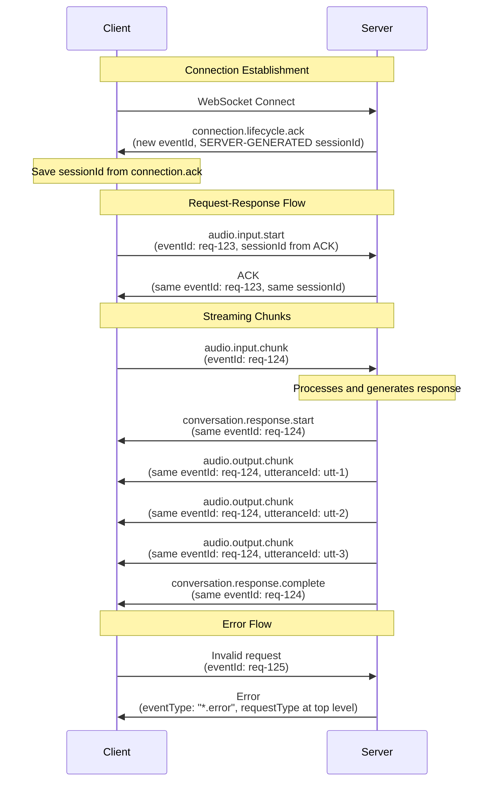

# WebSocket Protocol Specification

**Version**: 1.1.0
**Last Updated**: 2024-12-27
**Status**: Single Source of Truth

This document defines the complete WebSocket protocol specification for the Vantum backend. All implementations must follow these specifications exactly.

## Quick Start

**New to the protocol?** Start here:

1. Read [Base Message Structure](#base-message-structure) to understand the common format
2. Review [Session ID Generation](#session-id-generation) to understand how sessions work
3. Check [Message Types](#message-types) to see request/response patterns
4. Review [Complete Examples](#complete-examples) for real-world usage
5. Use [Quick Reference Guide](./websocket-quick-reference.md) for fast lookup

**Key Points**:

- All fields use **camelCase** (`eventType`, `eventId`, `sessionId`)
- All messages require 4 fields: `eventType`, `eventId`, `sessionId`, `payload`
- **Session ID is server-generated** (sent to client in `connection.ack`)
- Responses echo back the same `eventId` and `sessionId` from the request
- Error responses include `requestType` at top level

## Table of Contents

1. [Base Message Structure](#base-message-structure)
2. [Session ID Generation](#session-id-generation) **(CRITICAL)**
3. [Message Types](#message-types)
   - [Request Messages](#1-request-messages-client--server)
   - [ACK Response Messages](#2-ack-response-messages-server--client)
   - [Regular Response Messages](#3-regular-response-messages-server--client)
   - [Error Response Messages](#4-error-response-messages-server--client)
   - [Connection ACK](#5-connection-ack-special-case)
4. [Field Requirements](#field-requirements)
5. [Validation Rules](#validation-rules)
6. [Event Types](#event-types)
7. [Message Flow Examples](#message-flow-examples)
8. [Complete Examples](#complete-examples)
9. [Implementation Notes](#implementation-notes)

---

## Base Message Structure

All WebSocket messages (requests and responses) follow this structure:

```typescript
interface BaseMessage {
  eventType: string; // REQUIRED - Event type identifier
  eventId: string; // REQUIRED - UUIDv7 for this event
  sessionId: string; // REQUIRED - Session ID (UUIDv7, server-generated)
  payload: unknown; // REQUIRED - Event-specific data
}
```

### Field Descriptions

- **`eventType`** (string, required): Event type identifier (e.g., `"audio.input.start"`, `"audio.output.chunk"`)
- **`eventId`** (string, required): Unique identifier for this event (UUIDv7 format, time-ordered)
  - Client generates for requests
  - Server echoes back in responses
  - Server generates new for server-initiated events
- **`sessionId`** (string, required): Session identifier (UUIDv7 format, **server-generated**)
  - Server generates on connection
  - Server sends in `connection.ack`
  - Client uses in all subsequent messages
  - Same for all events in a session
- **`payload`** (object, required): Event-specific data structure

### Naming Convention

**All field names use camelCase:**

- ✅ `eventType` (not `event_type`)
- ✅ `eventId` (not `event_id`)
- ✅ `sessionId` (not `session_id`)
- ✅ `requestType` (not `request_type`)
- ✅ `utteranceId` (not `utterance_id`)
- ✅ `sampleRate` (not `sample_rate`)

---

## Session ID Generation (CRITICAL)

**IMPORTANT**: Session IDs are **always generated by the server**, not the client.

### Flow:

1. **Client connects** to WebSocket (no sessionId yet)
2. **Server generates** sessionId (UUIDv7)
3. **Server sends** `connection.ack` with sessionId
4. **Client receives** sessionId from `connection.ack`
5. **Client uses** that sessionId in all subsequent messages

### Why Server-Generated?

- **Server controls** session lifecycle and state
- **Prevents conflicts** from multiple clients using same ID
- **Time-ordered** UUIDv7 enables chronological session tracking
- **Simplifies** session management (server is source of truth)

### Example Flow:

```typescript
// 1. Client connects to WebSocket
// (No message sent yet, just TCP/WebSocket handshake)

// 2. Server generates sessionId and sends connection.ack
{
  eventType: "connection.lifecycle.ack",
  eventId: "01934567-89ab-cdef-0123-456789abcdef",  // Server-generated
  sessionId: "01934567-89ab-cdef-0123-456789abcd00", // SERVER-GENERATED ⭐
  payload: {
    success: true
  }
}

// 3. Client uses sessionId from connection.ack in all requests
{
  eventType: "audio.input.start",
  eventId: "11111111-1111-1111-1111-111111111111",  // Client-generated
  sessionId: "01934567-89ab-cdef-0123-456789abcd00", // FROM connection.ack ⭐
  payload: {
    samplingRate: 48000,
    language: "en-US"
  }
}
```

### Common Mistakes:

❌ **WRONG**: Client generates sessionId before connecting
```typescript
// DON'T DO THIS
const sessionId = generateUUID(); // Client-generated
connect(sessionId); // This won't work with server-generated IDs
```

✅ **CORRECT**: Client waits for server's sessionId
```typescript
// DO THIS
ws.on('message', (data) => {
  const message = unpack(data);
  if (message.eventType === 'connection.lifecycle.ack') {
    const sessionId = message.sessionId; // Use server's sessionId
    // Now use sessionId in all subsequent messages
  }
});
```

---

## Message Types

### 1. Request Messages (Client → Server)

Request messages are sent by the client to initiate actions or send data.

**Format:**

- `eventType`: Request event type (e.g., `"audio.input.start"`)
- `eventId`: UUIDv7 generated by client (unique per request)
- `sessionId`: UUIDv7 from `connection.ack` (server-generated)
- `payload`: Request-specific data

**Example:**

```typescript
{
  eventType: "audio.input.start",
  eventId: "01234567-89ab-cdef-0123-456789abcdef",
  sessionId: "fedcba98-7654-3210-fedc-ba9876543210",  // From connection.ack
  payload: {
    samplingRate: 48000,
    language: "en-US"
  }
}
```

**Note:** All requests must be sent after receiving `connection.ack`. The client must use the `sessionId` from that ACK in all subsequent messages.

---

### 2. ACK Response Messages (Server → Client)

ACK responses acknowledge successful processing of a request.

**Format:**

- `eventType`: **Same as request** (echoed back)
- `eventId`: **Same as request** (echoed back)
- `sessionId`: **Same as request** (echoed back)
- `payload`: `{ success: true }`

**Example:**

```typescript
{
  eventType: "audio.input.start",  // Same as request
  eventId: "01234567-89ab-cdef-0123-456789abcdef",  // Same as request
  sessionId: "fedcba98-7654-3210-fedc-ba9876543210",  // Same as request
  payload: {
    success: true
  }
}
```

**When ACKs are sent:**

- ✅ ACK for `audio.input.start` (after session initialization)
- ✅ ACK for `audio.input.end` (after session cleanup)
- ❌ **No ACK for `audio.input.chunk`** (streaming events don't get ACKs)

**If validation fails:** Send an error response (not an ACK).

---

### 3. Regular Response Messages (Server → Client)

Regular responses are sent by the server to provide data or signal events.

**Format:**

- `eventType`: Response event type (e.g., `"conversation.response.start"`)
- `eventId`: **Same as original request** `eventId` (echoed back for correlation)
- `sessionId`: **Same as original request** `sessionId` (echoed back)
- `payload`: Response-specific data

**Response Types:**

- `conversation.response.start` - AI about to respond
- `conversation.response.complete` - AI response complete
- `audio.output.cancel` - User interrupted AI / stop response
- `audio.output.chunk` - TTS audio chunk (see special format below)

**Example - Response Start:**

```typescript
{
  eventType: "conversation.response.start",
  eventId: "01234567-89ab-cdef-0123-456789abcdef",  // Same as request
  sessionId: "fedcba98-7654-3210-fedc-ba9876543210",  // Same as request
  payload: {
    utteranceId: "01234567-89ab-cdef-0123-456789abcdef",
    timestamp: 1234567890
  }
}
```

**Example - Response Complete:**

```typescript
{
  eventType: "conversation.response.complete",
  eventId: "01234567-89ab-cdef-0123-456789abcdef",  // Same as request
  sessionId: "fedcba98-7654-3210-fedc-ba9876543210",  // Same as request
  payload: {
    utteranceId: "01234567-89ab-cdef-0123-456789abcdef"
  }
}
```

#### Response Chunks (Special Format)

**Critical:** All chunks for the same response share the **same `eventId`**, but each chunk has a **unique `utteranceId`** (time-ordered UUIDv7) used for ordering.

**Format:**

- `eventType`: `"audio.output.chunk"`
- `eventId`: **Same for all chunks** (from original request)
- `sessionId`: **Same for all chunks** (from original request)
- `payload`: Contains unique `utteranceId` per chunk

**Example - Multiple Chunks:**

```typescript
// Chunk 1
{
  eventType: "audio.output.chunk",
  eventId: "req-123",  // SAME for all chunks
  sessionId: "sess-456",
  payload: {
    audio: Uint8Array,
    utteranceId: "utt-001",  // UNIQUE per chunk, time-ordered UUIDv7
    sampleRate: 16000
  }
}

// Chunk 2
{
  eventType: "audio.output.chunk",
  eventId: "req-123",  // SAME as chunk 1
  sessionId: "sess-456",
  payload: {
    audio: Uint8Array,
    utteranceId: "utt-002",  // UNIQUE, different from chunk 1
    sampleRate: 16000
  }
}

// Chunk 3
{
  eventType: "audio.output.chunk",
  eventId: "req-123",  // SAME as chunks 1 and 2
  sessionId: "sess-456",
  payload: {
    audio: Uint8Array,
    utteranceId: "utt-003",  // UNIQUE, different from chunks 1 and 2
    sampleRate: 16000
  }
}
```

**Key Points:**

- ✅ Same `eventId` for all chunks (correlates to original request)
- ✅ Unique `utteranceId` per chunk (time-ordered UUIDv7 for ordering)
- ✅ No `sequenceNumber` field (replaced by unique `utteranceId`)
- ✅ Client orders chunks by `utteranceId` (UUIDv7 is time-ordered)

---

### 4. Error Response Messages (Server → Client)

Error responses indicate that a request failed or was invalid.

**Format:**

- `eventType`: Converted using `toErrorEventType(requestType)` (e.g., `"audio.error.invalid_format"`)
- `eventId`: **Same as original request** `eventId` (echoed back)
- `sessionId`: **Same as original request** `sessionId` (echoed back)
- `requestType`: **Original request `eventType`** (at top level, not in payload)
- `payload`: `{ message: string }` (only error message)

**Example:**

```typescript
{
  eventType: "audio.error.invalid_format",  // Converted from "audio.input.start"
  eventId: "01234567-89ab-cdef-0123-456789abcdef",  // Same as request
  sessionId: "fedcba98-7654-3210-fedc-ba9876543210",  // Same as request
  requestType: "audio.input.start",  // Original eventType - AT TOP LEVEL
  payload: {
    message: "Invalid sampling rate: must be between 8000 and 48000"
  }
}
```

**Error Event Type Conversion:**

- `toErrorEventType("audio.input.start")` → `"audio.error.invalid_format"` or `"audio.error.general"`
- `toErrorEventType("conversation.response.start")` → `"conversation.error.general"`
- Generic pattern: Replace last part with "error"

**Malformed Requests:**

- If `eventType` is missing: Use `"error.system.unknown"` as `eventType`
- `requestType` in payload: Use `null` or the malformed value if available

**Key Points:**

- ✅ `requestType` is at **top level** (same level as `eventType`, `eventId`, `sessionId`)
- ✅ `payload` contains **only** `{ message: string }`
- ✅ No error code, timestamp, or other fields in payload

---

### 5. Connection ACK (Special Case)

Connection ACK is sent automatically by the server when a WebSocket connection is established.

**Format:**

- `eventType`: `"connection.lifecycle.ack"`
- `eventId`: **New UUIDv7** (generated by server, not a response to a request)
- `sessionId`: **Server-generated session ID** (UUIDv7) ⭐ **CRITICAL**
- `payload`: `{ success: true }`

**Example:**

```typescript
{
  eventType: "connection.lifecycle.ack",
  eventId: "01234567-89ab-cdef-0123-456789abcdef",  // New UUIDv7
  sessionId: "fedcba98-7654-3210-fedc-ba9876543210",  // SERVER-GENERATED ⭐
  payload: {
    success: true
  }
}
```

**Note:** This is **not** a response to a client request. It's sent automatically on connection establishment, and it contains the **server-generated sessionId** that the client must use in all subsequent messages.

---

## Field Requirements

| Field         | Request                  | ACK Response           | Regular Response   | Error Response           | Connection ACK              |
| ------------- | ------------------------ | ---------------------- | ------------------ | ------------------------ | --------------------------- |
| `eventType`   | ✅ Required              | ✅ Same as request     | ✅ Response type   | ✅ Converted error type  | ✅ `"connection.lifecycle.ack"` |
| `eventId`     | ✅ Required (new UUIDv7) | ✅ Same as request     | ✅ Same as request | ✅ Same as request       | ✅ New UUIDv7               |
| `sessionId`   | ✅ Required (from ACK)   | ✅ Same as request     | ✅ Same as request | ✅ Same as request       | ✅ **Server-generated** ⭐  |
| `requestType` | ❌                       | ❌                     | ❌                 | ✅ Required (top level)  | ❌                          |
| `payload`     | ✅ Required              | ✅ `{ success: true }` | ✅ Response data   | ✅ `{ message: string }` | ✅ `{ success: true }`      |

---

## Validation Rules

1. **Required Fields:** All messages must have all four base fields (`eventType`, `eventId`, `sessionId`, `payload`)
2. **Missing Fields:** If required fields are missing, send error response with `eventType: "error.system.unknown"`
3. **UUID Format:** `eventId` and `sessionId` must be valid UUIDv7 format
4. **Session ID:** `sessionId` is **server-generated** (sent in `connection.ack`), client must use that value
5. **Duplicate Event IDs:** Server accepts duplicate `eventId` values (client responsibility to ensure uniqueness)

---

## Event Types

This section lists all event types. For detailed specifications, see the [Message Types](#message-types) section above.

### Client → Server Events

- `audio.input.start` - Initialize voice session (see [Request Messages](#1-request-messages-client--server))
- `audio.input.chunk` - Stream audio chunk (see [Request Messages](#1-request-messages-client--server))
- `audio.input.end` - End voice session (see [Request Messages](#1-request-messages-client--server))

### Server → Client Events

- `connection.lifecycle.ack` - Connection acknowledgment with server-generated sessionId (see [Connection ACK](#5-connection-ack-special-case))
- `conversation.response.start` - AI about to respond (see [Regular Response Messages](#3-regular-response-messages-server--client))
- `audio.output.chunk` - TTS audio chunk (see [Response Chunks](#response-chunks-special-format))
- `conversation.response.complete` - AI response complete (see [Regular Response Messages](#3-regular-response-messages-server--client))
- `audio.output.cancel` - User interrupted AI / stop response (see [Regular Response Messages](#3-regular-response-messages-server--client))
- `audio.error.*` - Error for audio events (see [Error Response Messages](#4-error-response-messages-server--client))
- `conversation.error.*` - Error for conversation events (see [Error Response Messages](#4-error-response-messages-server--client))
- `error.system.unknown` - Generic error for malformed messages (see [Error Response Messages](#4-error-response-messages-server--client))

**Note:** Event types use the new hierarchical naming (domain.category.action). See [Event System Architecture](./event-system.md) for complete reference.

---

## Message Flow Examples



---

## Complete Examples

### Example 1: Connection Establishment

**Client:** Establishes WebSocket connection

**Server Response:**

```typescript
{
  eventType: "connection.lifecycle.ack",
  eventId: "01934567-89ab-cdef-0123-456789abcdef",
  sessionId: "01934567-89ab-cdef-0123-456789abcd00",  // SERVER-GENERATED ⭐
  payload: {
    success: true
  }
}
```

**Client:** Saves `sessionId` and uses it in all subsequent messages.

---

### Example 2: Audio Session Start

**Client Request:**

```typescript
{
  eventType: "audio.input.start",
  eventId: "11111111-1111-1111-1111-111111111111",
  sessionId: "01934567-89ab-cdef-0123-456789abcd00",  // From connection.ack
  payload: {
    samplingRate: 48000,
    language: "en-US"
  }
}
```

**Server ACK:**

```typescript
{
  eventType: "audio.input.start",
  eventId: "11111111-1111-1111-1111-111111111111",  // Same as request
  sessionId: "01934567-89ab-cdef-0123-456789abcd00",  // Same as request
  payload: {
    success: true
  }
}
```

---

### Example 3: Streaming Response with Chunks

**Client Request:**

```typescript
{
  eventType: "audio.input.chunk",
  eventId: "22222222-2222-2222-2222-222222222222",
  sessionId: "01934567-89ab-cdef-0123-456789abcd00",
  payload: {
    audio: Uint8Array,
    isMuted: false
  }
}
```

**Server Responses (same eventId, unique utteranceId per chunk):**

```typescript
// Response start
{
  eventType: "conversation.response.start",
  eventId: "22222222-2222-2222-2222-222222222222",  // Same as request
  sessionId: "01934567-89ab-cdef-0123-456789abcd00",
  payload: {
    utteranceId: "33333333-3333-3333-3333-333333333333",
    timestamp: 1234567890
  }
}

// Chunk 1
{
  eventType: "audio.output.chunk",
  eventId: "22222222-2222-2222-2222-222222222222",  // Same as request
  sessionId: "01934567-89ab-cdef-0123-456789abcd00",
  payload: {
    audio: Uint8Array,
    utteranceId: "44444444-4444-4444-4444-444444444444",  // Unique
    sampleRate: 16000
  }
}

// Chunk 2
{
  eventType: "audio.output.chunk",
  eventId: "22222222-2222-2222-2222-222222222222",  // Same as request
  sessionId: "01934567-89ab-cdef-0123-456789abcd00",
  payload: {
    audio: Uint8Array,
    utteranceId: "55555555-5555-5555-5555-555555555555",  // Unique, different from chunk 1
    sampleRate: 16000
  }
}

// Response complete
{
  eventType: "conversation.response.complete",
  eventId: "22222222-2222-2222-2222-222222222222",  // Same as request
  sessionId: "01934567-89ab-cdef-0123-456789abcd00",
  payload: {
    utteranceId: "33333333-3333-3333-3333-333333333333"
  }
}
```

---

### Example 4: Error Handling

**Client Request (Invalid):**

```typescript
{
  eventType: "audio.input.start",
  eventId: "66666666-6666-6666-6666-666666666666",
  sessionId: "01934567-89ab-cdef-0123-456789abcd00",
  payload: {
    samplingRate: 5000  // Invalid: below minimum
  }
}
```

**Server Error Response:**

```typescript
{
  eventType: "audio.error.invalid_format",  // Converted from "audio.input.start"
  eventId: "66666666-6666-6666-6666-666666666666",  // Same as request
  sessionId: "01934567-89ab-cdef-0123-456789abcd00",  // Same as request
  requestType: "audio.input.start",  // Original eventType - AT TOP LEVEL
  payload: {
    message: "Invalid sampling rate: must be between 8000 and 48000"
  }
}
```

---

## Implementation Notes

1. **Session ID:** **Server-generated** (sent in `connection.ack`), always at top level, never in `payload`
2. **Event ID Correlation:** Regular responses and errors echo the request `eventId`
3. **Server-Initiated Events:** For events not tied to a request, generate new `eventId` (UUIDv7)
4. **Chunk Ordering:** Use unique `utteranceId` per chunk (time-ordered UUIDv7) instead of `sequenceNumber`
5. **Error Event Type Conversion:** Generic and scalable (works for any event type prefix)
6. **Request Type in Errors:** Always at top level, not in `payload`
7. **Hierarchical Event Names:** Use new `domain.category.action` format (see [Event System Architecture](./event-system.md))

---

## See Also

- [Event System Architecture](./event-system.md) - Complete event reference (single EVENTS object)
- [WebSocket Quick Reference](./websocket-quick-reference.md) - One-page quick lookup
- [API Documentation](../api/api.md) - REST + WebSocket overview
- [Architecture Documentation](../architecture/architecture.md) - System architecture
- [Documentation Index](../README.md) - All documentation files

---

**This document is the single source of truth for WebSocket message formats in the Vantum project. All implementations must follow these specifications exactly.**
